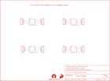

Contents
========

* [PRS494 > SOIC8-DIP Adapter](#prs494--soic8-dip-adapter)
	* [Schematic](#schematic)
	* [PCB](#pcb)
	* [Interactive BOM](#interactive-bom)
	* [OOMP Parts](#oomp-parts)
	* [Images](#images)
	* [Tags](#tags)
  
![][im]
# PRS494 > SOIC8-DIP Adapter

- ID: PROJ-SPAR-494-STAN-01
- Hex ID: PRS494
- Name: Sparkfun
- Description: Sparkfun
- Long Link: [http://oom.lt/PROJ-SPAR-494-STAN-01](http://oom.lt/PROJ-SPAR-494-STAN-01)
- Short Link: [http://oom.lt/PRS494](http://oom.lt/PRS494)

## Schematic
  

## PCB
  

## Interactive BOM

- Interactive BOM page: [ibom.html](https://htmlpreview.github.io/?https://github.com/oomlout/oomlout_OOMP_projects/blob/main/PROJ-SPAR-494-STAN-01/kicad/bom/ibom.html)

## OOMP Parts
  

|OOMP ID|Name|Identifier|
| :---: | :---: | :---: |
|UNMATCHED-UNMATCHED-X-UNMATCHED-01||FRAME1, U1, U2, U3, U4|
|[HEAD-I01-X-PI04-01](https://github.com/oomlout/oomlout_OOMP_parts/tree/main/HEAD-I01-X-PI04-01/)|[2.54 mm 4 Pin Header](https://github.com/oomlout/oomlout_OOMP_parts/tree/main/HEAD-I01-X-PI04-01/)|[JP1, JP2, JP3, JP4, JP5, JP6, JP7, JP8](https://github.com/oomlout/oomlout_OOMP_parts/tree/main/HEAD-I01-X-PI04-01/)|

## Images
  
  

|bominteractivefront|bominteractiveback|kicadPcb3d|kicadPcb3dFront|kicadPcb3dBack|eagleImage|eagleSchemImage|pcbdraw|pcbdrawback|
| :---: | :---: | :---: | :---: | :---: | :---: | :---: | :---: | :---: |
||||||||||

## Tags

- hexID: PRS494
- oompType: PROJ
- oompSize: SPAR
- oompColor: 494
- oompDesc: STAN
- oompIndex: 01
- oompName: SOIC8-DIP Adapter
- sources: All source files from https://github.com/sparkfun/SOIC8-DIP_Adapter (source licence details in srcLicense.md)
- linkBuyPage: https://www.sparkfun.com/products/494
- oompID: PROJ-SPAR-494-STAN-01
- oompParts: FRAME1,UNMATCHED-UNMATCHED-X-UNMATCHED-01
- oompParts: JP1,HEAD-I01-X-PI04-01
- oompParts: JP2,HEAD-I01-X-PI04-01
- oompParts: JP3,HEAD-I01-X-PI04-01
- oompParts: JP4,HEAD-I01-X-PI04-01
- oompParts: JP5,HEAD-I01-X-PI04-01
- oompParts: JP6,HEAD-I01-X-PI04-01
- oompParts: JP7,HEAD-I01-X-PI04-01
- oompParts: JP8,HEAD-I01-X-PI04-01
- oompParts: U1,UNMATCHED-UNMATCHED-X-UNMATCHED-01
- oompParts: U2,UNMATCHED-UNMATCHED-X-UNMATCHED-01
- oompParts: U3,UNMATCHED-UNMATCHED-X-UNMATCHED-01
- oompParts: U4,UNMATCHED-UNMATCHED-X-UNMATCHED-01
- rawParts: FRAME1,frame,FRAME-LETTER,CREATIVE_COMMONS,Schematic Frame,,
- rawParts: JP1,1x4,M041X04_NO_SILK,1X04_NO_SILK,Header 4,,
- rawParts: JP2,1x4,M04NO_SILK_ALL_ROUND,1X04_NO_SILK_ALL_ROUND,Header 4,,
- rawParts: JP3,1x4,M041X04_NO_SILK,1X04_NO_SILK,Header 4,,
- rawParts: JP4,1x4,M04NO_SILK_ALL_ROUND,1X04_NO_SILK_ALL_ROUND,Header 4,,
- rawParts: JP5,1x4,M041X04_NO_SILK,1X04_NO_SILK,Header 4,,
- rawParts: JP6,1x4,M04NO_SILK_ALL_ROUND,1X04_NO_SILK_ALL_ROUND,Header 4,,
- rawParts: JP7,1x4,M041X04_NO_SILK,1X04_NO_SILK,Header 4,,
- rawParts: JP8,1x4,M04NO_SILK_ALL_ROUND,1X04_NO_SILK_ALL_ROUND,Header 4,,
- rawParts: LOGO1,SFE_LOGO_FLAME.1_INCH,SFE_LOGO_FLAME.1_INCH,SFE_LOGO_FLAME_.1,SFE Logo, flame only,,
- rawParts: LOGO2,OSHW-LOGOS,OSHW-LOGOS,OSHW-LOGO-S,Open Source Hardware Logo,,
- rawParts: U1,GENERIC-SOIC8,GENERIC-SOIC8,SO08-UNIVERSAL,A placeholder for generic narrow & wide SOIC8 foorptints - used on the DIP adapter board.,,
- rawParts: U2,GENERIC-SOIC8,GENERIC-SOIC8,SO08-UNIVERSAL,A placeholder for generic narrow & wide SOIC8 foorptints - used on the DIP adapter board.,,
- rawParts: U3,GENERIC-SOIC8,GENERIC-SOIC8,SO08-UNIVERSAL,A placeholder for generic narrow & wide SOIC8 foorptints - used on the DIP adapter board.,,
- rawParts: U4,GENERIC-SOIC8,GENERIC-SOIC8,SO08-UNIVERSAL,A placeholder for generic narrow & wide SOIC8 foorptints - used on the DIP adapter board.,,

[im]: kicadPcb3d_450.png
