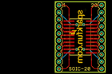
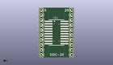
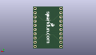
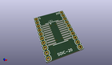

Contents
========

* [PROJ-SPAR-495-STAN-01>SOIC20-DIP Adapter](#proj-spar-495-stan-01soic20-dip-adapter)
	* [Images](#images)
	* [Interactive BOM](#interactive-bom)
	* [OOMP Parts](#oomp-parts)
	* [Tags](#tags)
  
![][im]
# PROJ-SPAR-495-STAN-01>SOIC20-DIP Adapter

- ID: PROJ-SPAR-495-STAN-01
- Hex ID: PRS495
- Name: SOIC20-DIP Adapter
- Description: 

## Images
  
  

|eagleImage|kicadPcb3dFront|kicadPcb3dBack|kicadPcb3d|
| :---: | :---: | :---: | :---: |
|||||

## Interactive BOM

- Interactive BOM page: [ibom.html](kicad/bom/ibom.html)

## OOMP Parts
  

|OOMP Parts|
| :---: |
|<table><tr><td></td><td> JP1</td><td>[HEAD-I01-X-PI10-01 2.54 mm 10 Pin Header](https://github.com/oomlout/oomlout_OOMP_parts/tree/main/HEAD-I01-X-PI10-01/)</td><td>[H10](https://github.com/oomlout/oomlout_OOMP_parts/tree/main/HEAD-I01-X-PI10-01/)</td></tr></table>|
|<table><tr><td></td><td> JP2</td><td>[HEAD-I01-X-PI10-01 2.54 mm 10 Pin Header](https://github.com/oomlout/oomlout_OOMP_parts/tree/main/HEAD-I01-X-PI10-01/)</td><td>[H10](https://github.com/oomlout/oomlout_OOMP_parts/tree/main/HEAD-I01-X-PI10-01/)</td></tr></table>|
|UNMATCHED-UNMATCHED-X-UNMATCHED-01, U$1, 8.889999999999999, 12.7, 270,U$1, SOIC_20, SO20W, SparkFun, (0.35, 0.5), R270|

## Tags

- hexID: PRS495
- oompType: PROJ
- oompSize: SPAR
- oompColor: 495
- oompDesc: STAN
- oompIndex: 01
- oompName: SOIC20-DIP Adapter
- sources: All source files from https://github.com/sparkfun/SOIC20-DIP_Adapter (source licence details in srcLicense.md)
- linkBuyPage: https://www.sparkfun.com/products/495
- oompPart: HEAD-I01-X-PI10-01, JP1, 1.27, 1.27, 90
- oompPart: HEAD-I01-X-PI10-01, JP2, 16.509999999999998, 24.13, 270
- oompPart: UNMATCHED-UNMATCHED-X-UNMATCHED-01, U$1, 8.889999999999999, 12.7, 270
- rawPart: JP1, M100.1, 1X10, SparkFun, (0.05, 0.05), R90
- rawPart: JP2, M100.1, 1X10, SparkFun, (0.65, 0.95), R270
- rawPart: U$1, SOIC_20, SO20W, SparkFun, (0.35, 0.5), R270
- oompID: PROJ-SPAR-495-STAN-01

[im]: kicadPcb3d_450.png
