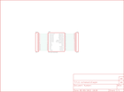

Contents
========

* [PRS496 > SOIC28-DIP Adapter](#prs496--soic28-dip-adapter)
	* [Schematic](#schematic)
	* [PCB](#pcb)
	* [Interactive BOM](#interactive-bom)
	* [Images](#images)
	* [Tags](#tags)
  
![][im]
# PRS496 > SOIC28-DIP Adapter

- ID: PROJ-SPAR-496-STAN-01
- Hex ID: PRS496
- Name: Sparkfun
- Description: Sparkfun
- Long Link: [http://oom.lt/PROJ-SPAR-496-STAN-01](http://oom.lt/PROJ-SPAR-496-STAN-01)
- Short Link: [http://oom.lt/PRS496](http://oom.lt/PRS496)

## Schematic
  

## PCB
  

## Interactive BOM

- Interactive BOM page: [ibom.html](https://htmlpreview.github.io/?https://github.com/oomlout/oomlout_OOMP_projects/blob/main/PROJ-SPAR-496-STAN-01/kicad/bom/ibom.html)

## Images
  
  

|bominteractivefront|bominteractiveback|kicadPcb3d|kicadPcb3dFront|kicadPcb3dBack|eagleImage|eagleSchemImage|pcbdraw|pcbdrawback|
| :---: | :---: | :---: | :---: | :---: | :---: | :---: | :---: | :---: |
||||||||||

## Tags

- hexID: PRS496
- oompType: PROJ
- oompSize: SPAR
- oompColor: 496
- oompDesc: STAN
- oompIndex: 01
- oompName: SOIC28-DIP Adapter
- sources: All source files from https://github.com/sparkfun/SOIC28-DIP_Adapter (source licence details in srcLicense.md)
- linkBuyPage: https://www.sparkfun.com/products/496
- oompID: PROJ-SPAR-496-STAN-01
- rawParts: JP1,M14,M14,1X14,Header 14,,
- rawParts: JP2,M14,M14,1X14,Header 14,,
- rawParts: U$1,LOGO-SFESK,LOGO-SFESK,SFE-LOGO-FLAME,Spark Fun Electronics PCB Logo,,
- rawParts: U$2,LOGO-SFENEW,LOGO-SFENEW,SFE-NEW-WEBLOGO,Spark Fun Electronics PCB Logo,,
- rawParts: U$3,PIC18F2455SMD,PIC18F2455SMD,SO-28W,,,

[im]: kicadPcb3d_450.png
