Contents
========

* [PRS497 > SSOP-DIP Adapter 8-Pin](#prs497--ssop-dip-adapter-8-pin)
	* [Schematic](#schematic)
	* [PCB](#pcb)
	* [Interactive BOM](#interactive-bom)
	* [OOMP Parts](#oomp-parts)
	* [Images](#images)
	* [Tags](#tags)
  
![][im]
# PRS497 > SSOP-DIP Adapter 8-Pin

- ID: PROJ-SPAR-497-STAN-01
- Hex ID: PRS497
- Name: Sparkfun
- Description: Sparkfun
- Long Link: [http://oom.lt/PROJ-SPAR-497-STAN-01](http://oom.lt/PROJ-SPAR-497-STAN-01)
- Short Link: [http://oom.lt/PRS497](http://oom.lt/PRS497)

## Schematic
  
[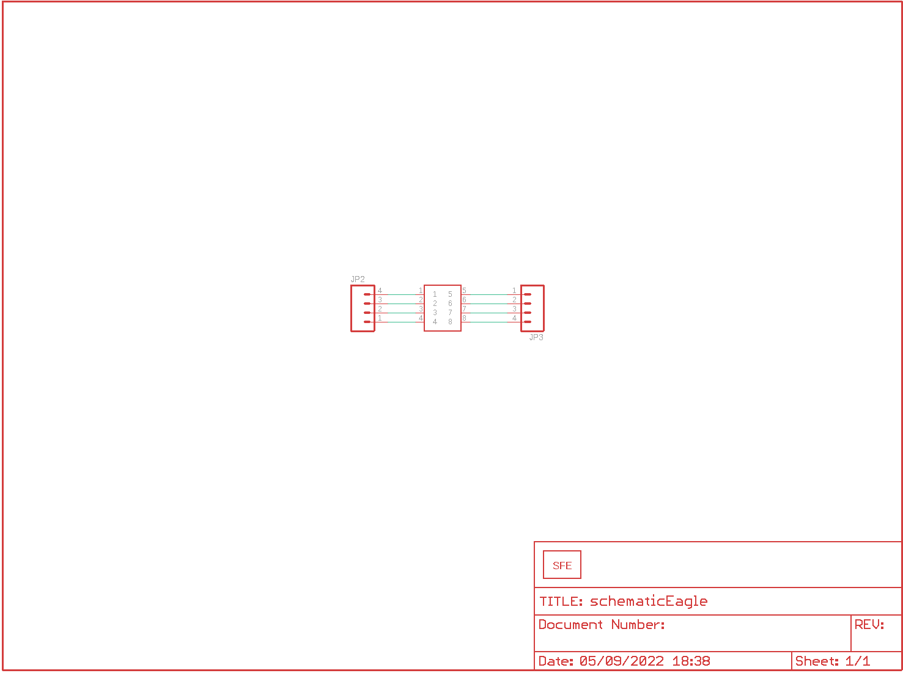](eagleSchemImage.png)
## PCB
  
[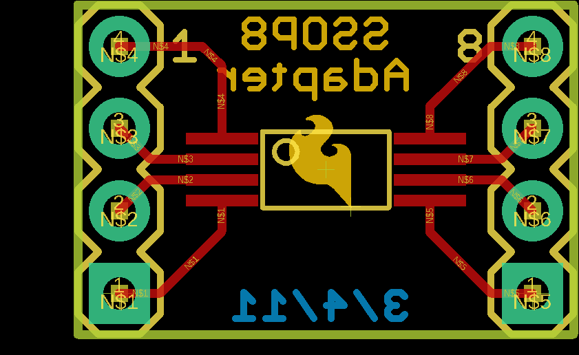](eagleImage.png)
## Interactive BOM

- Interactive BOM page: [ibom.html](https://htmlpreview.github.io/?https://github.com/oomlout/oomlout_OOMP_projects/blob/main/PROJ-SPAR-497-STAN-01/kicad/bom/ibom.html)

## OOMP Parts
  

|OOMP ID|Name|Identifier|
| :---: | :---: | :---: |
|[HEAD-I01-X-PI04-01](https://github.com/oomlout/oomlout_OOMP_parts/tree/main/HEAD-I01-X-PI04-01/)|[2.54 mm 4 Pin Header](https://github.com/oomlout/oomlout_OOMP_parts/tree/main/HEAD-I01-X-PI04-01/)|[JP2, JP3](https://github.com/oomlout/oomlout_OOMP_parts/tree/main/HEAD-I01-X-PI04-01/)|
|UNMATCHED-UNMATCHED-X-UNMATCHED-01||U$1|

## Images
  
  

|bominteractivefront|bominteractiveback|kicadPcb3d|kicadPcb3dFront|kicadPcb3dBack|kicadSchem|eagleImage|eagleSchemImage|pcbdraw|pcbdrawback|
| :---: | :---: | :---: | :---: | :---: | :---: | :---: | :---: | :---: | :---: |
|[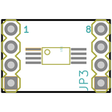](bomFront.png)|[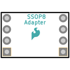](bomBack.png)|[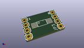](kicadPcb3d.png)|[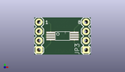](kicadPcb3dFront.png)|[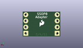](kicadPcb3dBack.png)|[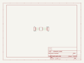](kicadSchem.png)|[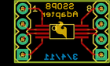](eagleImage.png)|[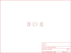](eagleSchemImage.png)|[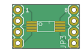](pcbdraw.png)|[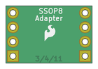](pcbdrawBack.png)|

## Tags

- hexID: PRS497
- oompType: PROJ
- oompSize: SPAR
- oompColor: 497
- oompDesc: STAN
- oompIndex: 01
- oompName: SSOP-DIP Adapter 8-Pin
- sources: All source files from https://github.com/sparkfun/SSOP-DIP_Adapter_8-Pin (source licence details in srcLicense.md)
- linkBuyPage: https://www.sparkfun.com/products/497
- oompID: PROJ-SPAR-497-STAN-01
- oompParts: JP2,HEAD-I01-X-PI04-01
- oompParts: JP3,HEAD-I01-X-PI04-01
- oompParts: U$1,UNMATCHED-UNMATCHED-X-UNMATCHED-01
- rawParts: JP1,LOGO-SFESK,LOGO-SFESK,SFE-LOGO-FLAME,Spark Fun Electronics PCB Logo,,
- rawParts: JP2,,M04PTH,1X04,Header 4,,
- rawParts: JP3,,M04PTH,1X04,Header 4,,
- rawParts: U$1,SSOP8,SSOP8,SSOP8,,,

[im]: kicadPcb3d_450.png
