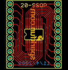
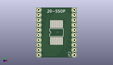
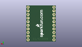
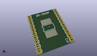

Contents
========

* [PROJ-SPAR-499-STAN-01>SSOP-DIP Adapter 20-Pin](#proj-spar-499-stan-01ssop-dip-adapter-20-pin)
	* [Images](#images)
	* [Interactive BOM](#interactive-bom)
	* [OOMP Parts](#oomp-parts)
	* [Tags](#tags)
  
![][im]
# PROJ-SPAR-499-STAN-01>SSOP-DIP Adapter 20-Pin

- ID: PROJ-SPAR-499-STAN-01
- Hex ID: PRS499
- Name: SSOP-DIP Adapter 20-Pin
- Description: 

## Images
  
  

|eagleImage|kicadPcb3dFront|kicadPcb3dBack|kicadPcb3d|
| :---: | :---: | :---: | :---: |
|||||

## Interactive BOM

- Interactive BOM page: [ibom.html](kicad/bom/ibom.html)

## OOMP Parts
  

|OOMP Parts|
| :---: |
|<table><tr><td></td><td> JP1</td><td>[HEAD-I01-X-PI10-01 2.54 mm 10 Pin Header](https://github.com/oomlout/oomlout_OOMP_parts/tree/main/HEAD-I01-X-PI10-01/)</td><td>[H10](https://github.com/oomlout/oomlout_OOMP_parts/tree/main/HEAD-I01-X-PI10-01/)</td></tr></table>|
|<table><tr><td></td><td> JP2</td><td>[HEAD-I01-X-PI10-01 2.54 mm 10 Pin Header](https://github.com/oomlout/oomlout_OOMP_parts/tree/main/HEAD-I01-X-PI10-01/)</td><td>[H10](https://github.com/oomlout/oomlout_OOMP_parts/tree/main/HEAD-I01-X-PI10-01/)</td></tr></table>|
|UNMATCHED-UNMATCHED-X-UNMATCHED-01, U$1, 10.16, 12.7, 0,U$1, SSOP20, SSOP20-LONG, SparkFun, (0.4, 0.5), R0|

## Tags

- hexID: PRS499
- oompType: PROJ
- oompSize: SPAR
- oompColor: 499
- oompDesc: STAN
- oompIndex: 01
- oompName: SSOP-DIP Adapter 20-Pin
- sources: All source files from https://github.com/sparkfun/SSOP-DIP_Adapter_20-Pin (source licence details in srcLicense.md)
- linkBuyPage: https://www.sparkfun.com/products/499
- oompID: PROJ-SPAR-499-STAN-01
- oompPart: HEAD-I01-X-PI10-01, JP1, 1.27, 1.27, 90
- oompPart: HEAD-I01-X-PI10-01, JP2, 19.049999999999997, 1.27, 90
- oompPart: UNMATCHED-UNMATCHED-X-UNMATCHED-01, U$1, 10.16, 12.7, 0
- rawPart: JP1, M10, 1X10, SparkFun, (0.05, 0.05), R90
- rawPart: JP2, M10, 1X10, SparkFun, (0.75, 0.05), R90
- rawPart: U$1, SSOP20, SSOP20-LONG, SparkFun, (0.4, 0.5), R0

[im]: kicadPcb3d_450.png
