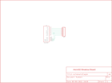

Contents
========

* [PRS544 > microSD Transflash Breakout](#prs544--microsd-transflash-breakout)
	* [Schematic](#schematic)
	* [PCB](#pcb)
	* [OOMP Parts](#oomp-parts)
	* [Images](#images)
	* [Tags](#tags)
  
![][im]
# PRS544 > microSD Transflash Breakout

- ID: PROJ-SPAR-544-STAN-01
- Hex ID: PRS544
- Name: Sparkfun
- Description: Sparkfun
- Long Link: [http://oom.lt/PROJ-SPAR-544-STAN-01](http://oom.lt/PROJ-SPAR-544-STAN-01)
- Short Link: [http://oom.lt/PRS544](http://oom.lt/PRS544)

## Schematic
  

## PCB
  

## OOMP Parts
  

|OOMP ID|Name|Identifier|
| :---: | :---: | :---: |
|[HEAD-I01-X-PI07-01](https://github.com/oomlout/oomlout_OOMP_parts/tree/main/HEAD-I01-X-PI07-01/)|[2.54 mm 7 Pin Header](https://github.com/oomlout/oomlout_OOMP_parts/tree/main/HEAD-I01-X-PI07-01/)|[JP1](https://github.com/oomlout/oomlout_OOMP_parts/tree/main/HEAD-I01-X-PI07-01/)|
|UNMATCHED-UNMATCHED-X-UNMATCHED-01||U1|

## Images
  
  

|kicadPcb3d|kicadPcb3dFront|kicadPcb3dBack|eagleImage|eagleSchemImage|
| :---: | :---: | :---: | :---: | :---: |
||||||

## Tags

- hexID: PRS544
- oompType: PROJ
- oompSize: SPAR
- oompColor: 544
- oompDesc: STAN
- oompIndex: 01
- oompName: microSD Transflash Breakout
- sources: All source files from https://github.com/sparkfun/microSD_Transflash_Breakout (source licence details in srcLicense.md)
- linkBuyPage: https://www.sparkfun.com/products/544
- oompID: PROJ-SPAR-544-STAN-01
- oompParts: JP1,HEAD-I01-X-PI07-01
- oompParts: U1,UNMATCHED-UNMATCHED-X-UNMATCHED-01
- rawParts: JP1,,M07,1X07,Header 7,,
- rawParts: U$1,LOGO-SFENEW,LOGO-SFENEW,SFE-NEW-WEBLOGO,Spark Fun Electronics PCB Logo,,
- rawParts: U1,microSD,USD-SOCKETSMD,MICRO-SD-SOCKET-PP,microSD Socket,,

[im]: kicadPcb3d_450.png
