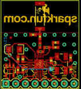
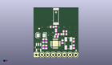
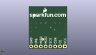
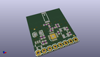

Contents
========

* [PROJ-SPAR-691-STAN-01>Transceiver Breakout-nRF24L01](#proj-spar-691-stan-01transceiver-breakout-nrf24l01)
	* [Images](#images)
	* [Interactive BOM](#interactive-bom)
	* [Tags](#tags)
  
![][im]
# PROJ-SPAR-691-STAN-01>Transceiver Breakout-nRF24L01

- ID: PROJ-SPAR-691-STAN-01
- Hex ID: PRS691
- Name: Transceiver Breakout-nRF24L01
- Description: 

## Images
  
  

|eagleImage|kicadPcb3dFront|kicadPcb3dBack|kicadPcb3d|
| :---: | :---: | :---: | :---: |
|||||

## Interactive BOM

- Interactive BOM page: [ibom.html](kicad/bom/ibom.html)

## Tags

- hexID: PRS691
- oompType: PROJ
- oompSize: SPAR
- oompColor: 691
- oompDesc: STAN
- oompIndex: 01
- oompName: Transceiver Breakout-nRF24L01
- sources: All source files from https://github.com/sparkfun/Transceiver_Breakout-nRF24L01 (source licence details in srcLicense.md)
- linkBuyPage: https://www.sparkfun.com/products/691
- oompID: PROJ-SPAR-691-STAN-01

[im]: kicadPcb3d_450.png
