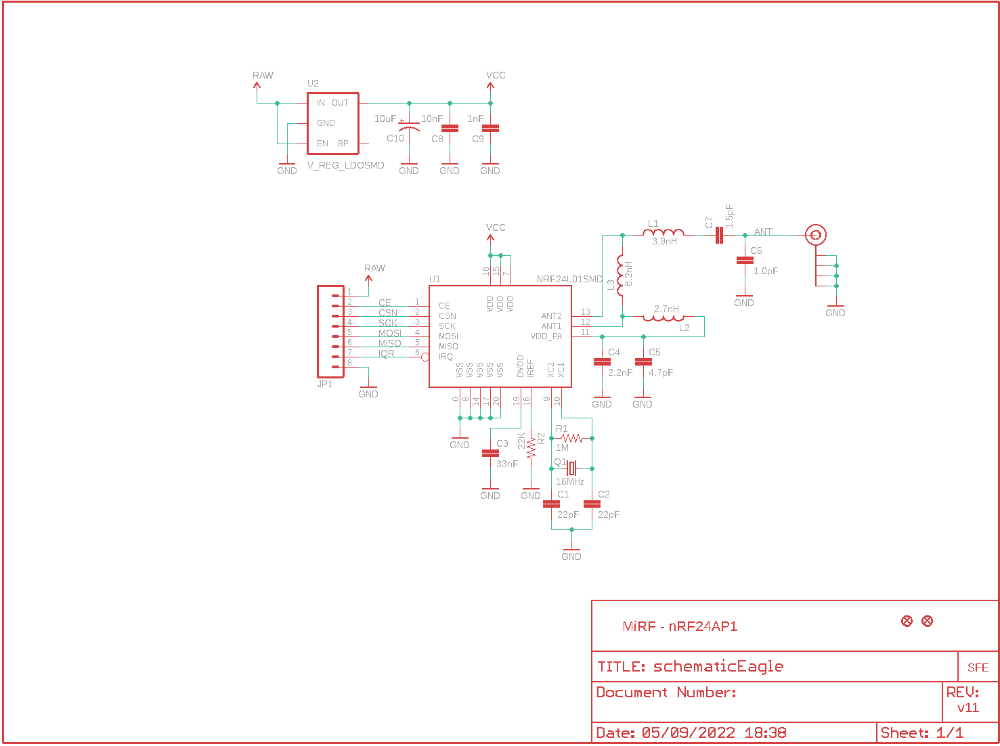
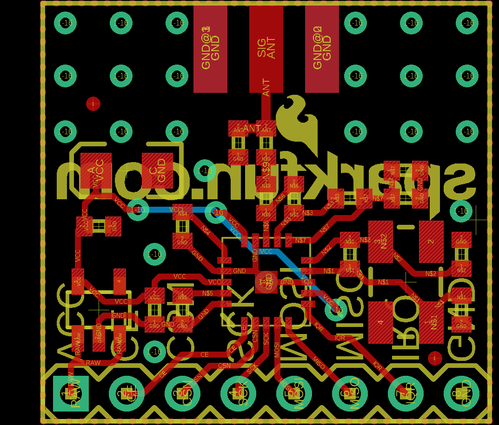
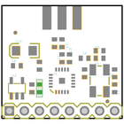
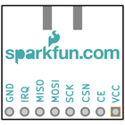
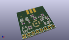
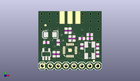
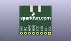
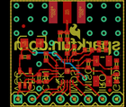
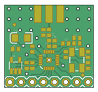
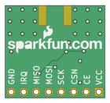

Contents
========

* [PRS705 > Transceiver Breakout-nRF24L01 RP-SMA](#prs705--transceiver-breakout-nrf24l01-rp-sma)
	* [Schematic](#schematic)
	* [PCB](#pcb)
	* [Interactive BOM](#interactive-bom)
	* [OOMP Parts](#oomp-parts)
	* [Images](#images)
	* [Tags](#tags)
  
![][im]
# PRS705 > Transceiver Breakout-nRF24L01 RP-SMA

- ID: PROJ-SPAR-705-STAN-01
- Hex ID: PRS705
- Name: Sparkfun
- Description: Sparkfun
- Long Link: [http://oom.lt/PROJ-SPAR-705-STAN-01](http://oom.lt/PROJ-SPAR-705-STAN-01)
- Short Link: [http://oom.lt/PRS705](http://oom.lt/PRS705)

## Schematic
  

## PCB
  

## Interactive BOM

- Interactive BOM page: [ibom.html](https://htmlpreview.github.io/?https://github.com/oomlout/oomlout_OOMP_projects/blob/main/PROJ-SPAR-705-STAN-01/kicad/bom/ibom.html)

## OOMP Parts
  

|OOMP ID|Name|Identifier|
| :---: | :---: | :---: |
|[CAPC-0402-X-PF22-V50](https://github.com/oomlout/oomlout_OOMP_parts/tree/main/CAPC-0402-X-PF22-V50/)|[SMD (0402) 22 pF Capacitor (Ceramic) 50v](https://github.com/oomlout/oomlout_OOMP_parts/tree/main/CAPC-0402-X-PF22-V50/)|[C1, C2](https://github.com/oomlout/oomlout_OOMP_parts/tree/main/CAPC-0402-X-PF22-V50/)|
|CAPC-0402-X-NF33-01||C3|
|[CAPC-0402-X-PF22D-V50](https://github.com/oomlout/oomlout_OOMP_parts/tree/main/CAPC-0402-X-PF22D-V50/)|[SMD (0402) 2.2 pF Capacitor (Ceramic) 50v](https://github.com/oomlout/oomlout_OOMP_parts/tree/main/CAPC-0402-X-PF22D-V50/)|[C4](https://github.com/oomlout/oomlout_OOMP_parts/tree/main/CAPC-0402-X-PF22D-V50/)|
|CAPC-0402-X-PF47D-01||C5|
|CAPC-0402-X-UNMATCHED-01||C6|
|[CAPC-0402-X-PF15D-V50](https://github.com/oomlout/oomlout_OOMP_parts/tree/main/CAPC-0402-X-PF15D-V50/)|[SMD (0402) 1.5 pF Capacitor (Ceramic) 50v](https://github.com/oomlout/oomlout_OOMP_parts/tree/main/CAPC-0402-X-PF15D-V50/)|[C7](https://github.com/oomlout/oomlout_OOMP_parts/tree/main/CAPC-0402-X-PF15D-V50/)|
|[CAPC-0402-X-NF10-V50](https://github.com/oomlout/oomlout_OOMP_parts/tree/main/CAPC-0402-X-NF10-V50/)|[SMD (0402) 10 nF Capacitor (Ceramic) 50v](https://github.com/oomlout/oomlout_OOMP_parts/tree/main/CAPC-0402-X-NF10-V50/)|[C8](https://github.com/oomlout/oomlout_OOMP_parts/tree/main/CAPC-0402-X-NF10-V50/)|
|[CAPC-0402-X-NF1-V50](https://github.com/oomlout/oomlout_OOMP_parts/tree/main/CAPC-0402-X-NF1-V50/)|[SMD (0402) 1 nF Capacitor (Ceramic) 50v](https://github.com/oomlout/oomlout_OOMP_parts/tree/main/CAPC-0402-X-NF1-V50/)|[C9](https://github.com/oomlout/oomlout_OOMP_parts/tree/main/CAPC-0402-X-NF1-V50/)|
|CAPT-3216-X-UF10-01||C10|
|UNMATCHED-UNMATCHED-X-UNMATCHED-01||J$1, Q1, U1|
|[HEAD-I01-X-PI08-01](https://github.com/oomlout/oomlout_OOMP_parts/tree/main/HEAD-I01-X-PI08-01/)|[2.54 mm 8 Pin Header](https://github.com/oomlout/oomlout_OOMP_parts/tree/main/HEAD-I01-X-PI08-01/)|[JP1](https://github.com/oomlout/oomlout_OOMP_parts/tree/main/HEAD-I01-X-PI08-01/)|
|UNMATCHED-0402-X-UNMATCHED-01||L1, L2, L3|
|[RESE-0402-X-O105-01](https://github.com/oomlout/oomlout_OOMP_parts/tree/main/RESE-0402-X-O105-01/)|[SMD (0402) 1M Ohm Resistor](https://github.com/oomlout/oomlout_OOMP_parts/tree/main/RESE-0402-X-O105-01/)|[R1](https://github.com/oomlout/oomlout_OOMP_parts/tree/main/RESE-0402-X-O105-01/)|
|RESE-0402-X-O223-01||R2|
|UNMATCHED-SO235-X-UNMATCHED-01||U2|

## Images
  
  

|bominteractivefront|bominteractiveback|kicadPcb3d|kicadPcb3dFront|kicadPcb3dBack|eagleImage|eagleSchemImage|pcbdraw|pcbdrawback|
| :---: | :---: | :---: | :---: | :---: | :---: | :---: | :---: | :---: |
||||||||||

## Tags

- hexID: PRS705
- oompType: PROJ
- oompSize: SPAR
- oompColor: 705
- oompDesc: STAN
- oompIndex: 01
- oompName: Transceiver Breakout-nRF24L01 RP-SMA
- sources: All source files from https://github.com/sparkfun/Transceiver_Breakout-nRF24L01_RP-SMA (source licence details in srcLicense.md)
- linkBuyPage: https://www.sparkfun.com/products/705
- oompID: PROJ-SPAR-705-STAN-01
- oompParts: C1,CAPC-0402-X-PF22-V50
- oompParts: C2,CAPC-0402-X-PF22-V50
- oompParts: C3,CAPC-0402-X-NF33-01
- oompParts: C4,CAPC-0402-X-PF22D-V50
- oompParts: C5,CAPC-0402-X-PF47D-01
- oompParts: C6,CAPC-0402-X-UNMATCHED-01
- oompParts: C7,CAPC-0402-X-PF15D-V50
- oompParts: C8,CAPC-0402-X-NF10-V50
- oompParts: C9,CAPC-0402-X-NF1-V50
- oompParts: C10,CAPT-3216-X-UF10-01
- oompParts: J$1,UNMATCHED-UNMATCHED-X-UNMATCHED-01
- oompParts: JP1,HEAD-I01-X-PI08-01
- oompParts: L1,UNMATCHED-0402-X-UNMATCHED-01
- oompParts: L2,UNMATCHED-0402-X-UNMATCHED-01
- oompParts: L3,UNMATCHED-0402-X-UNMATCHED-01
- oompParts: Q1,UNMATCHED-UNMATCHED-X-UNMATCHED-01
- oompParts: R1,RESE-0402-X-O105-01
- oompParts: R2,RESE-0402-X-O223-01
- oompParts: U1,UNMATCHED-UNMATCHED-X-UNMATCHED-01
- oompParts: U2,UNMATCHED-SO235-X-UNMATCHED-01
- rawParts: C1,22pF,CAP0402,C0402,Capacitor,,
- rawParts: C2,22pF,CAP0402,C0402,Capacitor,,
- rawParts: C3,33nF,CAP0402,C0402,Capacitor,,
- rawParts: C4,2.2nF,CAP0402,C0402,Capacitor,,
- rawParts: C5,4.7pF,CAP0402,C0402,Capacitor,,
- rawParts: C6,1.0pF,CAP0402,C0402,Capacitor,,
- rawParts: C7,1.5pF,CAP0402,C0402,Capacitor,,
- rawParts: C8,10nF,CAP0402,C0402,Capacitor,,
- rawParts: C9,1nF,CAP0402,C0402,Capacitor,,
- rawParts: C10,10uF,CAP_POL1206,EIA3216,Capacitor Polarized,,
- rawParts: FID1,FIDUCIALUFIDUCIAL,FIDUCIALUFIDUCIAL,MICRO-FIDUCIAL,Fiducial Alignment Points,,
- rawParts: FID2,FIDUCIALUFIDUCIAL,FIDUCIALUFIDUCIAL,MICRO-FIDUCIAL,Fiducial Alignment Points,,
- rawParts: J$1,SMA_EDGE,SMA_EDGE,SMA-EDGE,SMA Antenna Connector,,
- rawParts: JP1,,M08,1X08,Header 8,,
- rawParts: L1,3.9nH,INDUCTOR0402,C0402,Inductors,,
- rawParts: L2,2.7nH,INDUCTOR0402,C0402,Inductors,,
- rawParts: L3,8.2nH,INDUCTOR0402,C0402,Inductors,,
- rawParts: Q1,16MHz,CRYSTAL5X3,CRYSTAL-SMD-5X3,Crystals,,
- rawParts: R1,1M,RESISTOR0402,C0402,Resistor,,
- rawParts: R2,22K,RESISTOR0402,C0402,Resistor,,
- rawParts: U$5,LOGO-SFENEW,LOGO-SFENEW,SFE-NEW-WEBLOGO,Spark Fun Electronics PCB Logo,,
- rawParts: U1,NRF24L01SMD,NRF24L01SMD,QFN20,2.4GHz Low Power Transceiver,,
- rawParts: U2,V_REG_LDOSMD,V_REG_LDOSMD,SOT23-5,Voltage Regulator LDO,,

[im]: kicadPcb3d_450.png
