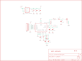

Contents
========

* [PRS705 > Sparkfun](#prs705--sparkfun)
	* [Images](#images)
	* [Tags](#tags)
  
![][im]
# PRS705 > Sparkfun

- ID: PROJ-SPAR-705-STAN-01
- Hex ID: PRS705
- Name: Sparkfun
- Description: Sparkfun

## Images
  
  

|kicadPcb3d|kicadPcb3dFront|kicadPcb3dBack|eagleImage|eagleSchemImage|
| :---: | :---: | :---: | :---: | :---: |
||||||

## Tags

- hexID: PRS705
- oompType: PROJ
- oompSize: SPAR
- oompColor: 705
- oompDesc: STAN
- oompIndex: 01
- oompName: Transceiver Breakout-nRF24L01 RP-SMA
- sources: All source files from https://github.com/sparkfun/Transceiver_Breakout-nRF24L01_RP-SMA (source licence details in srcLicense.md)
- linkBuyPage: https://www.sparkfun.com/products/705
- oompID: PROJ-SPAR-705-STAN-01

[im]: kicadPcb3d_450.png
