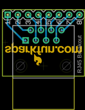

Contents
========

* [PROJ-SPAR-716-STAN-01>RJ45 Breakout](#proj-spar-716-stan-01rj45-breakout)
	* [Images](#images)
	* [Tags](#tags)
  
![][im]
# PROJ-SPAR-716-STAN-01>RJ45 Breakout

- ID: PROJ-SPAR-716-STAN-01
- Hex ID: PRS716
- Name: RJ45 Breakout
- Description: 

## Images
  
  

|eagleImage|kicadPcb3dFront|kicadPcb3dBack|kicadPcb3d|
| :---: | :---: | :---: | :---: |
|||||

## Tags

- hexID: PRS716
- oompType: PROJ
- oompSize: SPAR
- oompColor: 716
- oompDesc: STAN
- oompIndex: 01
- oompName: RJ45 Breakout
- sources: All source files from https://github.com/sparkfun/RJ45_Breakout (source licence details in srcLicense.md)
- linkBuyPage: https://www.sparkfun.com/products/716
- oompID: PROJ-SPAR-716-STAN-01

[im]: kicadPcb3d_450.png
