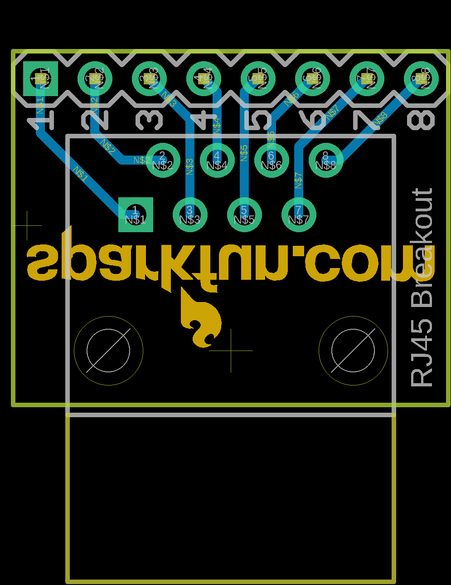
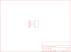

Contents
========

* [PRS716 > RJ45 Breakout](#prs716--rj45-breakout)
	* [Schematic](#schematic)
	* [PCB](#pcb)
	* [Images](#images)
	* [Tags](#tags)
  
![][im]
# PRS716 > RJ45 Breakout

- ID: PROJ-SPAR-716-STAN-01
- Hex ID: PRS716
- Name: Sparkfun
- Description: Sparkfun
- Long Link: [http://oom.lt/PROJ-SPAR-716-STAN-01](http://oom.lt/PROJ-SPAR-716-STAN-01)
- Short Link: [http://oom.lt/PRS716](http://oom.lt/PRS716)

## Schematic
  

## PCB
  

## Images
  
  

|kicadPcb3d|kicadPcb3dFront|kicadPcb3dBack|eagleImage|eagleSchemImage|
| :---: | :---: | :---: | :---: | :---: |
||||||

## Tags

- hexID: PRS716
- oompType: PROJ
- oompSize: SPAR
- oompColor: 716
- oompDesc: STAN
- oompIndex: 01
- oompName: RJ45 Breakout
- sources: All source files from https://github.com/sparkfun/RJ45_Breakout (source licence details in srcLicense.md)
- linkBuyPage: https://www.sparkfun.com/products/716
- oompID: PROJ-SPAR-716-STAN-01
- rawParts: JP1,,M08,1X08,Header 8,,
- rawParts: U1,RJ45,RJ45-8PTH,RJ45-8,RJ45 Jack,,

[im]: kicadPcb3d_450.png
