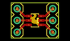
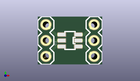
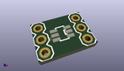

Contents
========

* [PROJ-SPAR-717-STAN-01>SOT23 DIP Adapter](#proj-spar-717-stan-01sot23-dip-adapter)
	* [Images](#images)
	* [Interactive BOM](#interactive-bom)
	* [OOMP Parts](#oomp-parts)
	* [Tags](#tags)
  
![][im]
# PROJ-SPAR-717-STAN-01>SOT23 DIP Adapter

- ID: PROJ-SPAR-717-STAN-01
- Hex ID: PRS717
- Name: SOT23 DIP Adapter
- Description: 

## Images
  
  

|eagleImage|kicadPcb3dFront|kicadPcb3dBack|kicadPcb3d|
| :---: | :---: | :---: | :---: |
|||||

## Interactive BOM

- Interactive BOM page: [ibom.html](kicad/bom/ibom.html)

## OOMP Parts
  

|OOMP Parts|
| :---: |
|UNMATCHED-UNMATCHED-X-UNMATCHED-01, JP1, 8.889999999999999, 6.35, 270,JP1, 1X03, SparkFun, (0.35, 0.25), R270|
|UNMATCHED-UNMATCHED-X-UNMATCHED-01, JP2, 1.27, 1.27, 90,JP2, 1X03, SparkFun, (0.05, 0.05), R90|
|UNMATCHED-UNMATCHED-X-UNMATCHED-01, U1, 5.08, 3.8099999999999996, 90,U1, SOT23, SOT23-6, SparkFun, (0.2, 0.15), R90|

## Tags

- hexID: PRS717
- oompType: PROJ
- oompSize: SPAR
- oompColor: 717
- oompDesc: STAN
- oompIndex: 01
- oompName: SOT23 DIP Adapter
- sources: All source files from https://github.com/sparkfun/SOT23_DIP_Adapter (source licence details in srcLicense.md)
- linkBuyPage: https://www.sparkfun.com/products/717
- oompPart: UNMATCHED-UNMATCHED-X-UNMATCHED-01, JP1, 8.889999999999999, 6.35, 270
- oompPart: UNMATCHED-UNMATCHED-X-UNMATCHED-01, JP2, 1.27, 1.27, 90
- oompPart: UNMATCHED-UNMATCHED-X-UNMATCHED-01, U1, 5.08, 3.8099999999999996, 90
- rawPart: JP1, 1X03, SparkFun, (0.35, 0.25), R270
- rawPart: JP2, 1X03, SparkFun, (0.05, 0.05), R90
- rawPart: U1, SOT23, SOT23-6, SparkFun, (0.2, 0.15), R90

[im]: kicadPcb3d_450.png
