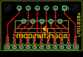
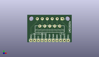
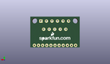
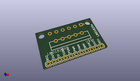

Contents
========

* [PROJ-SPAR-747-STAN-01>LMD1820x Breakout](#proj-spar-747-stan-01lmd1820x-breakout)
	* [Images](#images)
	* [Interactive BOM](#interactive-bom)
	* [OOMP Parts](#oomp-parts)
	* [Tags](#tags)
  
![][im]
# PROJ-SPAR-747-STAN-01>LMD1820x Breakout

- ID: PROJ-SPAR-747-STAN-01
- Hex ID: PRS747
- Name: LMD1820x Breakout
- Description: 

## Images
  
  

|eagleImage|kicadPcb3dFront|kicadPcb3dBack|kicadPcb3d|
| :---: | :---: | :---: | :---: |
|||||

## Interactive BOM

- Interactive BOM page: [ibom.html](kicad/bom/ibom.html)

## OOMP Parts
  

|OOMP Parts|
| :---: |
|HEAD-I01-X-PI11-01, JP1, 27.94, 1.27, 180,JP1, M11PTH, 1X11, SparkFun, (1.1, 0.05), R180|
|UNMATCHED-UNMATCHED-X-UNMATCHED-01, U$1, 25.4, 11.43, 180,U$1, LMD1820X, TO-220-11LEAD, SparkFun, (1, 0.45), R180|

## Tags

- hexID: PRS747
- oompType: PROJ
- oompSize: SPAR
- oompColor: 747
- oompDesc: STAN
- oompIndex: 01
- oompName: LMD1820x Breakout
- sources: All source files from https://github.com/sparkfun/LMD1820x_Breakout (source licence details in srcLicense.md)
- linkBuyPage: https://www.sparkfun.com/products/747
- oompID: PROJ-SPAR-747-STAN-01
- oompPart: HEAD-I01-X-PI11-01, JP1, 27.94, 1.27, 180
- oompPart: UNMATCHED-UNMATCHED-X-UNMATCHED-01, U$1, 25.4, 11.43, 180
- rawPart: JP1, M11PTH, 1X11, SparkFun, (1.1, 0.05), R180
- rawPart: U$1, LMD1820X, TO-220-11LEAD, SparkFun, (1, 0.45), R180

[im]: kicadPcb3d_450.png
