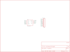

Contents
========

* [PRS747 > LMD1820x Breakout](#prs747--lmd1820x-breakout)
	* [Schematic](#schematic)
	* [PCB](#pcb)
	* [Interactive BOM](#interactive-bom)
	* [Images](#images)
	* [Tags](#tags)
  
![][im]
# PRS747 > LMD1820x Breakout

- ID: PROJ-SPAR-747-STAN-01
- Hex ID: PRS747
- Name: Sparkfun
- Description: Sparkfun
- Long Link: [http://oom.lt/PROJ-SPAR-747-STAN-01](http://oom.lt/PROJ-SPAR-747-STAN-01)
- Short Link: [http://oom.lt/PRS747](http://oom.lt/PRS747)

## Schematic
  

## PCB
  

## Interactive BOM

- Interactive BOM page: [ibom.html](https://htmlpreview.github.io/?https://github.com/oomlout/oomlout_OOMP_projects/blob/main/PROJ-SPAR-747-STAN-01/kicad/bom/ibom.html)

## Images
  
  

|bominteractivefront|bominteractiveback|kicadPcb3d|kicadPcb3dFront|kicadPcb3dBack|eagleImage|eagleSchemImage|pcbdraw|pcbdrawback|
| :---: | :---: | :---: | :---: | :---: | :---: | :---: | :---: | :---: |
||||||||||

## Tags

- hexID: PRS747
- oompType: PROJ
- oompSize: SPAR
- oompColor: 747
- oompDesc: STAN
- oompIndex: 01
- oompName: LMD1820x Breakout
- sources: All source files from https://github.com/sparkfun/LMD1820x_Breakout (source licence details in srcLicense.md)
- linkBuyPage: https://www.sparkfun.com/products/747
- oompID: PROJ-SPAR-747-STAN-01
- rawParts: JP1,M11PTH,M11PTH,1X11,Header 11,,
- rawParts: JP2,STAND-OFF,STAND-OFF,STAND-OFF,Stand Off,,
- rawParts: JP3,STAND-OFF,STAND-OFF,STAND-OFF,Stand Off,,
- rawParts: JP5,LOGO-SFENEW,LOGO-SFENEW,SFE-NEW-WEBLOGO,Spark Fun Electronics PCB Logo,,
- rawParts: U$1,LMD1820X,LMD1820X,TO-220-11LEAD,LMD1820X H-Bridge - BOB-00747,,

[im]: kicadPcb3d_450.png
