Contents
========

* [PRS759 > LED Matrix Serial Interface RedGreen](#prs759--led-matrix-serial-interface-redgreen)
	* [Schematic](#schematic)
	* [PCB](#pcb)
	* [Interactive BOM](#interactive-bom)
	* [OOMP Parts](#oomp-parts)
	* [Images](#images)
	* [Tags](#tags)
  
![][im]
# PRS759 > LED Matrix Serial Interface RedGreen

- ID: PROJ-SPAR-759-STAN-01
- Hex ID: PRS759
- Name: Sparkfun
- Description: Sparkfun
- Long Link: [http://oom.lt/PROJ-SPAR-759-STAN-01](http://oom.lt/PROJ-SPAR-759-STAN-01)
- Short Link: [http://oom.lt/PRS759](http://oom.lt/PRS759)

## Schematic
  
[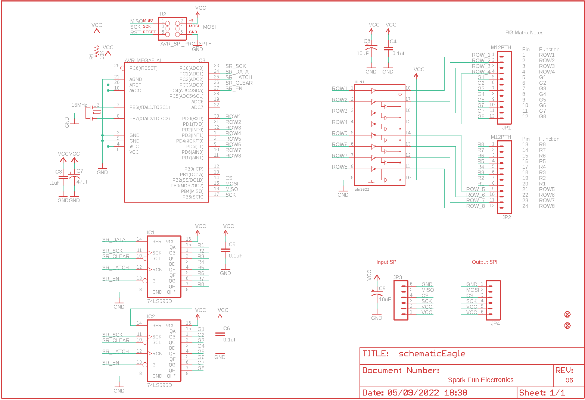](eagleSchemImage.png)
## PCB
  
[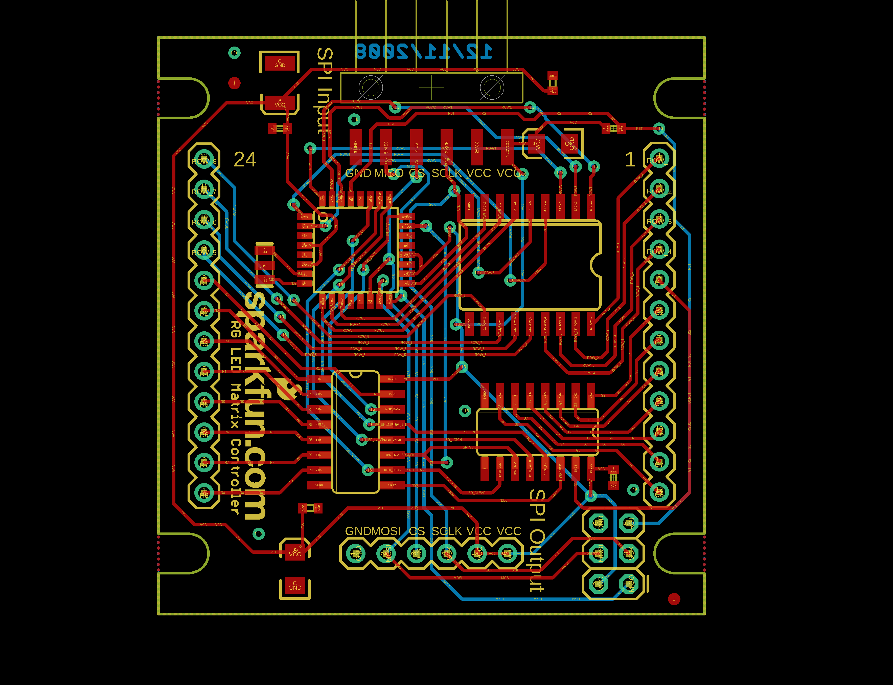](eagleImage.png)
## Interactive BOM

- Interactive BOM page: [ibom.html](https://htmlpreview.github.io/?https://github.com/oomlout/oomlout_OOMP_projects/blob/main/PROJ-SPAR-759-STAN-01/kicad/bom/ibom.html)

## OOMP Parts
  

|OOMP ID|Name|Identifier|
| :---: | :---: | :---: |
|[CAPC-0402-X-NF100-V10](https://github.com/oomlout/oomlout_OOMP_parts/tree/main/CAPC-0402-X-NF100-V10/)|[SMD (0402) 100 nF Capacitor (Ceramic) 10v](https://github.com/oomlout/oomlout_OOMP_parts/tree/main/CAPC-0402-X-NF100-V10/)|[C3, C4, C5, C6](https://github.com/oomlout/oomlout_OOMP_parts/tree/main/CAPC-0402-X-NF100-V10/)|
|CAPX-3528-X-UF47-01||C7|
|CAPT-3216-X-UF10-01||C8, C9|
|UNMATCHED-UNMATCHED-X-UNMATCHED-01||IC1, IC2, IC3, U2, U3, ULN1|
|[HEAD-I01-X-PI12-01](https://github.com/oomlout/oomlout_OOMP_parts/tree/main/HEAD-I01-X-PI12-01/)|[2.54 mm 12 Pin Header](https://github.com/oomlout/oomlout_OOMP_parts/tree/main/HEAD-I01-X-PI12-01/)|[JP1, JP2](https://github.com/oomlout/oomlout_OOMP_parts/tree/main/HEAD-I01-X-PI12-01/)|
|[HEAD-I01-X-PI06-01](https://github.com/oomlout/oomlout_OOMP_parts/tree/main/HEAD-I01-X-PI06-01/)|[2.54 mm 6 Pin Header](https://github.com/oomlout/oomlout_OOMP_parts/tree/main/HEAD-I01-X-PI06-01/)|[JP3, JP4](https://github.com/oomlout/oomlout_OOMP_parts/tree/main/HEAD-I01-X-PI06-01/)|
|[RESE-0402-X-O103-01](https://github.com/oomlout/oomlout_OOMP_parts/tree/main/RESE-0402-X-O103-01/)|[SMD (0402) 10k Ohm Resistor](https://github.com/oomlout/oomlout_OOMP_parts/tree/main/RESE-0402-X-O103-01/)|[R1](https://github.com/oomlout/oomlout_OOMP_parts/tree/main/RESE-0402-X-O103-01/)|

## Images
  
  

|bominteractivefront|bominteractiveback|kicadPcb3d|kicadPcb3dFront|kicadPcb3dBack|eagleImage|eagleSchemImage|pcbdraw|pcbdrawback|
| :---: | :---: | :---: | :---: | :---: | :---: | :---: | :---: | :---: |
|[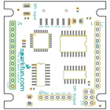](bomFront.png)|[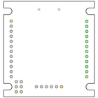](bomBack.png)|[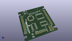](kicadPcb3d.png)|[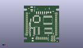](kicadPcb3dFront.png)|[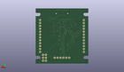](kicadPcb3dBack.png)|[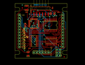](eagleImage.png)|[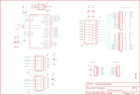](eagleSchemImage.png)|[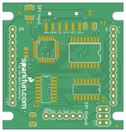](pcbdraw.png)|[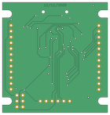](pcbdrawBack.png)|

## Tags

- hexID: PRS759
- oompType: PROJ
- oompSize: SPAR
- oompColor: 759
- oompDesc: STAN
- oompIndex: 01
- oompName: LED Matrix Serial Interface RedGreen
- sources: All source files from https://github.com/sparkfun/LED_Matrix_Serial_Interface_RedGreen (source licence details in srcLicense.md)
- linkBuyPage: https://www.sparkfun.com/products/759
- oompID: PROJ-SPAR-759-STAN-01
- oompParts: C3,CAPC-0402-X-NF100-V10
- oompParts: C4,CAPC-0402-X-NF100-V10
- oompParts: C5,CAPC-0402-X-NF100-V10
- oompParts: C6,CAPC-0402-X-NF100-V10
- oompParts: C7,CAPX-3528-X-UF47-01
- oompParts: C8,CAPT-3216-X-UF10-01
- oompParts: C9,CAPT-3216-X-UF10-01
- oompParts: IC1,UNMATCHED-UNMATCHED-X-UNMATCHED-01
- oompParts: IC2,UNMATCHED-UNMATCHED-X-UNMATCHED-01
- oompParts: IC3,UNMATCHED-UNMATCHED-X-UNMATCHED-01
- oompParts: JP1,HEAD-I01-X-PI12-01
- oompParts: JP2,HEAD-I01-X-PI12-01
- oompParts: JP3,HEAD-I01-X-PI06-01
- oompParts: JP4,HEAD-I01-X-PI06-01
- oompParts: R1,RESE-0402-X-O103-01
- oompParts: U2,UNMATCHED-UNMATCHED-X-UNMATCHED-01
- oompParts: U3,UNMATCHED-UNMATCHED-X-UNMATCHED-01
- oompParts: ULN1,UNMATCHED-UNMATCHED-X-UNMATCHED-01
- rawParts: C3,.1uf,CAP0402,C0402,Capacitor,,
- rawParts: C4,0.1uf,CAP0402,C0402,Capacitor,,
- rawParts: C5,0.1uF,CAP0402,C0402,Capacitor,,
- rawParts: C6,0.1uf,CAP0402,C0402,Capacitor,,
- rawParts: C7,47uF,CAP_POL3528,EIA3528,Capacitor Polarized,,
- rawParts: C8,10uF,CAP_POL1206,EIA3216,Capacitor Polarized,,
- rawParts: C9,10uF,CAP_POL1206,EIA3216,Capacitor Polarized,,
- rawParts: IC1,74LS595D,74LS595D,SO16,8-bit SHIFT REGISTER, output latch,,
- rawParts: IC2,74LS595D,74LS595D,SO16,8-bit SHIFT REGISTER, output latch,,
- rawParts: IC3,AVR-MEGA8-AI,AVR-MEGA8-AI,TQFP32-08,MICROCONTROLLER,,
- rawParts: JP1,M12PTH,M12PTH,1X12,Header 12,,
- rawParts: JP2,M12PTH,M12PTH,1X12,Header 12,,
- rawParts: JP3,,M06SMD,1X06-SMD,Header 6,,
- rawParts: JP4,,M06SIP,1X06,Header 6,,
- rawParts: R1,10K,RESISTOR0402,C0402,Resistor,,
- rawParts: U$1,FIDUCIAL1X2,FIDUCIAL1X2,FIDUCIAL-1X2,Fiducial Alignment Points,,
- rawParts: U$3,FIDUCIAL1X2,FIDUCIAL1X2,FIDUCIAL-1X2,Fiducial Alignment Points,,
- rawParts: U2,AVR_SPI_PRG_6PTH,AVR_SPI_PRG_6PTH,2X3,AVR ISP 6 Pin,,
- rawParts: U3,16MHz,RESONATORSMD,RESONATOR-SMD,Resonator,,
- rawParts: ULN1,uln2803,ULN2803SOICW,SO18L,Darlington Driver,,

[im]: kicadPcb3d_450.png
