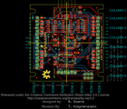
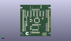
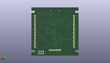
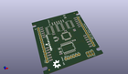

Contents
========

* [PROJ-SPAR-760-STAN-01>LED Matrix Serial Interface RGB](#proj-spar-760-stan-01led-matrix-serial-interface-rgb)
	* [Images](#images)
	* [Interactive BOM](#interactive-bom)
	* [OOMP Parts](#oomp-parts)
	* [Tags](#tags)
  
![][im]
# PROJ-SPAR-760-STAN-01>LED Matrix Serial Interface RGB

- ID: PROJ-SPAR-760-STAN-01
- Hex ID: PRS760
- Name: LED Matrix Serial Interface RGB
- Description: 

## Images
  
  

|eagleImage|kicadPcb3dFront|kicadPcb3dBack|kicadPcb3d|
| :---: | :---: | :---: | :---: |
|||||

## Interactive BOM

- Interactive BOM page: [ibom.html](kicad/bom/ibom.html)

## OOMP Parts
  

|OOMP Parts|
| :---: |
|<table><tr><td></td><td> C3</td><td>[CAPC-0603-X-NF100-V50 SMD (0603) 100 nF Capacitor (Ceramic) 50v](https://github.com/oomlout/oomlout_OOMP_parts/tree/main/CAPC-0603-X-NF100-V50/)</td><td>[C6N100](https://github.com/oomlout/oomlout_OOMP_parts/tree/main/CAPC-0603-X-NF100-V50/)</td></tr></table>|
|<table><tr><td></td><td> C4</td><td>[CAPC-0603-X-NF100-V50 SMD (0603) 100 nF Capacitor (Ceramic) 50v](https://github.com/oomlout/oomlout_OOMP_parts/tree/main/CAPC-0603-X-NF100-V50/)</td><td>[C6N100](https://github.com/oomlout/oomlout_OOMP_parts/tree/main/CAPC-0603-X-NF100-V50/)</td></tr></table>|
|<table><tr><td></td><td> C5</td><td>[CAPC-0603-X-NF100-V50 SMD (0603) 100 nF Capacitor (Ceramic) 50v](https://github.com/oomlout/oomlout_OOMP_parts/tree/main/CAPC-0603-X-NF100-V50/)</td><td>[C6N100](https://github.com/oomlout/oomlout_OOMP_parts/tree/main/CAPC-0603-X-NF100-V50/)</td></tr></table>|
|<table><tr><td></td><td> C6</td><td>[CAPC-0603-X-NF100-V50 SMD (0603) 100 nF Capacitor (Ceramic) 50v](https://github.com/oomlout/oomlout_OOMP_parts/tree/main/CAPC-0603-X-NF100-V50/)</td><td>[C6N100](https://github.com/oomlout/oomlout_OOMP_parts/tree/main/CAPC-0603-X-NF100-V50/)</td></tr></table>|
|CAPC-UNMATCHED-X-UNMATCHED-01, C7, 19.225999901999998, 16.242000028, 270,C7, 10uF, EIA3216, SparkFun, (0.75692913, 0.63944882), R270|
|CAPE-UNMATCHED-X-UNMATCHED-01, C8, 19.049999999999997, 29.209999999999997, 270,C8, 47uF, EIA3528, SparkFun, (0.75, 1.15), R270|
|CAPC-UNMATCHED-X-UNMATCHED-01, C9, 38.099999999999994, 54.60999999999999, 90,C9, 10uF, EIA3216, SparkFun, (1.5, 2.15), R90|
|<table><tr><td></td><td> C10</td><td>[CAPC-0603-X-NF100-V50 SMD (0603) 100 nF Capacitor (Ceramic) 50v](https://github.com/oomlout/oomlout_OOMP_parts/tree/main/CAPC-0603-X-NF100-V50/)</td><td>[C6N100](https://github.com/oomlout/oomlout_OOMP_parts/tree/main/CAPC-0603-X-NF100-V50/)</td></tr></table>|
|UNMATCHED-UNMATCHED-X-UNMATCHED-01, IC1, 39.37, 41.91, 270,IC1, 74LS595D, SO16, SparkFun, (1.55, 1.65), R270|
|UNMATCHED-UNMATCHED-X-UNMATCHED-01, IC2, 27.94, 41.91, 270,IC2, 74LS595D, SO16, SparkFun, (1.1, 1.65), R270|
|UNMATCHED-UNMATCHED-X-UNMATCHED-01, IC3, 30.470199918, 29.219599929999998, 90,IC3, AVR-MEGA8-AI, TQFP32-08, SparkFun, (1.19961417, 1.15037795), R90|
|UNMATCHED-UNMATCHED-X-UNMATCHED-01, IC4, 16.509999999999998, 41.91, 270,IC4, 74LS595D, SO16, SparkFun, (0.65, 1.65), R270|
|<table><tr><td></td><td> JP1</td><td>[HEAD-I01-X-PI16-01 2.54 mm 16 Pin Header](https://github.com/oomlout/oomlout_OOMP_parts/tree/main/HEAD-I01-X-PI16-01/)</td><td>[H16](https://github.com/oomlout/oomlout_OOMP_parts/tree/main/HEAD-I01-X-PI16-01/)</td></tr></table>|
|<table><tr><td></td><td> JP2</td><td>[HEAD-I01-X-PI16-01 2.54 mm 16 Pin Header](https://github.com/oomlout/oomlout_OOMP_parts/tree/main/HEAD-I01-X-PI16-01/)</td><td>[H16](https://github.com/oomlout/oomlout_OOMP_parts/tree/main/HEAD-I01-X-PI16-01/)</td></tr></table>|
|<table><tr><td></td><td> JP3</td><td>[HEAD-I01-X-PI06-01 2.54 mm 6 Pin Header](https://github.com/oomlout/oomlout_OOMP_parts/tree/main/HEAD-I01-X-PI06-01/)</td><td>[H06](https://github.com/oomlout/oomlout_OOMP_parts/tree/main/HEAD-I01-X-PI06-01/)</td></tr></table>|
|<table><tr><td></td><td> JP4</td><td>[HEAD-I01-X-PI06-01 2.54 mm 6 Pin Header](https://github.com/oomlout/oomlout_OOMP_parts/tree/main/HEAD-I01-X-PI06-01/)</td><td>[H06](https://github.com/oomlout/oomlout_OOMP_parts/tree/main/HEAD-I01-X-PI06-01/)</td></tr></table>|
|<table><tr><td></td><td> R1</td><td>[RESE-0603-X-O103-01 SMD (0603) 10k Ohm Resistor](https://github.com/oomlout/oomlout_OOMP_parts/tree/main/RESE-0603-X-O103-01/)</td><td>[R6103](https://github.com/oomlout/oomlout_OOMP_parts/tree/main/RESE-0603-X-O103-01/)</td></tr></table>|
|RESE-0603-X-UNMATCHED-01, R2, 48.26, 45.72, 0,R2, 100, 0603-RES, SparkFun-Passives, (1.9, 1.8), R0|
|RESE-0603-X-UNMATCHED-01, R3, 8.889999999999999, 43.18, 180,R3, 100, 0603-RES, SparkFun-Passives, (0.35, 1.7), R180|
|RESE-0603-X-UNMATCHED-01, R4, 48.26, 38.099999999999994, 0,R4, 100, 0603-RES, SparkFun-Passives, (1.9, 1.5), R0|
|RESE-0603-X-UNMATCHED-01, R5, 8.889999999999999, 35.559999999999995, 180,R5, 100, 0603-RES, SparkFun-Passives, (0.35, 1.4), R180|
|RESE-0603-X-UNMATCHED-01, R6, 8.889999999999999, 22.86, 180,R6, 100, 0603-RES, SparkFun-Passives, (0.35, 0.9), R180|
|RESE-0603-X-UNMATCHED-01, R7, 48.26, 17.779999999999998, 0,R7, 100, 0603-RES, SparkFun-Passives, (1.9, 0.7), R0|
|RESE-0603-X-UNMATCHED-01, R8, 8.889999999999999, 15.239999999999998, 180,R8, 100, 0603-RES, SparkFun-Passives, (0.35, 0.6), R180|
|RESE-0603-X-UNMATCHED-01, R9, 48.26, 10.16, 0,R9, 100, 0603-RES, SparkFun-Passives, (1.9, 0.4), R0|
|RESE-0603-X-UNMATCHED-01, R10, 8.889999999999999, 48.26, 180,R10, 100, 0603-RES, SparkFun-Passives, (0.35, 1.9), R180|
|RESE-0603-X-UNMATCHED-01, R11, 48.26, 43.18, 0,R11, 100, 0603-RES, SparkFun-Passives, (1.9, 1.7), R0|
|RESE-0603-X-UNMATCHED-01, R12, 8.889999999999999, 40.64, 180,R12, 100, 0603-RES, SparkFun-Passives, (0.35, 1.6), R180|
|RESE-0603-X-UNMATCHED-01, R13, 48.26, 35.559999999999995, 0,R13, 100, 0603-RES, SparkFun-Passives, (1.9, 1.4), R0|
|RESE-0603-X-UNMATCHED-01, R14, 48.26, 20.32, 0,R14, 100, 0603-RES, SparkFun-Passives, (1.9, 0.8), R0|
|RESE-0603-X-UNMATCHED-01, R15, 8.889999999999999, 17.779999999999998, 180,R15, 100, 0603-RES, SparkFun-Passives, (0.35, 0.7), R180|
|RESE-0603-X-UNMATCHED-01, R16, 48.26, 12.7, 0,R16, 100, 0603-RES, SparkFun-Passives, (1.9, 0.5), R0|
|RESE-0603-X-UNMATCHED-01, R17, 8.889999999999999, 10.16, 180,R17, 100, 0603-RES, SparkFun-Passives, (0.35, 0.4), R180|
|RESE-0603-X-UNMATCHED-01, R18, 48.26, 48.26, 0,R18, 100, 0603-RES, SparkFun-Passives, (1.9, 1.9), R0|
|RESE-0603-X-UNMATCHED-01, R19, 8.889999999999999, 45.72, 180,R19, 100, 0603-RES, SparkFun-Passives, (0.35, 1.8), R180|
|RESE-0603-X-UNMATCHED-01, R20, 48.26, 40.64, 0,R20, 100, 0603-RES, SparkFun-Passives, (1.9, 1.6), R0|
|RESE-0603-X-UNMATCHED-01, R21, 8.889999999999999, 38.099999999999994, 180,R21, 100, 0603-RES, SparkFun-Passives, (0.35, 1.5), R180|
|RESE-0603-X-UNMATCHED-01, R22, 48.26, 22.86, 0,R22, 100, 0603-RES, SparkFun-Passives, (1.9, 0.9), R0|
|RESE-0603-X-UNMATCHED-01, R23, 8.889999999999999, 20.32, 180,R23, 100, 0603-RES, SparkFun-Passives, (0.35, 0.8), R180|
|RESE-0603-X-UNMATCHED-01, R24, 48.26, 15.239999999999998, 0,R24, 100, 0603-RES, SparkFun-Passives, (1.9, 0.6), R0|
|RESE-0603-X-UNMATCHED-01, R25, 8.889999999999999, 12.7, 180,R25, 100, 0603-RES, SparkFun-Passives, (0.35, 0.5), R180|
|UNMATCHED-UNMATCHED-X-UNMATCHED-01, U2, 46.99, 5.08, 180,U2, AVR_SPI_PRG_6PTH, 2X3, SparkFun, (1.85, 0.2), R180|
|ERROR, U3 16 MHz, 0, 0, 0,U3, 16, MHz, RESONATOR-SMD, SparkFun, (1.4, 0.85), R0|
|UNMATCHED-UNMATCHED-X-UNMATCHED-01, ULN2803, 31.75, 16.509999999999998, 180,ULN2803, SO18L, SparkFun, (1.25, 0.65), R180|

## Tags

- hexID: PRS760
- oompType: PROJ
- oompSize: SPAR
- oompColor: 760
- oompDesc: STAN
- oompIndex: 01
- oompName: LED Matrix Serial Interface RGB
- sources: All source files from https://github.com/sparkfun/LED_Matrix_Serial_Interface_RGB (source licence details in srcLicense.md)
- linkBuyPage: https://www.sparkfun.com/products/760
- oompPart: CAPC-0603-X-NF100-V50, C3, 21.59, 29.209999999999997, 90
- oompPart: CAPC-0603-X-NF100-V50, C4, 19.049999999999997, 12.7, 180
- oompPart: CAPC-0603-X-NF100-V50, C5, 31.75, 35.559999999999995, 180
- oompPart: CAPC-0603-X-NF100-V50, C6, 19.049999999999997, 35.559999999999995, 0
- oompPart: CAPC-UNMATCHED-X-UNMATCHED-01, C7, 19.225999901999998, 16.242000028, 270
- oompPart: CAPE-UNMATCHED-X-UNMATCHED-01, C8, 19.049999999999997, 29.209999999999997, 270
- oompPart: CAPC-UNMATCHED-X-UNMATCHED-01, C9, 38.099999999999994, 54.60999999999999, 90
- oompPart: CAPC-0603-X-NF100-V50, C10, 41.91, 33.019999999999996, 270
- oompPart: UNMATCHED-UNMATCHED-X-UNMATCHED-01, IC1, 39.37, 41.91, 270
- oompPart: UNMATCHED-UNMATCHED-X-UNMATCHED-01, IC2, 27.94, 41.91, 270
- oompPart: UNMATCHED-UNMATCHED-X-UNMATCHED-01, IC3, 30.470199918, 29.219599929999998, 90
- oompPart: UNMATCHED-UNMATCHED-X-UNMATCHED-01, IC4, 16.509999999999998, 41.91, 270
- oompPart: HEAD-I01-X-PI16-01, JP1, 51.775000082, 48.26, 270
- oompPart: HEAD-I01-X-PI16-01, JP2, 5.374999917999999, 10.16, 90
- oompPart: HEAD-I01-X-PI06-01, JP3, 27.94, 54.60999999999999, 180
- oompPart: HEAD-I01-X-PI06-01, JP4, 21.59, 6.7564, 0
- oompPart: RESE-0603-X-O103-01, R1, 40.64, 33.019999999999996, 90
- oompPart: RESE-0603-X-UNMATCHED-01, R2, 48.26, 45.72, 0
- oompPart: RESE-0603-X-UNMATCHED-01, R3, 8.889999999999999, 43.18, 180
- oompPart: RESE-0603-X-UNMATCHED-01, R4, 48.26, 38.099999999999994, 0
- oompPart: RESE-0603-X-UNMATCHED-01, R5, 8.889999999999999, 35.559999999999995, 180
- oompPart: RESE-0603-X-UNMATCHED-01, R6, 8.889999999999999, 22.86, 180
- oompPart: RESE-0603-X-UNMATCHED-01, R7, 48.26, 17.779999999999998, 0
- oompPart: RESE-0603-X-UNMATCHED-01, R8, 8.889999999999999, 15.239999999999998, 180
- oompPart: RESE-0603-X-UNMATCHED-01, R9, 48.26, 10.16, 0
- oompPart: RESE-0603-X-UNMATCHED-01, R10, 8.889999999999999, 48.26, 180
- oompPart: RESE-0603-X-UNMATCHED-01, R11, 48.26, 43.18, 0
- oompPart: RESE-0603-X-UNMATCHED-01, R12, 8.889999999999999, 40.64, 180
- oompPart: RESE-0603-X-UNMATCHED-01, R13, 48.26, 35.559999999999995, 0
- oompPart: RESE-0603-X-UNMATCHED-01, R14, 48.26, 20.32, 0
- oompPart: RESE-0603-X-UNMATCHED-01, R15, 8.889999999999999, 17.779999999999998, 180
- oompPart: RESE-0603-X-UNMATCHED-01, R16, 48.26, 12.7, 0
- oompPart: RESE-0603-X-UNMATCHED-01, R17, 8.889999999999999, 10.16, 180
- oompPart: RESE-0603-X-UNMATCHED-01, R18, 48.26, 48.26, 0
- oompPart: RESE-0603-X-UNMATCHED-01, R19, 8.889999999999999, 45.72, 180
- oompPart: RESE-0603-X-UNMATCHED-01, R20, 48.26, 40.64, 0
- oompPart: RESE-0603-X-UNMATCHED-01, R21, 8.889999999999999, 38.099999999999994, 180
- oompPart: RESE-0603-X-UNMATCHED-01, R22, 48.26, 22.86, 0
- oompPart: RESE-0603-X-UNMATCHED-01, R23, 8.889999999999999, 20.32, 180
- oompPart: RESE-0603-X-UNMATCHED-01, R24, 48.26, 15.239999999999998, 0
- oompPart: RESE-0603-X-UNMATCHED-01, R25, 8.889999999999999, 12.7, 180
- oompPart: SKIP-UNMATCHED-X-UNMATCHED-01, U$1, 5.08, 2.54, 90
- oompPart: SKIP-UNMATCHED-X-UNMATCHED-01, U$3, 50.8, 55.88, 90
- oompPart: UNMATCHED-UNMATCHED-X-UNMATCHED-01, U2, 46.99, 5.08, 180
- oompPart: ERROR, U3 16 MHz, 0, 0, 0
- oompPart: UNMATCHED-UNMATCHED-X-UNMATCHED-01, ULN2803, 31.75, 16.509999999999998, 180
- rawPart: C3, 0.1uf, 0603-CAP, SparkFun-Passives, (0.85, 1.15), R90
- rawPart: C4, 0.1uf, 0603-CAP, SparkFun-Passives, (0.75, 0.5), R180
- rawPart: C5, 0.1uF, 0603-CAP, SparkFun-Passives, (1.25, 1.4), R180
- rawPart: C6, 0.1uF, 0603-CAP, SparkFun-Passives, (0.75, 1.4), R0
- rawPart: C7, 10uF, EIA3216, SparkFun, (0.75692913, 0.63944882), R270
- rawPart: C8, 47uF, EIA3528, SparkFun, (0.75, 1.15), R270
- rawPart: C9, 10uF, EIA3216, SparkFun, (1.5, 2.15), R90
- rawPart: C10, 0.1uF, 0603-CAP, SparkFun-Passives, (1.65, 1.3), R270
- rawPart: IC1, 74LS595D, SO16, SparkFun, (1.55, 1.65), R270
- rawPart: IC2, 74LS595D, SO16, SparkFun, (1.1, 1.65), R270
- rawPart: IC3, AVR-MEGA8-AI, TQFP32-08, SparkFun, (1.19961417, 1.15037795), R90
- rawPart: IC4, 74LS595D, SO16, SparkFun, (0.65, 1.65), R270
- rawPart: JP1, M16LOCK, 1X16_LOCK, SparkFun-Connectors, (2.03838583, 1.9), R270
- rawPart: JP2, M16LOCK, 1X16_LOCK, SparkFun-Connectors, (0.21161417, 0.4), R90
- rawPart: JP3, 1X06-SMD, SparkFun, (1.1, 2.15), R180
- rawPart: JP4, 1X06_LOCK, SparkFun-Connectors, (0.85, 0.266), R0
- rawPart: R1, 10k, 0603-RES, SparkFun-Passives, (1.6, 1.3), R90
- rawPart: R2, 100, 0603-RES, SparkFun-Passives, (1.9, 1.8), R0
- rawPart: R3, 100, 0603-RES, SparkFun-Passives, (0.35, 1.7), R180
- rawPart: R4, 100, 0603-RES, SparkFun-Passives, (1.9, 1.5), R0
- rawPart: R5, 100, 0603-RES, SparkFun-Passives, (0.35, 1.4), R180
- rawPart: R6, 100, 0603-RES, SparkFun-Passives, (0.35, 0.9), R180
- rawPart: R7, 100, 0603-RES, SparkFun-Passives, (1.9, 0.7), R0
- rawPart: R8, 100, 0603-RES, SparkFun-Passives, (0.35, 0.6), R180
- rawPart: R9, 100, 0603-RES, SparkFun-Passives, (1.9, 0.4), R0
- rawPart: R10, 100, 0603-RES, SparkFun-Passives, (0.35, 1.9), R180
- rawPart: R11, 100, 0603-RES, SparkFun-Passives, (1.9, 1.7), R0
- rawPart: R12, 100, 0603-RES, SparkFun-Passives, (0.35, 1.6), R180
- rawPart: R13, 100, 0603-RES, SparkFun-Passives, (1.9, 1.4), R0
- rawPart: R14, 100, 0603-RES, SparkFun-Passives, (1.9, 0.8), R0
- rawPart: R15, 100, 0603-RES, SparkFun-Passives, (0.35, 0.7), R180
- rawPart: R16, 100, 0603-RES, SparkFun-Passives, (1.9, 0.5), R0
- rawPart: R17, 100, 0603-RES, SparkFun-Passives, (0.35, 0.4), R180
- rawPart: R18, 100, 0603-RES, SparkFun-Passives, (1.9, 1.9), R0
- rawPart: R19, 100, 0603-RES, SparkFun-Passives, (0.35, 1.8), R180
- rawPart: R20, 100, 0603-RES, SparkFun-Passives, (1.9, 1.6), R0
- rawPart: R21, 100, 0603-RES, SparkFun-Passives, (0.35, 1.5), R180
- rawPart: R22, 100, 0603-RES, SparkFun-Passives, (1.9, 0.9), R0
- rawPart: R23, 100, 0603-RES, SparkFun-Passives, (0.35, 0.8), R180
- rawPart: R24, 100, 0603-RES, SparkFun-Passives, (1.9, 0.6), R0
- rawPart: R25, 100, 0603-RES, SparkFun-Passives, (0.35, 0.5), R180
- rawPart: U$1, FIDUCIAL1X2, FIDUCIAL-1X2, SparkFun, (0.2, 0.1), R90
- rawPart: U$3, FIDUCIAL1X2, FIDUCIAL-1X2, SparkFun, (2, 2.2), R90
- rawPart: U2, AVR_SPI_PRG_6PTH, 2X3, SparkFun, (1.85, 0.2), R180
- rawPart: U3, 16, MHz, RESONATOR-SMD, SparkFun, (1.4, 0.85), R0
- rawPart: ULN2803, SO18L, SparkFun, (1.25, 0.65), R180
- oompID: PROJ-SPAR-760-STAN-01

[im]: kicadPcb3d_450.png
