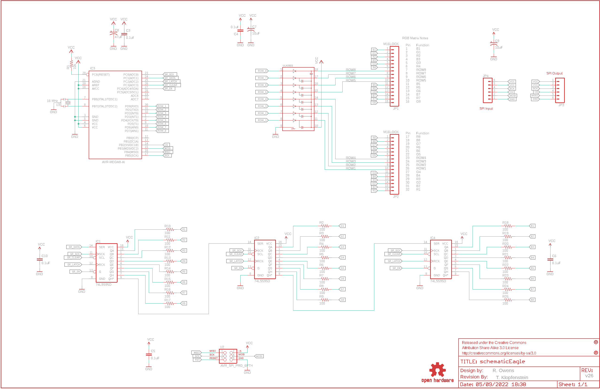
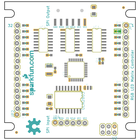
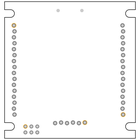
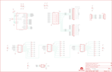
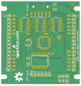
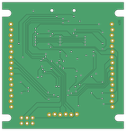

Contents
========

* [PRS760 > LED Matrix Serial Interface RGB](#prs760--led-matrix-serial-interface-rgb)
	* [Schematic](#schematic)
	* [PCB](#pcb)
	* [Interactive BOM](#interactive-bom)
	* [Images](#images)
	* [Tags](#tags)
  
![][im]
# PRS760 > LED Matrix Serial Interface RGB

- ID: PROJ-SPAR-760-STAN-01
- Hex ID: PRS760
- Name: Sparkfun
- Description: Sparkfun
- Long Link: [http://oom.lt/PROJ-SPAR-760-STAN-01](http://oom.lt/PROJ-SPAR-760-STAN-01)
- Short Link: [http://oom.lt/PRS760](http://oom.lt/PRS760)

## Schematic
  

## PCB
  

## Interactive BOM

- Interactive BOM page: [ibom.html](https://htmlpreview.github.io/?https://github.com/oomlout/oomlout_OOMP_projects/blob/main/PROJ-SPAR-760-STAN-01/kicad/bom/ibom.html)

## Images
  
  

|bominteractivefront|bominteractiveback|kicadPcb3d|kicadPcb3dFront|kicadPcb3dBack|eagleImage|eagleSchemImage|pcbdraw|pcbdrawback|
| :---: | :---: | :---: | :---: | :---: | :---: | :---: | :---: | :---: |
||||||||||

## Tags

- hexID: PRS760
- oompType: PROJ
- oompSize: SPAR
- oompColor: 760
- oompDesc: STAN
- oompIndex: 01
- oompName: LED Matrix Serial Interface RGB
- sources: All source files from https://github.com/sparkfun/LED_Matrix_Serial_Interface_RGB (source licence details in srcLicense.md)
- linkBuyPage: https://www.sparkfun.com/products/760
- oompID: PROJ-SPAR-760-STAN-01
- rawParts: C3,0.1uf,CAP0603-CAP,0603-CAP,Capacitor,,
- rawParts: C4,0.1uf,CAP0603-CAP,0603-CAP,Capacitor,,
- rawParts: C5,0.1uF,CAP0603-CAP,0603-CAP,Capacitor,,
- rawParts: C6,0.1uF,CAP0603-CAP,0603-CAP,Capacitor,,
- rawParts: C7,10uF,CAP_POL1206,EIA3216,Capacitor Polarized,,
- rawParts: C8,47uF,CAP_POL3528,EIA3528,Capacitor Polarized,,
- rawParts: C9,10uF,CAP_POL1206,EIA3216,Capacitor Polarized,,
- rawParts: C10,0.1uF,CAP0603-CAP,0603-CAP,Capacitor,,
- rawParts: FRAME1,FRAME-LEDGER,FRAME-LEDGER,CREATIVE_COMMONS,Schematic Frame,,
- rawParts: IC1,74LS595D,74LS595D,SO16,8-bit SHIFT REGISTER, output latch,,
- rawParts: IC2,74LS595D,74LS595D,SO16,8-bit SHIFT REGISTER, output latch,,
- rawParts: IC3,AVR-MEGA8-AI,AVR-MEGA8-AI,TQFP32-08,MICROCONTROLLER,,
- rawParts: IC4,74LS595D,74LS595D,SO16,8-bit SHIFT REGISTER, output latch,,
- rawParts: JP1,M16LOCK,M16LOCK,1X16_LOCK,1x16 .1 header,,
- rawParts: JP2,M16LOCK,M16LOCK,1X16_LOCK,1x16 .1 header,,
- rawParts: JP3,,M06SMD,1X06-SMD,Header 6,,
- rawParts: JP4,,M06LOCK,1X06_LOCK,Header 6,,
- rawParts: LOGO1,OSHW-LOGOL,OSHW-LOGOL,OSHW-LOGO-L,Open Source Hardware Logo This logo indicates the piece of hardware it is found on incorporates a OSHW license and/or adheres to the definition of open source hardware found here: http://freedomdefined.org/OSHW,,
- rawParts: R1,10k,RESISTOR0603-RES,0603-RES,Resistor,,
- rawParts: R2,100,RESISTOR0603-RES,0603-RES,Resistor,,
- rawParts: R3,100,RESISTOR0603-RES,0603-RES,Resistor,,
- rawParts: R4,100,RESISTOR0603-RES,0603-RES,Resistor,,
- rawParts: R5,100,RESISTOR0603-RES,0603-RES,Resistor,,
- rawParts: R6,100,RESISTOR0603-RES,0603-RES,Resistor,,
- rawParts: R7,100,RESISTOR0603-RES,0603-RES,Resistor,,
- rawParts: R8,100,RESISTOR0603-RES,0603-RES,Resistor,,
- rawParts: R9,100,RESISTOR0603-RES,0603-RES,Resistor,,
- rawParts: R10,100,RESISTOR0603-RES,0603-RES,Resistor,,
- rawParts: R11,100,RESISTOR0603-RES,0603-RES,Resistor,,
- rawParts: R12,100,RESISTOR0603-RES,0603-RES,Resistor,,
- rawParts: R13,100,RESISTOR0603-RES,0603-RES,Resistor,,
- rawParts: R14,100,RESISTOR0603-RES,0603-RES,Resistor,,
- rawParts: R15,100,RESISTOR0603-RES,0603-RES,Resistor,,
- rawParts: R16,100,RESISTOR0603-RES,0603-RES,Resistor,,
- rawParts: R17,100,RESISTOR0603-RES,0603-RES,Resistor,,
- rawParts: R18,100,RESISTOR0603-RES,0603-RES,Resistor,,
- rawParts: R19,100,RESISTOR0603-RES,0603-RES,Resistor,,
- rawParts: R20,100,RESISTOR0603-RES,0603-RES,Resistor,,
- rawParts: R21,100,RESISTOR0603-RES,0603-RES,Resistor,,
- rawParts: R22,100,RESISTOR0603-RES,0603-RES,Resistor,,
- rawParts: R23,100,RESISTOR0603-RES,0603-RES,Resistor,,
- rawParts: R24,100,RESISTOR0603-RES,0603-RES,Resistor,,
- rawParts: R25,100,RESISTOR0603-RES,0603-RES,Resistor,,
- rawParts: U$1,FIDUCIAL1X2,FIDUCIAL1X2,FIDUCIAL-1X2,Fiducial Alignment Points,,
- rawParts: U$2,REVISION,REVISION,REVISION,,,
- rawParts: U$3,FIDUCIAL1X2,FIDUCIAL1X2,FIDUCIAL-1X2,Fiducial Alignment Points,,
- rawParts: U2,AVR_SPI_PRG_6PTH,AVR_SPI_PRG_6PTH,2X3,AVR ISP 6 Pin,,
- rawParts: U3,16 MHz,RESONATORSMD,RESONATOR-SMD,Resonator,,
- rawParts: ULN2803,,ULN2803SOICW,SO18L,Darlington Driver,,

[im]: kicadPcb3d_450.png
