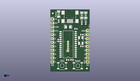
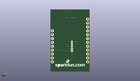
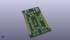

Contents
========

* [PROJ-SPAR-762-STAN-01>USB Bit Whacker-18F2553](#proj-spar-762-stan-01usb-bit-whacker-18f2553)
	* [Images](#images)
	* [Interactive BOM](#interactive-bom)
	* [OOMP Parts](#oomp-parts)
	* [Tags](#tags)
  
![][im]
# PROJ-SPAR-762-STAN-01>USB Bit Whacker-18F2553

- ID: PROJ-SPAR-762-STAN-01
- Hex ID: PRS762
- Name: USB Bit Whacker-18F2553
- Description: 

## Images
  
  

|eagleImage|kicadPcb3dFront|kicadPcb3dBack|kicadPcb3d|
| :---: | :---: | :---: | :---: |
|||||

## Interactive BOM

- Interactive BOM page: [ibom.html](kicad/bom/ibom.html)

## OOMP Parts
  

|OOMP Parts|
| :---: |
|CAPC-0402-X-NF100-V50, C1, 16.509999999999998, 27.94, 0,C1, 0.1uF, 0402-CAP, SparkFun, (0.65, 1.1), R0|
|CAPC-0402-X-NF100-V50, C2, 5.08, 20.32, 90,C2, 0.1uF, 0402-CAP, SparkFun, (0.2, 0.8), R90|
|CAPC-UNMATCHED-X-UNMATCHED-01, C3, 11.43, 29.209999999999997, 0,C3, 10uF, EIA3216, SparkFun, (0.45, 1.15), R0|
|CAPE-0402-X-UNMATCHED-01, C4, 20.32, 24.13, 0,C4, 22pF, 0402-CAP, SparkFun, (0.8, 0.95), R0|
|CAPE-0402-X-UNMATCHED-01, C5, 20.32, 16.509999999999998, 0,C5, 22pF, 0402-CAP, SparkFun, (0.8, 0.65), R0|
|<table><tr><td></td><td> JP2</td><td>[HEAD-I01-X-PI12-01 2.54 mm 12 Pin Header](https://github.com/oomlout/oomlout_OOMP_parts/tree/main/HEAD-I01-X-PI12-01/)</td><td>[H12](https://github.com/oomlout/oomlout_OOMP_parts/tree/main/HEAD-I01-X-PI12-01/)</td></tr></table>|
|UNMATCHED-UNMATCHED-X-UNMATCHED-01, JP3, 11.43, 16.509999999999998, 90,JP3, PIC-ICSP-MINI, PIC-ICSP-MINI, SparkFun, (0.45, 0.65), R90|
|<table><tr><td></td><td> JP4</td><td>[HEAD-I01-X-PI09-01 2.54 mm 9 Pin Header](https://github.com/oomlout/oomlout_OOMP_parts/tree/main/HEAD-I01-X-PI09-01/)</td><td>[H09](https://github.com/oomlout/oomlout_OOMP_parts/tree/main/HEAD-I01-X-PI09-01/)</td></tr></table>|
|UNMATCHED-UNMATCHED-X-UNMATCHED-01, LED1, 5.334, 37.592, 90,LED1, Green, LED-1206, SparkFun, (0.21, 1.48), R90|
|UNMATCHED-UNMATCHED-X-UNMATCHED-01, LED2, 22.86, 36.83, 90,LED2, Yellow, LED-1206, SparkFun, (0.9, 1.45), R90|
|UNMATCHED-UNMATCHED-X-UNMATCHED-01, LED3, 20.32, 36.83, 90,LED3, Red, LED-1206, SparkFun, (0.8, 1.45), R90|
|UNMATCHED-UNMATCHED-X-UNMATCHED-01, Q1, 19.685, 20.32, 270,Q1, 24MHz, CRYSTAL-SMD-5X3, SparkFun, (0.775, 0.8), R270|
|RESE-0402-X-O331-01, R1, 5.334, 33.019999999999996, 270,R1, 330, 0402-RES, SparkFun, (0.21, 1.3), R270|
|RESE-0402-X-O331-01, R2, 22.86, 31.75, 270,R2, 330, 0402-RES, SparkFun, (0.9, 1.25), R270|
|RESE-0402-X-O331-01, R3, 20.32, 31.75, 270,R3, 330, 0402-RES, SparkFun, (0.8, 1.25), R270|
|<table><tr><td></td><td> R4</td><td>[RESE-0402-X-O103-01 SMD (0402) 10k Ohm Resistor](https://github.com/oomlout/oomlout_OOMP_parts/tree/main/RESE-0402-X-O103-01/)</td><td>[R42103](https://github.com/oomlout/oomlout_OOMP_parts/tree/main/RESE-0402-X-O103-01/)</td></tr></table>|
|<table><tr><td></td><td> R5</td><td>[RESE-0402-X-O103-01 SMD (0402) 10k Ohm Resistor](https://github.com/oomlout/oomlout_OOMP_parts/tree/main/RESE-0402-X-O103-01/)</td><td>[R42103](https://github.com/oomlout/oomlout_OOMP_parts/tree/main/RESE-0402-X-O103-01/)</td></tr></table>|
|UNMATCHED-UNMATCHED-X-UNMATCHED-01, S1, 17.779999999999998, 3.8099999999999996, 0,S1, Reset, TACTILE_SWITCH_SMD, SparkFun, (0.7, 0.15), R0|
|UNMATCHED-UNMATCHED-X-UNMATCHED-01, S2, 7.619999999999999, 3.8099999999999996, 0,S2, PRG, TACTILE_SWITCH_SMD, SparkFun, (0.3, 0.15), R0|
|UNMATCHED-UNMATCHED-X-UNMATCHED-01, U2, 11.43, 17.779999999999998, 90,U2, PIC18F2455, SO-28W, SparkFun, (0.45, 0.7), R90|
|UNMATCHED-UNMATCHED-X-UNMATCHED-01, X1, 12.7, 35.559999999999995, 270,X1, USBSMD, USB-MINIB, SparkFun, (0.5, 1.4), R270|

## Tags

- hexID: PRS762
- oompType: PROJ
- oompSize: SPAR
- oompColor: 762
- oompDesc: STAN
- oompIndex: 01
- oompName: USB Bit Whacker-18F2553
- sources: All source files from https://github.com/sparkfun/USB_Bit_Whacker-18F2553 (source licence details in srcLicense.md)
- linkBuyPage: https://www.sparkfun.com/products/762
- oompPart: CAPC-0402-X-NF100-V50, C1, 16.509999999999998, 27.94, 0
- oompPart: CAPC-0402-X-NF100-V50, C2, 5.08, 20.32, 90
- oompPart: CAPC-UNMATCHED-X-UNMATCHED-01, C3, 11.43, 29.209999999999997, 0
- oompPart: CAPE-0402-X-UNMATCHED-01, C4, 20.32, 24.13, 0
- oompPart: CAPE-0402-X-UNMATCHED-01, C5, 20.32, 16.509999999999998, 0
- oompPart: SKIP-UNMATCHED-X-UNMATCHED-01, FID1, 1.5239999999999998, 38.099999999999994, 0
- oompPart: SKIP-UNMATCHED-X-UNMATCHED-01, FID2, 23.622, 2.032, 0
- oompPart: HEAD-I01-X-PI12-01, JP2, 1.27, 6.35, 90
- oompPart: UNMATCHED-UNMATCHED-X-UNMATCHED-01, JP3, 11.43, 16.509999999999998, 90
- oompPart: HEAD-I01-X-PI09-01, JP4, 24.13, 26.669999999999998, 270
- oompPart: UNMATCHED-UNMATCHED-X-UNMATCHED-01, LED1, 5.334, 37.592, 90
- oompPart: UNMATCHED-UNMATCHED-X-UNMATCHED-01, LED2, 22.86, 36.83, 90
- oompPart: UNMATCHED-UNMATCHED-X-UNMATCHED-01, LED3, 20.32, 36.83, 90
- oompPart: UNMATCHED-UNMATCHED-X-UNMATCHED-01, Q1, 19.685, 20.32, 270
- oompPart: RESE-0402-X-O331-01, R1, 5.334, 33.019999999999996, 270
- oompPart: RESE-0402-X-O331-01, R2, 22.86, 31.75, 270
- oompPart: RESE-0402-X-O331-01, R3, 20.32, 31.75, 270
- oompPart: RESE-0402-X-O103-01, R4, 11.176, 7.619999999999999, 0
- oompPart: RESE-0402-X-O103-01, R5, 13.97, 7.619999999999999, 180
- oompPart: UNMATCHED-UNMATCHED-X-UNMATCHED-01, S1, 17.779999999999998, 3.8099999999999996, 0
- oompPart: UNMATCHED-UNMATCHED-X-UNMATCHED-01, S2, 7.619999999999999, 3.8099999999999996, 0
- oompPart: UNMATCHED-UNMATCHED-X-UNMATCHED-01, U2, 11.43, 17.779999999999998, 90
- oompPart: UNMATCHED-UNMATCHED-X-UNMATCHED-01, X1, 12.7, 35.559999999999995, 270
- rawPart: C1, 0.1uF, 0402-CAP, SparkFun, (0.65, 1.1), R0
- rawPart: C2, 0.1uF, 0402-CAP, SparkFun, (0.2, 0.8), R90
- rawPart: C3, 10uF, EIA3216, SparkFun, (0.45, 1.15), R0
- rawPart: C4, 22pF, 0402-CAP, SparkFun, (0.8, 0.95), R0
- rawPart: C5, 22pF, 0402-CAP, SparkFun, (0.8, 0.65), R0
- rawPart: FID1, FIDUCIAL1X2, FIDUCIAL-1X2, SparkFun-Aesthetics, (0.06, 1.5), R0
- rawPart: FID2, FIDUCIAL1X2, FIDUCIAL-1X2, SparkFun-Aesthetics, (0.93, 0.08), R0
- rawPart: JP2, 1X12, SparkFun, (0.05, 0.25), R90
- rawPart: JP3, PIC-ICSP-MINI, PIC-ICSP-MINI, SparkFun, (0.45, 0.65), R90
- rawPart: JP4, 1X09, SparkFun, (0.95, 1.05), R270
- rawPart: LED1, Green, LED-1206, SparkFun, (0.21, 1.48), R90
- rawPart: LED2, Yellow, LED-1206, SparkFun, (0.9, 1.45), R90
- rawPart: LED3, Red, LED-1206, SparkFun, (0.8, 1.45), R90
- rawPart: Q1, 24MHz, CRYSTAL-SMD-5X3, SparkFun, (0.775, 0.8), R270
- rawPart: R1, 330, 0402-RES, SparkFun, (0.21, 1.3), R270
- rawPart: R2, 330, 0402-RES, SparkFun, (0.9, 1.25), R270
- rawPart: R3, 330, 0402-RES, SparkFun, (0.8, 1.25), R270
- rawPart: R4, 10K, 0402-RES, SparkFun, (0.44, 0.3), R0
- rawPart: R5, 10K, 0402-RES, SparkFun, (0.55, 0.3), R180
- rawPart: S1, Reset, TACTILE_SWITCH_SMD, SparkFun, (0.7, 0.15), R0
- rawPart: S2, PRG, TACTILE_SWITCH_SMD, SparkFun, (0.3, 0.15), R0
- rawPart: U2, PIC18F2455, SO-28W, SparkFun, (0.45, 0.7), R90
- rawPart: X1, USBSMD, USB-MINIB, SparkFun, (0.5, 1.4), R270
- oompID: PROJ-SPAR-762-STAN-01

[im]: kicadPcb3d_450.png
