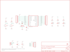

Contents
========

* [PRS762 > USB Bit Whacker-18F2553](#prs762--usb-bit-whacker-18f2553)
	* [Schematic](#schematic)
	* [PCB](#pcb)
	* [Interactive BOM](#interactive-bom)
	* [Images](#images)
	* [Tags](#tags)
  
![][im]
# PRS762 > USB Bit Whacker-18F2553

- ID: PROJ-SPAR-762-STAN-01
- Hex ID: PRS762
- Name: Sparkfun
- Description: Sparkfun
- Long Link: [http://oom.lt/PROJ-SPAR-762-STAN-01](http://oom.lt/PROJ-SPAR-762-STAN-01)
- Short Link: [http://oom.lt/PRS762](http://oom.lt/PRS762)

## Schematic
  

## PCB
  

## Interactive BOM

- Interactive BOM page: [ibom.html](https://htmlpreview.github.io/?https://github.com/oomlout/oomlout_OOMP_projects/blob/main/PROJ-SPAR-762-STAN-01/kicad/bom/ibom.html)

## Images
  
  

|bominteractivefront|bominteractiveback|kicadPcb3d|kicadPcb3dFront|kicadPcb3dBack|eagleImage|eagleSchemImage|pcbdraw|pcbdrawback|
| :---: | :---: | :---: | :---: | :---: | :---: | :---: | :---: | :---: |
||||||||||

## Tags

- hexID: PRS762
- oompType: PROJ
- oompSize: SPAR
- oompColor: 762
- oompDesc: STAN
- oompIndex: 01
- oompName: USB Bit Whacker-18F2553
- sources: All source files from https://github.com/sparkfun/USB_Bit_Whacker-18F2553 (source licence details in srcLicense.md)
- linkBuyPage: https://www.sparkfun.com/products/762
- oompID: PROJ-SPAR-762-STAN-01
- rawParts: C1,0.1uF,CAP0402-CAP,0402-CAP,Capacitor,,
- rawParts: C2,0.1uF,CAP0402-CAP,0402-CAP,Capacitor,,
- rawParts: C3,10uF,CAP_POL1206,EIA3216,Capacitor Polarized,,
- rawParts: C4,22pF,CAP0402-CAP,0402-CAP,Capacitor,,
- rawParts: C5,22pF,CAP0402-CAP,0402-CAP,Capacitor,,
- rawParts: FID1,FIDUCIAL1X2,FIDUCIAL1X2,FIDUCIAL-1X2,Fiducial Alignment Points,,
- rawParts: FID2,FIDUCIAL1X2,FIDUCIAL1X2,FIDUCIAL-1X2,Fiducial Alignment Points,,
- rawParts: JP2,,M12PTH,1X12,Header 12,,
- rawParts: JP3,PIC-ICSP-MINI,PIC-ICSP-MINI,PIC-ICSP-MINI,PIC-ICSP-Mini,,
- rawParts: JP4,,M09,1X09,Header 9,,
- rawParts: LED1,Green,LED1206,LED-1206,LEDs,,
- rawParts: LED2,Yellow,LED1206,LED-1206,LEDs,,
- rawParts: LED3,Red,LED1206,LED-1206,LEDs,,
- rawParts: Q1,24MHz,CRYSTAL5X3,CRYSTAL-SMD-5X3,Crystals,,
- rawParts: R1,330,RESISTOR0402-RES,0402-RES,Resistor,,
- rawParts: R2,330,RESISTOR0402-RES,0402-RES,Resistor,,
- rawParts: R3,330,RESISTOR0402-RES,0402-RES,Resistor,,
- rawParts: R4,10K,RESISTOR0402-RES,0402-RES,Resistor,,
- rawParts: R5,10K,RESISTOR0402-RES,0402-RES,Resistor,,
- rawParts: S1,Reset,TAC_SWITCHSMD,TACTILE_SWITCH_SMD,Momentary Switch,,
- rawParts: S2,PRG,TAC_SWITCHSMD,TACTILE_SWITCH_SMD,Momentary Switch,,
- rawParts: U$1,LOGO-SFENEW,LOGO-SFENEW,SFE-NEW-WEBLOGO,Spark Fun Electronics PCB Logo,,
- rawParts: U$2,CREATIVE_COMMONS,CREATIVE_COMMONS,CREATIVE_COMMONS,,,
- rawParts: U2,PIC18F2455,PIC18F2455SMD,SO-28W,,,
- rawParts: X1,USBSMD,USBSMD,USB-MINIB,USB Connectors,,

[im]: kicadPcb3d_450.png
