Contents
========

* [PRS8130 > I2C Expander Breakout-PCF8575](#prs8130--i2c-expander-breakout-pcf8575)
	* [Schematic](#schematic)
	* [PCB](#pcb)
	* [Interactive BOM](#interactive-bom)
	* [OOMP Parts](#oomp-parts)
	* [Images](#images)
	* [Tags](#tags)
  
![][im]
# PRS8130 > I2C Expander Breakout-PCF8575

- ID: PROJ-SPAR-8130-STAN-01
- Hex ID: PRS8130
- Name: Sparkfun
- Description: Sparkfun
- Long Link: [http://oom.lt/PROJ-SPAR-8130-STAN-01](http://oom.lt/PROJ-SPAR-8130-STAN-01)
- Short Link: [http://oom.lt/PRS8130](http://oom.lt/PRS8130)

## Schematic
  
[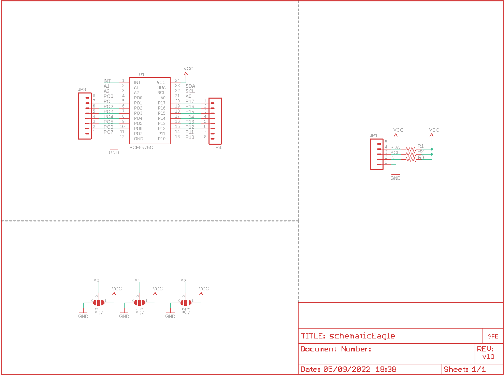](eagleSchemImage.png)
## PCB
  
[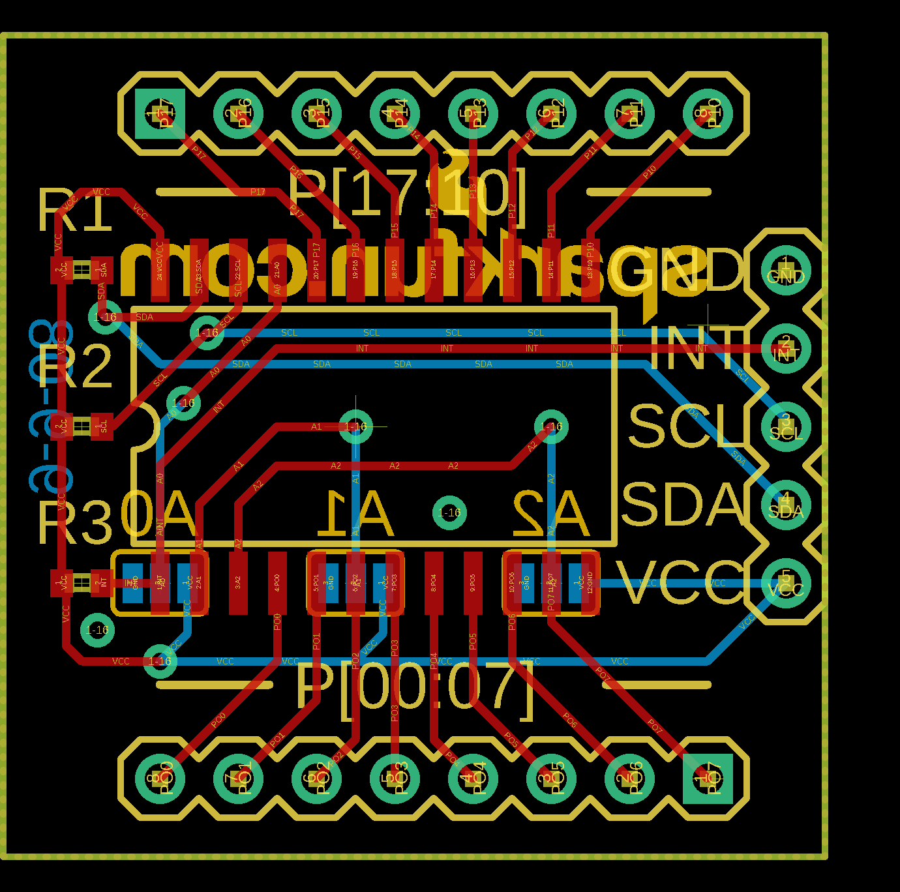](eagleImage.png)
## Interactive BOM

- Interactive BOM page: [ibom.html](https://htmlpreview.github.io/?https://github.com/oomlout/oomlout_OOMP_projects/blob/main/PROJ-SPAR-8130-STAN-01/kicad/bom/ibom.html)

## OOMP Parts
  

|OOMP ID|Name|Identifier|
| :---: | :---: | :---: |
|[HEAD-I01-X-PI05-01](https://github.com/oomlout/oomlout_OOMP_parts/tree/main/HEAD-I01-X-PI05-01/)|[2.54 mm 5 Pin Header](https://github.com/oomlout/oomlout_OOMP_parts/tree/main/HEAD-I01-X-PI05-01/)|[JP1](https://github.com/oomlout/oomlout_OOMP_parts/tree/main/HEAD-I01-X-PI05-01/)|
|[HEAD-I01-X-PI08-01](https://github.com/oomlout/oomlout_OOMP_parts/tree/main/HEAD-I01-X-PI08-01/)|[2.54 mm 8 Pin Header](https://github.com/oomlout/oomlout_OOMP_parts/tree/main/HEAD-I01-X-PI08-01/)|[JP3, JP4](https://github.com/oomlout/oomlout_OOMP_parts/tree/main/HEAD-I01-X-PI08-01/)|
|RESE-0402-X-UNMATCHED-01||R1, R2, R3|
|UNMATCHED-UNMATCHED-X-UNMATCHED-01||U1|

## Images
  
  

|bominteractivefront|bominteractiveback|kicadPcb3d|kicadPcb3dFront|kicadPcb3dBack|eagleImage|eagleSchemImage|pcbdraw|pcbdrawback|
| :---: | :---: | :---: | :---: | :---: | :---: | :---: | :---: | :---: |
|[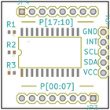](bomFront.png)|[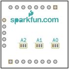](bomBack.png)|[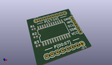](kicadPcb3d.png)|[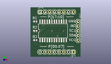](kicadPcb3dFront.png)|[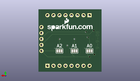](kicadPcb3dBack.png)|[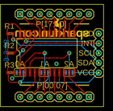](eagleImage.png)|[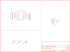](eagleSchemImage.png)|[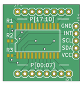](pcbdraw.png)|[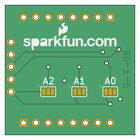](pcbdrawBack.png)|

## Tags

- hexID: PRS8130
- oompType: PROJ
- oompSize: SPAR
- oompColor: 8130
- oompDesc: STAN
- oompIndex: 01
- oompName: I2C Expander Breakout-PCF8575
- sources: All source files from https://github.com/sparkfun/I2C_Expander_Breakout-PCF8575 (source licence details in srcLicense.md)
- linkBuyPage: https://www.sparkfun.com/products/8130
- oompID: PROJ-SPAR-8130-STAN-01
- oompParts: JP1,HEAD-I01-X-PI05-01
- oompParts: JP3,HEAD-I01-X-PI08-01
- oompParts: JP4,HEAD-I01-X-PI08-01
- oompParts: R1,RESE-0402-X-UNMATCHED-01
- oompParts: R2,RESE-0402-X-UNMATCHED-01
- oompParts: R3,RESE-0402-X-UNMATCHED-01
- oompParts: U1,UNMATCHED-UNMATCHED-X-UNMATCHED-01
- rawParts: JP1,,M05,1X05,Header 5,,
- rawParts: JP3,,M08,1X08,Header 8,,
- rawParts: JP4,,M08,1X08,Header 8,,
- rawParts: R1,,RESISTOR0402,C0402,Resistor,,
- rawParts: R2,,RESISTOR0402,C0402,Resistor,,
- rawParts: R3,,RESISTOR0402,C0402,Resistor,,
- rawParts: SJ1,A0,SOLDERJUMPER_2WAYS,SJ_3,Solder Jumper,,
- rawParts: SJ2,A1,SOLDERJUMPER_2WAYS,SJ_3,Solder Jumper,,
- rawParts: SJ3,A2,SOLDERJUMPER_2WAYS,SJ_3,Solder Jumper,,
- rawParts: U$2,LOGO-SFENEW,LOGO-SFENEW,SFE-NEW-WEBLOGO,Spark Fun Electronics PCB Logo,,
- rawParts: U1,PCF8575C,PCF8575C,SO-24DW,PCF8575C I/O Expander.,,

[im]: kicadPcb3d_450.png
