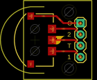
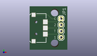
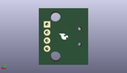
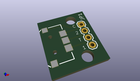

Contents
========

* [PROJ-SPAR-8236-STAN-01>Navigation Switch Breakout](#proj-spar-8236-stan-01navigation-switch-breakout)
	* [Images](#images)
	* [Interactive BOM](#interactive-bom)
	* [OOMP Parts](#oomp-parts)
	* [Tags](#tags)
  
![][im]
# PROJ-SPAR-8236-STAN-01>Navigation Switch Breakout

- ID: PROJ-SPAR-8236-STAN-01
- Hex ID: PRS8236
- Name: Navigation Switch Breakout
- Description: 

## Images
  
  

|eagleImage|kicadPcb3dFront|kicadPcb3dBack|kicadPcb3d|
| :---: | :---: | :---: | :---: |
|||||

## Interactive BOM

- Interactive BOM page: [ibom.html](kicad/bom/ibom.html)

## OOMP Parts
  

|OOMP Parts|
| :---: |
|<table><tr><td></td><td> JP1</td><td>[HEAD-I01-X-PI04-01 2.54 mm 4 Pin Header](https://github.com/oomlout/oomlout_OOMP_parts/tree/main/HEAD-I01-X-PI04-01/)</td><td>[H04](https://github.com/oomlout/oomlout_OOMP_parts/tree/main/HEAD-I01-X-PI04-01/)</td></tr></table>|
|UNMATCHED-UNMATCHED-X-UNMATCHED-01, JP2, 2.54, 8.889999999999999, 90,JP2, NAV_SWITCH, NAV_SWITCH, SparkFun, (0.1, 0.35), R90|

## Tags

- hexID: PRS8236
- oompType: PROJ
- oompSize: SPAR
- oompColor: 8236
- oompDesc: STAN
- oompIndex: 01
- oompName: Navigation Switch Breakout
- sources: All source files from https://github.com/sparkfun/Navigation_Switch_Breakout (source licence details in srcLicense.md)
- linkBuyPage: https://www.sparkfun.com/products/8236
- oompPart: HEAD-I01-X-PI04-01, JP1, 12.7, 12.7, 270
- oompPart: UNMATCHED-UNMATCHED-X-UNMATCHED-01, JP2, 2.54, 8.889999999999999, 90
- rawPart: JP1, 1X04, SparkFun, (0.5, 0.5), R270
- rawPart: JP2, NAV_SWITCH, NAV_SWITCH, SparkFun, (0.1, 0.35), R90
- oompID: PROJ-SPAR-8236-STAN-01

[im]: kicadPcb3d_450.png
