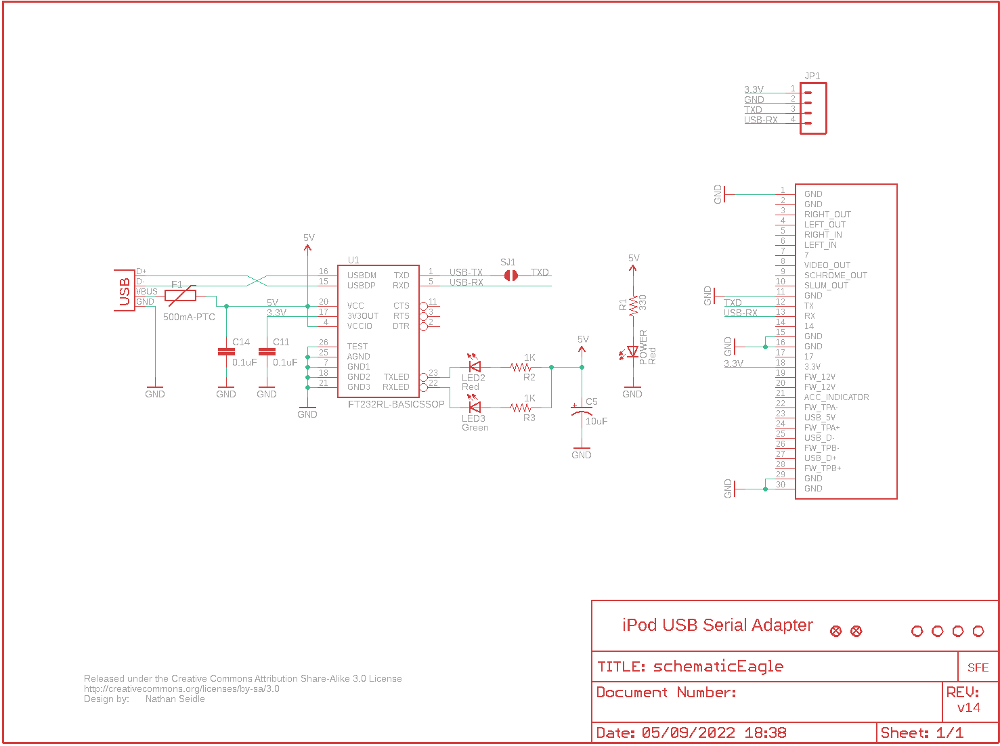
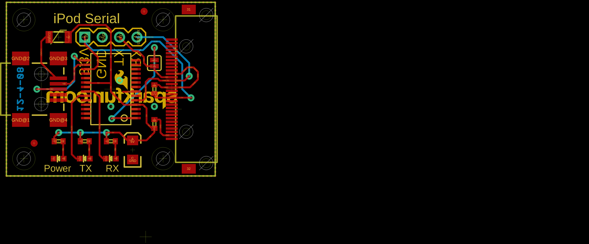
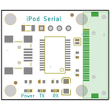
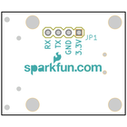
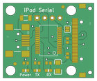
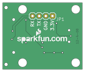

Contents
========

* [PRS8245 > Serial USB Adapter-Nike iPod](#prs8245--serial-usb-adapter-nike-ipod)
	* [Schematic](#schematic)
	* [PCB](#pcb)
	* [Interactive BOM](#interactive-bom)
	* [Images](#images)
	* [Tags](#tags)
  
![][im]
# PRS8245 > Serial USB Adapter-Nike iPod

- ID: PROJ-SPAR-8245-STAN-01
- Hex ID: PRS8245
- Name: Sparkfun
- Description: Sparkfun
- Long Link: [http://oom.lt/PROJ-SPAR-8245-STAN-01](http://oom.lt/PROJ-SPAR-8245-STAN-01)
- Short Link: [http://oom.lt/PRS8245](http://oom.lt/PRS8245)

## Schematic
  

## PCB
  

## Interactive BOM

- Interactive BOM page: [ibom.html](https://htmlpreview.github.io/?https://github.com/oomlout/oomlout_OOMP_projects/blob/main/PROJ-SPAR-8245-STAN-01/kicad/bom/ibom.html)

## Images
  
  

|bominteractivefront|bominteractiveback|kicadPcb3d|kicadPcb3dFront|kicadPcb3dBack|eagleImage|eagleSchemImage|pcbdraw|pcbdrawback|
| :---: | :---: | :---: | :---: | :---: | :---: | :---: | :---: | :---: |
||||||||||

## Tags

- hexID: PRS8245
- oompType: PROJ
- oompSize: SPAR
- oompColor: 8245
- oompDesc: STAN
- oompIndex: 01
- oompName: Serial USB Adapter-Nike iPod
- sources: All source files from https://github.com/sparkfun/Serial_USB_Adapter-Nike_iPod (source licence details in srcLicense.md)
- linkBuyPage: https://www.sparkfun.com/products/8245
- oompID: PROJ-SPAR-8245-STAN-01
- rawParts: C5,10uF,CAP_POL1206,EIA3216,Capacitor Polarized,,
- rawParts: C11,0.1uF,CAP0402,C0402,Capacitor,,
- rawParts: C14,0.1uF,CAP0402,C0402,Capacitor,,
- rawParts: F1,500mA-PTC,PTCSMD,PTC-1206,Resettable Fuse PTC,,
- rawParts: JP1,,M04PTH,1X04,Header 4,,
- rawParts: LED2,Red,LED0603,LED-0603,LEDs,,
- rawParts: LED3,Green,LED0603,LED-0603,LEDs,,
- rawParts: POWER,Red,LED0603,LED-0603,LEDs,,
- rawParts: R1,330,RESISTOR0402,C0402,Resistor,,
- rawParts: R2,1K,RESISTOR0402,C0402,Resistor,,
- rawParts: R3,1K,RESISTOR0402,C0402,Resistor,,
- rawParts: SJ1,SOLDERJUMPERNC2,SOLDERJUMPERNC2,SJ_2S,Solder Jumper,,
- rawParts: U$1,STAND-OFF,STAND-OFF,STAND-OFF,Stand Off,,
- rawParts: U$2,IPOD_CONNECTOR_FEMALE,IPOD_CONNECTOR_FEMALE,IPOD_FEMALE_CONNECTOR,iPod Female Connector,,
- rawParts: U$3,LOGO-SFENEW,LOGO-SFENEW,SFE-NEW-WEBLOGO,Spark Fun Electronics PCB Logo,,
- rawParts: U$4,FIDUCIAL1X2,FIDUCIAL1X2,FIDUCIAL-1X2,Fiducial Alignment Points,,
- rawParts: U$5,STAND-OFF,STAND-OFF,STAND-OFF,Stand Off,,
- rawParts: U$6,STAND-OFF,STAND-OFF,STAND-OFF,Stand Off,,
- rawParts: U$7,STAND-OFF,STAND-OFF,STAND-OFF,Stand Off,,
- rawParts: U$8,FIDUCIAL1X2,FIDUCIAL1X2,FIDUCIAL-1X2,Fiducial Alignment Points,,
- rawParts: U$9,CREATIVE_COMMONS,CREATIVE_COMMONS,CREATIVE_COMMONS,,,
- rawParts: U1,FT232RL-BASICSSOP,FT232RL-BASICSSOP,SSOP28DB,USB UART,,
- rawParts: X1,USBSMD,USBSMD,USB-MINIB,USB Connectors,,

[im]: kicadPcb3d_450.png
