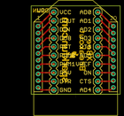
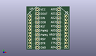
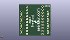
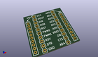

Contents
========

* [PROJ-SPAR-8276-STAN-01>XBee Module Breakout Board](#proj-spar-8276-stan-01xbee-module-breakout-board)
	* [Images](#images)
	* [Interactive BOM](#interactive-bom)
	* [OOMP Parts](#oomp-parts)
	* [Tags](#tags)
  
![][im]
# PROJ-SPAR-8276-STAN-01>XBee Module Breakout Board

- ID: PROJ-SPAR-8276-STAN-01
- Hex ID: PRS8276
- Name: XBee Module Breakout Board
- Description: 

## Images
  
  

|eagleImage|kicadPcb3dFront|kicadPcb3dBack|kicadPcb3d|
| :---: | :---: | :---: | :---: |
|||||

## Interactive BOM

- Interactive BOM page: [ibom.html](kicad/bom/ibom.html)

## OOMP Parts
  

|OOMP Parts|
| :---: |
|UNMATCHED-UNMATCHED-X-UNMATCHED-01, JP1, 6.604, 24.13, 270,JP1, 1X10, SparkFun, (0.26, 0.95), R270|
|UNMATCHED-UNMATCHED-X-UNMATCHED-01, JP2, 19.431, 24.13, 270,JP2, 1X10, SparkFun, (0.765, 0.95), R270|
|UNMATCHED-UNMATCHED-X-UNMATCHED-01, U1, 12.999999908, 0.0, 0,U1, XBEE, XBEE-1, SparkFun, (0.51181102, 0), R0|

## Tags

- hexID: PRS8276
- oompType: PROJ
- oompSize: SPAR
- oompColor: 8276
- oompDesc: STAN
- oompIndex: 01
- oompName: XBee Module Breakout Board
- sources: All source files from https://github.com/sparkfun/XBee_Module_Breakout_Board (source licence details in srcLicense.md)
- linkBuyPage: https://www.sparkfun.com/products/8276
- oompPart: UNMATCHED-UNMATCHED-X-UNMATCHED-01, JP1, 6.604, 24.13, 270
- oompPart: UNMATCHED-UNMATCHED-X-UNMATCHED-01, JP2, 19.431, 24.13, 270
- oompPart: UNMATCHED-UNMATCHED-X-UNMATCHED-01, U1, 12.999999908, 0.0, 0
- rawPart: JP1, 1X10, SparkFun, (0.26, 0.95), R270
- rawPart: JP2, 1X10, SparkFun, (0.765, 0.95), R270
- rawPart: U1, XBEE, XBEE-1, SparkFun, (0.51181102, 0), R0

[im]: kicadPcb3d_450.png
