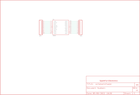

Contents
========

* [PRS8276 > XBee Module Breakout Board](#prs8276--xbee-module-breakout-board)
	* [Schematic](#schematic)
	* [PCB](#pcb)
	* [Interactive BOM](#interactive-bom)
	* [OOMP Parts](#oomp-parts)
	* [Images](#images)
	* [Tags](#tags)
  
![][im]
# PRS8276 > XBee Module Breakout Board

- ID: PROJ-SPAR-8276-STAN-01
- Hex ID: PRS8276
- Name: Sparkfun 8276
- Description: Sparkfun 8276
- Long Link: [http://oom.lt/PROJ-SPAR-8276-STAN-01](http://oom.lt/PROJ-SPAR-8276-STAN-01)
- Short Link: [http://oom.lt/PRS8276](http://oom.lt/PRS8276)

## Schematic
  

## PCB
  

## Interactive BOM

- Interactive BOM page: [ibom.html](https://htmlpreview.github.io/?https://github.com/oomlout/oomlout_OOMP_projects/blob/main/PROJ-SPAR-8276-STAN-01/kicad/bom/ibom.html)

## OOMP Parts
  

|OOMP ID|Name|Identifier|
| :---: | :---: | :---: |
|[HEAD-I01-X-PI10-01](https://github.com/oomlout/oomlout_OOMP_parts/tree/main/HEAD-I01-X-PI10-01/)|[2.54 mm 10 Pin Header](https://github.com/oomlout/oomlout_OOMP_parts/tree/main/HEAD-I01-X-PI10-01/)|[JP1, JP2](https://github.com/oomlout/oomlout_OOMP_parts/tree/main/HEAD-I01-X-PI10-01/)|
|UNMATCHED-UNMATCHED-X-UNMATCHED-01||U1|

## Images
  
  

|bominteractivefront|bominteractiveback|kicadPcb3d|kicadPcb3dFront|kicadPcb3dBack|kicadSchem|eagleImage|eagleSchemImage|pcbdraw|pcbdrawback|
| :---: | :---: | :---: | :---: | :---: | :---: | :---: | :---: | :---: | :---: |
|||||||||||

## Tags

- hexID: PRS8276
- oompType: PROJ
- oompSize: SPAR
- oompColor: 8276
- oompDesc: STAN
- oompIndex: 01
- oompName: XBee Module Breakout Board
- sources: All source files from https://github.com/sparkfun/XBee_Module_Breakout_Board (source licence details in srcLicense.md)
- linkBuyPage: https://www.sparkfun.com/products/8276
- oompID: PROJ-SPAR-8276-STAN-01
- oompParts: JP1,HEAD-I01-X-PI10-01
- oompParts: JP2,HEAD-I01-X-PI10-01
- oompParts: U1,UNMATCHED-UNMATCHED-X-UNMATCHED-01
- rawParts: JP1,,M100.1,1X10,Header 10,,
- rawParts: JP2,,M100.1,1X10,Header 10,,
- rawParts: U$2,LOGO-SFENEW,LOGO-SFENEW,SFE-NEW-WEBLOGO,Spark Fun Electronics PCB Logo,,
- rawParts: U1,XBEE,XBEE-1B1,XBEE-1,,,

[im]: kicadPcb3d_450.png
