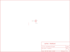

Contents
========

* [PRS8463 > LilyPad Buzzer](#prs8463--lilypad-buzzer)
	* [Schematic](#schematic)
	* [PCB](#pcb)
	* [Interactive BOM](#interactive-bom)
	* [OOMP Parts](#oomp-parts)
	* [Images](#images)
	* [Tags](#tags)
  
![][im]
# PRS8463 > LilyPad Buzzer

- ID: PROJ-SPAR-8463-STAN-01
- Hex ID: PRS8463
- Name: Sparkfun
- Description: Sparkfun
- Long Link: [http://oom.lt/PROJ-SPAR-8463-STAN-01](http://oom.lt/PROJ-SPAR-8463-STAN-01)
- Short Link: [http://oom.lt/PRS8463](http://oom.lt/PRS8463)

## Schematic
  

## PCB
  

## Interactive BOM

- Interactive BOM page: [ibom.html](https://htmlpreview.github.io/?https://github.com/oomlout/oomlout_OOMP_projects/blob/main/PROJ-SPAR-8463-STAN-01/kicad/bom/ibom.html)

## OOMP Parts
  

|OOMP ID|Name|Identifier|
| :---: | :---: | :---: |
|UNMATCHED-UNMATCHED-X-UNMATCHED-01||B1|

## Images
  
  

|bominteractivefront|bominteractiveback|kicadPcb3d|kicadPcb3dFront|kicadPcb3dBack|kicadSchem|eagleImage|eagleSchemImage|pcbdraw|pcbdrawback|
| :---: | :---: | :---: | :---: | :---: | :---: | :---: | :---: | :---: | :---: |
|||||||||||

## Tags

- hexID: PRS8463
- oompType: PROJ
- oompSize: SPAR
- oompColor: 8463
- oompDesc: STAN
- oompIndex: 01
- oompName: LilyPad Buzzer
- sources: All source files from https://github.com/sparkfun/LilyPad_Buzzer (source licence details in srcLicense.md)
- linkBuyPage: https://www.sparkfun.com/products/8463
- oompID: PROJ-SPAR-8463-STAN-01
- oompParts: B1,UNMATCHED-UNMATCHED-X-UNMATCHED-01
- rawParts: B1,Buzzer,BUZZERSMD2,BUZZER-CCV,Buzzer 12mm,,
- rawParts: U$1,SEWTAP-NOHOLE2,SEWTAP-NOHOLE2,PETAL-NOHOLE-2SIDE,,,
- rawParts: U$2,LOGO-LPLP,LOGO-LPLP,LOGO-LILYPAD,,,
- rawParts: U$4,SEWTAP-NOHOLE2,SEWTAP-NOHOLE2,PETAL-NOHOLE-2SIDE,,,
- rawParts: U$6,SEWTAP-NOHOLE2,SEWTAP-NOHOLE2,PETAL-NOHOLE-2SIDE,,,
- rawParts: U$7,SEWTAP-NOHOLE2,SEWTAP-NOHOLE2,PETAL-NOHOLE-2SIDE,,,
- rawParts: U$8,SEWTAP6,SEWTAP6,PETAL-SMALL-2SIDE,,,
- rawParts: U$9,SEWTAP6,SEWTAP6,PETAL-SMALL-2SIDE,,,

[im]: kicadPcb3d_450.png
