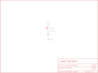

Contents
========

* [PRS8464 > LilyPad Light Sensor](#prs8464--lilypad-light-sensor)
	* [Schematic](#schematic)
	* [PCB](#pcb)
	* [Interactive BOM](#interactive-bom)
	* [OOMP Parts](#oomp-parts)
	* [Images](#images)
	* [Tags](#tags)
  
![][im]
# PRS8464 > LilyPad Light Sensor

- ID: PROJ-SPAR-8464-STAN-01
- Hex ID: PRS8464
- Name: Sparkfun 8464
- Description: Sparkfun 8464
- Long Link: [http://oom.lt/PROJ-SPAR-8464-STAN-01](http://oom.lt/PROJ-SPAR-8464-STAN-01)
- Short Link: [http://oom.lt/PRS8464](http://oom.lt/PRS8464)

## Schematic
  

## PCB
  

## Interactive BOM

- Interactive BOM page: [ibom.html](https://htmlpreview.github.io/?https://github.com/oomlout/oomlout_OOMP_projects/blob/main/PROJ-SPAR-8464-STAN-01/kicad/bom/ibom.html)

## OOMP Parts
  

|OOMP ID|Name|Identifier|
| :---: | :---: | :---: |
|[RESE-0402-X-O103-01](https://github.com/oomlout/oomlout_OOMP_parts/tree/main/RESE-0402-X-O103-01/)|[SMD (0402) 10k Ohm Resistor](https://github.com/oomlout/oomlout_OOMP_parts/tree/main/RESE-0402-X-O103-01/)|[R1](https://github.com/oomlout/oomlout_OOMP_parts/tree/main/RESE-0402-X-O103-01/)|
|UNMATCHED-UNMATCHED-X-UNMATCHED-01||U1|

## Images
  
  

|bominteractivefront|bominteractiveback|kicadPcb3d|kicadPcb3dFront|kicadPcb3dBack|kicadSchem|eagleImage|eagleSchemImage|pcbdraw|pcbdrawback|
| :---: | :---: | :---: | :---: | :---: | :---: | :---: | :---: | :---: | :---: |
|||||||||||

## Tags

- hexID: PRS8464
- oompType: PROJ
- oompSize: SPAR
- oompColor: 8464
- oompDesc: STAN
- oompIndex: 01
- oompName: LilyPad Light Sensor
- sources: All source files from https://github.com/sparkfun/LilyPad_Light_Sensor (source licence details in srcLicense.md)
- linkBuyPage: https://www.sparkfun.com/products/8464
- oompID: PROJ-SPAR-8464-STAN-01
- oompParts: R1,RESE-0402-X-O103-01
- oompParts: U1,UNMATCHED-UNMATCHED-X-UNMATCHED-01
- rawParts: LIGHT+,SEWTAP6,SEWTAP6,PETAL-SMALL-2SIDE,,,
- rawParts: LIGHT-,SEWTAP6,SEWTAP6,PETAL-SMALL-2SIDE,,,
- rawParts: LIGHT1,SEWTAP-NOHOLE2,SEWTAP-NOHOLE2,PETAL-NOHOLE-2SIDE,,,
- rawParts: LIGHT2,SEWTAP-NOHOLE2,SEWTAP-NOHOLE2,PETAL-NOHOLE-2SIDE,,,
- rawParts: LIGHT3,SEWTAP-NOHOLE2,SEWTAP-NOHOLE2,PETAL-NOHOLE-2SIDE,,,
- rawParts: LIGHTS,SEWTAP6,SEWTAP6,PETAL-SMALL-2SIDE,,,
- rawParts: R1,10K,RESISTOR0402,C0402,Resistor,,
- rawParts: U$2,LOGO-LPLP,LOGO-LPLP,LOGO-LILYPAD,,,
- rawParts: U1,TEMT6000,TEMT6000,TEMT6000-SEN,Ambient Light Sensor,,

[im]: kicadPcb3d_450.png
