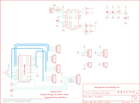

Contents
========

* [PRS8480 > Gainer PSoC Development Board](#prs8480--gainer-psoc-development-board)
	* [Schematic](#schematic)
	* [PCB](#pcb)
	* [Interactive BOM](#interactive-bom)
	* [OOMP Parts](#oomp-parts)
	* [Images](#images)
	* [Tags](#tags)
  
![][im]
# PRS8480 > Gainer PSoC Development Board

- ID: PROJ-SPAR-8480-STAN-01
- Hex ID: PRS8480
- Name: Sparkfun 8480
- Description: Sparkfun 8480
- Long Link: [http://oom.lt/PROJ-SPAR-8480-STAN-01](http://oom.lt/PROJ-SPAR-8480-STAN-01)
- Short Link: [http://oom.lt/PRS8480](http://oom.lt/PRS8480)

## Schematic
  

## PCB
  

## Interactive BOM

- Interactive BOM page: [ibom.html](https://htmlpreview.github.io/?https://github.com/oomlout/oomlout_OOMP_projects/blob/main/PROJ-SPAR-8480-STAN-01/kicad/bom/ibom.html)

## OOMP Parts
  

|OOMP ID|Name|Identifier|
| :---: | :---: | :---: |
|[CAPC-0402-X-NF100-V10](https://github.com/oomlout/oomlout_OOMP_parts/tree/main/CAPC-0402-X-NF100-V10/)|[SMD (0402) 100 nF Capacitor (Ceramic) 10v](https://github.com/oomlout/oomlout_OOMP_parts/tree/main/CAPC-0402-X-NF100-V10/)|[C1, C2, C5](https://github.com/oomlout/oomlout_OOMP_parts/tree/main/CAPC-0402-X-NF100-V10/)|
|[CAPT-3216-X-UF10-V10](https://github.com/oomlout/oomlout_OOMP_parts/tree/main/CAPT-3216-X-UF10-V10/)|[SMD (3216) 10 uF Capacitor (Tantalum) 10v](https://github.com/oomlout/oomlout_OOMP_parts/tree/main/CAPT-3216-X-UF10-V10/)|[C3](https://github.com/oomlout/oomlout_OOMP_parts/tree/main/CAPT-3216-X-UF10-V10/)|
|REFU-1206-X-UNMATCHED-01||F1|
|[HEAD-I01-X-PI04-01](https://github.com/oomlout/oomlout_OOMP_parts/tree/main/HEAD-I01-X-PI04-01/)|[2.54 mm 4 Pin Header](https://github.com/oomlout/oomlout_OOMP_parts/tree/main/HEAD-I01-X-PI04-01/)|[JP1, JP3, JP5, JP6, JP7, JP8](https://github.com/oomlout/oomlout_OOMP_parts/tree/main/HEAD-I01-X-PI04-01/)|
|[HEAD-I01-X-PI02-01](https://github.com/oomlout/oomlout_OOMP_parts/tree/main/HEAD-I01-X-PI02-01/)|[2.54 mm 2 Pin Header](https://github.com/oomlout/oomlout_OOMP_parts/tree/main/HEAD-I01-X-PI02-01/)|[JP2, JP4](https://github.com/oomlout/oomlout_OOMP_parts/tree/main/HEAD-I01-X-PI02-01/)|
|[HEAD-I01-X-PI05-01](https://github.com/oomlout/oomlout_OOMP_parts/tree/main/HEAD-I01-X-PI05-01/)|[2.54 mm 5 Pin Header](https://github.com/oomlout/oomlout_OOMP_parts/tree/main/HEAD-I01-X-PI05-01/)|[JP9](https://github.com/oomlout/oomlout_OOMP_parts/tree/main/HEAD-I01-X-PI05-01/)|
|LEDS-1206-G-STAN-01||LED1, LED2|
|[LEDS-0603-G-STAN-01](https://github.com/oomlout/oomlout_OOMP_parts/tree/main/LEDS-0603-G-STAN-01/)|[SMD (0603) Green LED](https://github.com/oomlout/oomlout_OOMP_parts/tree/main/LEDS-0603-G-STAN-01/)|[LED3, LED4](https://github.com/oomlout/oomlout_OOMP_parts/tree/main/LEDS-0603-G-STAN-01/)|
|[RESE-0402-X-O102-01](https://github.com/oomlout/oomlout_OOMP_parts/tree/main/RESE-0402-X-O102-01/)|[SMD (0402) 1k Ohm Resistor](https://github.com/oomlout/oomlout_OOMP_parts/tree/main/RESE-0402-X-O102-01/)|[R1, R3, R4, R5, R6](https://github.com/oomlout/oomlout_OOMP_parts/tree/main/RESE-0402-X-O102-01/)|
|[RESE-0402-X-O331-01](https://github.com/oomlout/oomlout_OOMP_parts/tree/main/RESE-0402-X-O331-01/)|[SMD (0402) 330 Ohm Resistor](https://github.com/oomlout/oomlout_OOMP_parts/tree/main/RESE-0402-X-O331-01/)|[R2](https://github.com/oomlout/oomlout_OOMP_parts/tree/main/RESE-0402-X-O331-01/)|
|UNMATCHED-UNMATCHED-X-UNMATCHED-01||S1, U1, U2, X2|

## Images
  
  

|bominteractivefront|bominteractiveback|kicadPcb3d|kicadPcb3dFront|kicadPcb3dBack|kicadSchem|eagleImage|eagleSchemImage|pcbdraw|pcbdrawback|
| :---: | :---: | :---: | :---: | :---: | :---: | :---: | :---: | :---: | :---: |
|||||||||||

## Tags

- hexID: PRS8480
- oompType: PROJ
- oompSize: SPAR
- oompColor: 8480
- oompDesc: STAN
- oompIndex: 01
- oompName: Gainer PSoC Development Board
- sources: All source files from https://github.com/sparkfun/Gainer_PSoC_Development_Board (source licence details in srcLicense.md)
- linkBuyPage: https://www.sparkfun.com/products/8480
- oompID: PROJ-SPAR-8480-STAN-01
- oompParts: C1,CAPC-0402-X-NF100-V10
- oompParts: C2,CAPC-0402-X-NF100-V10
- oompParts: C3,CAPT-3216-X-UF10-V10
- oompParts: C5,CAPC-0402-X-NF100-V10
- oompParts: F1,REFU-1206-X-UNMATCHED-01
- oompParts: JP1,HEAD-I01-X-PI04-01
- oompParts: JP2,HEAD-I01-X-PI02-01
- oompParts: JP3,HEAD-I01-X-PI04-01
- oompParts: JP4,HEAD-I01-X-PI02-01
- oompParts: JP5,HEAD-I01-X-PI04-01
- oompParts: JP6,HEAD-I01-X-PI04-01
- oompParts: JP7,HEAD-I01-X-PI04-01
- oompParts: JP8,HEAD-I01-X-PI04-01
- oompParts: JP9,HEAD-I01-X-PI05-01
- oompParts: LED1,LEDS-1206-G-STAN-01
- oompParts: LED2,LEDS-1206-G-STAN-01
- oompParts: LED3,LEDS-0603-G-STAN-01
- oompParts: LED4,LEDS-0603-G-STAN-01
- oompParts: R1,RESE-0402-X-O102-01
- oompParts: R2,RESE-0402-X-O331-01
- oompParts: R3,RESE-0402-X-O102-01
- oompParts: R4,RESE-0402-X-O102-01
- oompParts: R5,RESE-0402-X-O102-01
- oompParts: R6,RESE-0402-X-O102-01
- oompParts: S1,UNMATCHED-UNMATCHED-X-UNMATCHED-01
- oompParts: U1,UNMATCHED-UNMATCHED-X-UNMATCHED-01
- oompParts: U2,UNMATCHED-UNMATCHED-X-UNMATCHED-01
- oompParts: X2,UNMATCHED-UNMATCHED-X-UNMATCHED-01
- rawParts: C1,0.1uF,CAP0402,C0402,Capacitor,,
- rawParts: C2,0.1uF,CAP0402,C0402,Capacitor,,
- rawParts: C3,10uF,CAP_POL1206,EIA3216,Capacitor Polarized,,
- rawParts: C5,0.1uF,CAP0402,C0402,Capacitor,,
- rawParts: F1,PTC,PTCSMD,PTC-1206,Resettable Fuse PTC,,
- rawParts: JP1,,M04PTH,1X04,Header 4,,
- rawParts: JP2,,M02PTH,1X02,Header 2,,
- rawParts: JP3,,M04PTH,1X04,Header 4,,
- rawParts: JP4,,M02PTH,1X02,Header 2,,
- rawParts: JP5,AIN,M04PTH,1X04,Header 4,,
- rawParts: JP6,DIN,M04PTH,1X04,Header 4,,
- rawParts: JP7,AOUT,M04PTH,1X04,Header 4,,
- rawParts: JP8,DOUT,M04PTH,1X04,Header 4,,
- rawParts: JP9,ISSP,M05,1X05,Header 5,,
- rawParts: LED1,Power,LED1206,LED-1206,LEDs,,
- rawParts: LED2,,LED1206,LED-1206,LEDs,,
- rawParts: LED3,TX,LED0603,LED-0603,LEDs,,
- rawParts: LED4,RX,LED0603,LED-0603,LEDs,,
- rawParts: R1,1K,RESISTOR0402,C0402,Resistor,,
- rawParts: R2,330,RESISTOR0402,C0402,Resistor,,
- rawParts: R3,1K,RESISTOR0402,C0402,Resistor,,
- rawParts: R4,1K,RESISTOR0402,C0402,Resistor,,
- rawParts: R5,1K,RESISTOR0402,C0402,Resistor,,
- rawParts: R6,1K,RESISTOR0402,C0402,Resistor,,
- rawParts: S1,,TAC_SWITCHSMD,TACTILE_SWITCH_SMD,Momentary Switch,,
- rawParts: U$1,LOGO-SFENEW,LOGO-SFENEW,SFE-NEW-WEBLOGO,Spark Fun Electronics PCB Logo,,
- rawParts: U$10,FIDUCIAL1X2,FIDUCIAL1X2,FIDUCIAL-1X2,Fiducial Alignment Points,,
- rawParts: U$12,STAND-OFF,STAND-OFF,STAND-OFF,Stand Off,,
- rawParts: U$13,STAND-OFF,STAND-OFF,STAND-OFF,Stand Off,,
- rawParts: U$14,STAND-OFF,STAND-OFF,STAND-OFF,Stand Off,,
- rawParts: U$15,STAND-OFF,STAND-OFF,STAND-OFF,Stand Off,,
- rawParts: U$17,FIDUCIAL1X2,FIDUCIAL1X2,FIDUCIAL-1X2,Fiducial Alignment Points,,
- rawParts: U$18,CREATIVE_COMMONS,CREATIVE_COMMONS,CREATIVE_COMMONS,,,
- rawParts: U1,CY8C29466-24SOIC,CY8C29466-24SOIC,SOIC28,,,
- rawParts: U2,FT232RL,FT232RL-BASICSSOP,SSOP28DB,USB UART,,
- rawParts: X2,USBSMD,USBSMD,USB-MINIB,USB Connectors,,

[im]: kicadPcb3d_450.png
