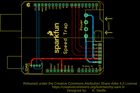
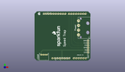
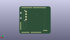
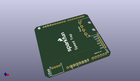

Contents
========

* [PROJ-SPAR-8530-STAN-01>Speed Trap](#proj-spar-8530-stan-01speed-trap)
	* [Images](#images)
	* [Interactive BOM](#interactive-bom)
	* [OOMP Parts](#oomp-parts)
	* [Tags](#tags)
  
![][im]
# PROJ-SPAR-8530-STAN-01>Speed Trap

- ID: PROJ-SPAR-8530-STAN-01
- Hex ID: PRS8530
- Name: Speed Trap
- Description: 

## Images
  
  

|eagleImage|kicadPcb3dFront|kicadPcb3dBack|kicadPcb3d|
| :---: | :---: | :---: | :---: |
|||||

## Interactive BOM

- Interactive BOM page: [ibom.html](kicad/bom/ibom.html)

## OOMP Parts
  

|OOMP Parts|
| :---: |
|UNMATCHED-UNMATCHED-X-UNMATCHED-01, J1, 0.0, 53.339999999999996, 270,J1, ARDUINO_R3_SHIELD, UNO_R3_SHIELD, SparkFun-Boards, (0, 2.1), R270|
|UNMATCHED-UNMATCHED-X-UNMATCHED-01, J2, 49.529999999999994, 35.559999999999995, 270,J2, Power, COMPUTER-PERIPHERAL-POWER-RA, SparkFun-Connectors, (1.95, 1.4), R270|
|UNMATCHED-UNMATCHED-X-UNMATCHED-01, JP1, 10.16, 6.35, 180,JP1, LIDAR, JST-4-PTH, SparkFun-Connectors, (0.4, 0.25), R180|
|<table><tr><td></td><td> JP2</td><td>[HEAD-I01-X-PI06-01 2.54 mm 6 Pin Header](https://github.com/oomlout/oomlout_OOMP_parts/tree/main/HEAD-I01-X-PI06-01/)</td><td>[H06](https://github.com/oomlout/oomlout_OOMP_parts/tree/main/HEAD-I01-X-PI06-01/)</td></tr></table>|

## Tags

- hexID: PRS8530
- oompType: PROJ
- oompSize: SPAR
- oompColor: 8530
- oompDesc: STAN
- oompIndex: 01
- oompName: Speed Trap
- sources: All source files from https://github.com/sparkfun/Speed_Trap (source licence details in srcLicense.md)
- linkBuyPage: https://www.sparkfun.com/products/8530
- oompID: PROJ-SPAR-8530-STAN-01
- oompPart: UNMATCHED-UNMATCHED-X-UNMATCHED-01, J1, 0.0, 53.339999999999996, 270
- oompPart: UNMATCHED-UNMATCHED-X-UNMATCHED-01, J2, 49.529999999999994, 35.559999999999995, 270
- oompPart: UNMATCHED-UNMATCHED-X-UNMATCHED-01, JP1, 10.16, 6.35, 180
- oompPart: HEAD-I01-X-PI06-01, JP2, 57.15, 21.59, 270
- rawPart: J1, ARDUINO_R3_SHIELD, UNO_R3_SHIELD, SparkFun-Boards, (0, 2.1), R270
- rawPart: J2, Power, COMPUTER-PERIPHERAL-POWER-RA, SparkFun-Connectors, (1.95, 1.4), R270
- rawPart: JP1, LIDAR, JST-4-PTH, SparkFun-Connectors, (0.4, 0.25), R180
- rawPart: JP2, OUT, 1X06, SparkFun-Connectors, (2.25, 0.85), R270

[im]: kicadPcb3d_450.png
