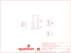

Contents
========

* [PRS8530 > Speed Trap](#prs8530--speed-trap)
	* [Schematic](#schematic)
	* [PCB](#pcb)
	* [Interactive BOM](#interactive-bom)
	* [OOMP Parts](#oomp-parts)
	* [Images](#images)
	* [Tags](#tags)
  
![][im]
# PRS8530 > Speed Trap

- ID: PROJ-SPAR-8530-STAN-01
- Hex ID: PRS8530
- Name: Sparkfun
- Description: Sparkfun
- Long Link: [http://oom.lt/PROJ-SPAR-8530-STAN-01](http://oom.lt/PROJ-SPAR-8530-STAN-01)
- Short Link: [http://oom.lt/PRS8530](http://oom.lt/PRS8530)

## Schematic
  

## PCB
  

## Interactive BOM

- Interactive BOM page: [ibom.html](https://htmlpreview.github.io/?https://github.com/oomlout/oomlout_OOMP_projects/blob/main/PROJ-SPAR-8530-STAN-01/kicad/bom/ibom.html)

## OOMP Parts
  

|OOMP ID|Name|Identifier|
| :---: | :---: | :---: |
|UNMATCHED-UNMATCHED-X-UNMATCHED-01||FRAME1, J1, J2|
|HEAD-I01-X-UNMATCHED-01||JP1|
|[HEAD-I01-X-PI06-01](https://github.com/oomlout/oomlout_OOMP_parts/tree/main/HEAD-I01-X-PI06-01/)|[2.54 mm 6 Pin Header](https://github.com/oomlout/oomlout_OOMP_parts/tree/main/HEAD-I01-X-PI06-01/)|[JP2](https://github.com/oomlout/oomlout_OOMP_parts/tree/main/HEAD-I01-X-PI06-01/)|

## Images
  
  

|bominteractivefront|bominteractiveback|kicadPcb3d|kicadPcb3dFront|kicadPcb3dBack|kicadSchem|eagleImage|eagleSchemImage|pcbdraw|pcbdrawback|
| :---: | :---: | :---: | :---: | :---: | :---: | :---: | :---: | :---: | :---: |
|||||||||||

## Tags

- hexID: PRS8530
- oompType: PROJ
- oompSize: SPAR
- oompColor: 8530
- oompDesc: STAN
- oompIndex: 01
- oompName: Speed Trap
- sources: All source files from https://github.com/sparkfun/Speed_Trap (source licence details in srcLicense.md)
- linkBuyPage: https://www.sparkfun.com/products/8530
- oompID: PROJ-SPAR-8530-STAN-01
- oompParts: FRAME1,UNMATCHED-UNMATCHED-X-UNMATCHED-01
- oompParts: J1,UNMATCHED-UNMATCHED-X-UNMATCHED-01
- oompParts: J2,UNMATCHED-UNMATCHED-X-UNMATCHED-01
- oompParts: JP1,HEAD-I01-X-UNMATCHED-01
- oompParts: JP2,HEAD-I01-X-PI06-01
- rawParts: FRAME1,,FRAME-LETTER,CREATIVE_COMMONS,Schematic Frame,N. Seidle,,,v01,
- rawParts: J1,ARDUINO_R3_SHIELD,ARDUINO_R3_SHIELD,UNO_R3_SHIELD,Shield form compatible with the Arduino Uno R3.,,,,,
- rawParts: J2,Power,COMPUTER-PERIPHERAL-POWERRA,COMPUTER-PERIPHERAL-POWER-RA,,,,,,
- rawParts: JP1,LIDAR,M04JST-PTH,JST-4-PTH,Header 4,,,PRT-09916,,
- rawParts: JP2,OUT,M06SILK_FEMALE_PTH,1X06,Header 6,,CONN-08437,,,
- rawParts: LOGO1,SFE_LOGO_NAME_FLAME.2_INCH,SFE_LOGO_NAME_FLAME.2_INCH,SFE_LOGO_NAME_FLAME_.2,SFE Logo, name and flame,,,,,
- rawParts: LOGO2,OSHW-LOGOS,OSHW-LOGOS,OSHW-LOGO-S,Open Source Hardware Logo This logo indicates the piece of hardware it is found on incorporates a OSHW license and/or adheres to the definition of open source hardware found here: http://freedomdefined.org/OSHW,,,,,

[im]: kicadPcb3d_450.png
