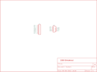
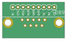

Contents
========

* [PRS8552 > Serial DB9 Breakout](#prs8552--serial-db9-breakout)
	* [Schematic](#schematic)
	* [PCB](#pcb)
	* [Interactive BOM](#interactive-bom)
	* [OOMP Parts](#oomp-parts)
	* [Images](#images)
	* [Tags](#tags)
  
![][im]
# PRS8552 > Serial DB9 Breakout

- ID: PROJ-SPAR-8552-STAN-01
- Hex ID: PRS8552
- Name: Sparkfun 8552
- Description: Sparkfun 8552
- Long Link: [http://oom.lt/PROJ-SPAR-8552-STAN-01](http://oom.lt/PROJ-SPAR-8552-STAN-01)
- Short Link: [http://oom.lt/PRS8552](http://oom.lt/PRS8552)

## Schematic
  

## PCB
  

## Interactive BOM

- Interactive BOM page: [ibom.html](https://htmlpreview.github.io/?https://github.com/oomlout/oomlout_OOMP_projects/blob/main/PROJ-SPAR-8552-STAN-01/kicad/bom/ibom.html)

## OOMP Parts
  

|OOMP ID|Name|Identifier|
| :---: | :---: | :---: |
|UNMATCHED-UNMATCHED-X-UNMATCHED-01||DB9|
|[HEAD-I01-X-PI09-01](https://github.com/oomlout/oomlout_OOMP_parts/tree/main/HEAD-I01-X-PI09-01/)|[2.54 mm 9 Pin Header](https://github.com/oomlout/oomlout_OOMP_parts/tree/main/HEAD-I01-X-PI09-01/)|[JP1](https://github.com/oomlout/oomlout_OOMP_parts/tree/main/HEAD-I01-X-PI09-01/)|

## Images
  
  

|bominteractivefront|bominteractiveback|kicadPcb3d|kicadPcb3dFront|kicadPcb3dBack|kicadSchem|eagleImage|eagleSchemImage|pcbdraw|pcbdrawback|
| :---: | :---: | :---: | :---: | :---: | :---: | :---: | :---: | :---: | :---: |
|||||||||||

## Tags

- hexID: PRS8552
- oompType: PROJ
- oompSize: SPAR
- oompColor: 8552
- oompDesc: STAN
- oompIndex: 01
- oompName: Serial DB9 Breakout
- sources: All source files from https://github.com/sparkfun/Serial_DB9_Breakout (source licence details in srcLicense.md)
- linkBuyPage: https://www.sparkfun.com/products/8552
- oompID: PROJ-SPAR-8552-STAN-01
- oompParts: DB9,UNMATCHED-UNMATCHED-X-UNMATCHED-01
- oompParts: JP1,HEAD-I01-X-PI09-01
- rawParts: DB9,,DB9,DB9,DB9 Connector,,
- rawParts: JP1,M09,M09,1X09,Header 9,,
- rawParts: U$2,LOGO-SFENEW,LOGO-SFENEW,SFE-NEW-WEBLOGO,Spark Fun Electronics PCB Logo,,

[im]: kicadPcb3d_450.png
