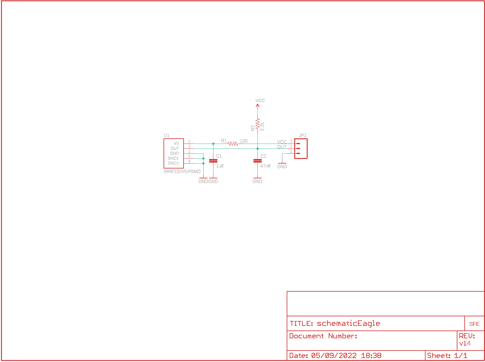
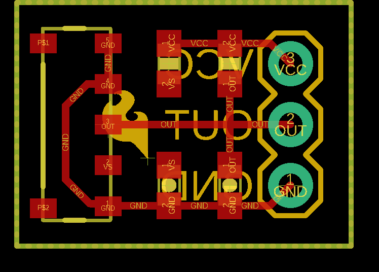
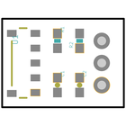
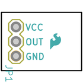
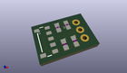
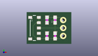
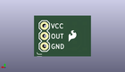
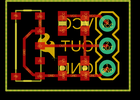
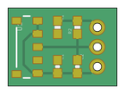
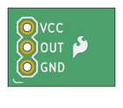

Contents
========

* [PRS8554 > IR Receiver Breakout](#prs8554--ir-receiver-breakout)
	* [Schematic](#schematic)
	* [PCB](#pcb)
	* [Interactive BOM](#interactive-bom)
	* [Images](#images)
	* [Tags](#tags)
  
![][im]
# PRS8554 > IR Receiver Breakout

- ID: PROJ-SPAR-8554-STAN-01
- Hex ID: PRS8554
- Name: Sparkfun
- Description: Sparkfun
- Long Link: [http://oom.lt/PROJ-SPAR-8554-STAN-01](http://oom.lt/PROJ-SPAR-8554-STAN-01)
- Short Link: [http://oom.lt/PRS8554](http://oom.lt/PRS8554)

## Schematic
  

## PCB
  

## Interactive BOM

- Interactive BOM page: [ibom.html](https://htmlpreview.github.io/?https://github.com/oomlout/oomlout_OOMP_projects/blob/main/PROJ-SPAR-8554-STAN-01/kicad/bom/ibom.html)

## Images
  
  

|bominteractivefront|bominteractiveback|kicadPcb3d|kicadPcb3dFront|kicadPcb3dBack|eagleImage|eagleSchemImage|pcbdraw|pcbdrawback|
| :---: | :---: | :---: | :---: | :---: | :---: | :---: | :---: | :---: |
||||||||||

## Tags

- hexID: PRS8554
- oompType: PROJ
- oompSize: SPAR
- oompColor: 8554
- oompDesc: STAN
- oompIndex: 01
- oompName: IR Receiver Breakout
- sources: All source files from https://github.com/sparkfun/IR_Receiver_Breakout (source licence details in srcLicense.md)
- linkBuyPage: https://www.sparkfun.com/products/8554
- oompID: PROJ-SPAR-8554-STAN-01
- rawParts: C1,1uF,CAP0603-CAP,0603-CAP,Capacitor,,
- rawParts: C2,47nF,CAP0603-CAP,0603-CAP,Capacitor,,
- rawParts: JP1,,M03PTH,1X03,Header 3,,
- rawParts: R1,100,RESISTOR0603-RES,0603-RES,Resistor,,
- rawParts: R2,2.2k,RESISTOR0603-RES,0603-RES,Resistor,,
- rawParts: U$1,LOGO-SFESK,LOGO-SFESK,SFE-LOGO-FLAME,Spark Fun Electronics PCB Logo,,
- rawParts: U1,IRRECEIVERSMD,IRRECEIVERSMD,TSOP8523,Description: IR receiver with built in demodulation and filtering. SparkFun SKU: SEN-08545,,

[im]: kicadPcb3d_450.png
