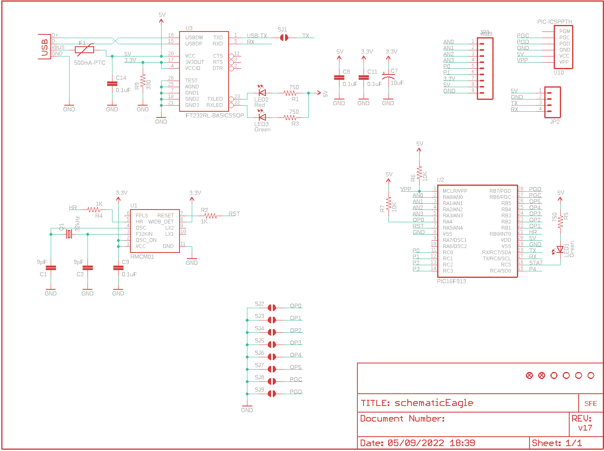
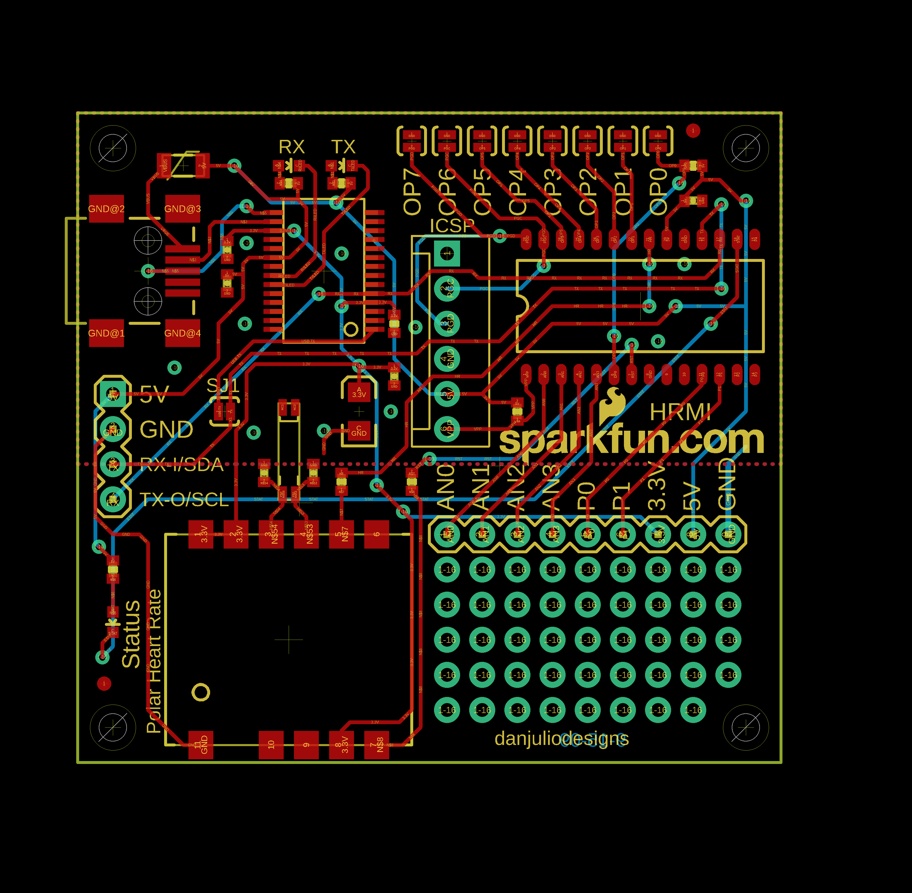
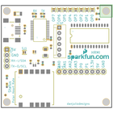
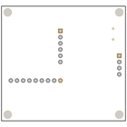
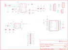
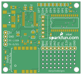
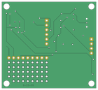

Contents
========

* [PRS8661 > Polar Heart Rate Monitor Interface](#prs8661--polar-heart-rate-monitor-interface)
	* [Schematic](#schematic)
	* [PCB](#pcb)
	* [Interactive BOM](#interactive-bom)
	* [Images](#images)
	* [Tags](#tags)
  
![][im]
# PRS8661 > Polar Heart Rate Monitor Interface

- ID: PROJ-SPAR-8661-STAN-01
- Hex ID: PRS8661
- Name: Sparkfun
- Description: Sparkfun
- Long Link: [http://oom.lt/PROJ-SPAR-8661-STAN-01](http://oom.lt/PROJ-SPAR-8661-STAN-01)
- Short Link: [http://oom.lt/PRS8661](http://oom.lt/PRS8661)

## Schematic
  

## PCB
  

## Interactive BOM

- Interactive BOM page: [ibom.html](https://htmlpreview.github.io/?https://github.com/oomlout/oomlout_OOMP_projects/blob/main/PROJ-SPAR-8661-STAN-01/kicad/bom/ibom.html)

## Images
  
  

|bominteractivefront|bominteractiveback|kicadPcb3d|kicadPcb3dFront|kicadPcb3dBack|eagleImage|eagleSchemImage|pcbdraw|pcbdrawback|
| :---: | :---: | :---: | :---: | :---: | :---: | :---: | :---: | :---: |
||||||||||

## Tags

- hexID: PRS8661
- oompType: PROJ
- oompSize: SPAR
- oompColor: 8661
- oompDesc: STAN
- oompIndex: 01
- oompName: Polar Heart Rate Monitor Interface
- sources: All source files from https://github.com/sparkfun/Polar_Heart_Rate_Monitor_Interface (source licence details in srcLicense.md)
- linkBuyPage: https://www.sparkfun.com/products/8661
- oompID: PROJ-SPAR-8661-STAN-01
- rawParts: C1,9pF,CAP0402-CAP,0402-CAP,Capacitor,,
- rawParts: C2,9pF,CAP0402-CAP,0402-CAP,Capacitor,,
- rawParts: C7,10uF,CAP_POL1206,EIA3216,Capacitor Polarized,,
- rawParts: C8,0.1uF,CAP0402-CAP,0402-CAP,Capacitor,,
- rawParts: C9,0.1uF,CAP0402-CAP,0402-CAP,Capacitor,,
- rawParts: C11,0.1uF,CAP0402-CAP,0402-CAP,Capacitor,,
- rawParts: C14,0.1uF,CAP0402-CAP,0402-CAP,Capacitor,,
- rawParts: F1,500mA-PTC,PTCSMD,PTC-1206,Resettable Fuse PTC,,
- rawParts: JP2,,M04PTH,1X04,Header 4,,
- rawParts: JP3,M09,M09,1X09,Header 9,,
- rawParts: LED1,Green,LED0603,LED-0603,LEDs,,
- rawParts: LED2,Red,LED0603,LED-0603,LEDs,,
- rawParts: LED3,Green,LED0603,LED-0603,LEDs,,
- rawParts: Q1,32kHz,CRYSTALEPSONMC146,CRYSTAL-32KHZ-SMD_EPSON_MC146,Crystals,,
- rawParts: R1,750,RESISTOR0402-RES,0402-RES,Resistor,,
- rawParts: R2,1K,RESISTOR0402-RES,0402-RES,Resistor,,
- rawParts: R3,750,RESISTOR0402-RES,0402-RES,Resistor,,
- rawParts: R4,1K,RESISTOR0402-RES,0402-RES,Resistor,,
- rawParts: R5,750,RESISTOR0402-RES,0402-RES,Resistor,,
- rawParts: R6,10K,RESISTOR0402-RES,0402-RES,Resistor,,
- rawParts: R7,10K,RESISTOR0402-RES,0402-RES,Resistor,,
- rawParts: R9,330,RESISTOR0402-RES,0402-RES,Resistor,,
- rawParts: SJ1,SOLDERJUMPERNC2,SOLDERJUMPERNC2,SJ_2S-NOTRACE,Solder Jumper,,
- rawParts: SJ2,SOLDERJUMPERNO,SOLDERJUMPERNO,SJ_2S-NO,Solder Jumper,,
- rawParts: SJ3,SOLDERJUMPERNO,SOLDERJUMPERNO,SJ_2S-NO,Solder Jumper,,
- rawParts: SJ4,SOLDERJUMPERNO,SOLDERJUMPERNO,SJ_2S-NO,Solder Jumper,,
- rawParts: SJ5,SOLDERJUMPERNO,SOLDERJUMPERNO,SJ_2S-NO,Solder Jumper,,
- rawParts: SJ6,SOLDERJUMPERNO,SOLDERJUMPERNO,SJ_2S-NO,Solder Jumper,,
- rawParts: SJ7,SOLDERJUMPERNO,SOLDERJUMPERNO,SJ_2S-NO,Solder Jumper,,
- rawParts: SJ8,SOLDERJUMPERNO,SOLDERJUMPERNO,SJ_2S-NO,Solder Jumper,,
- rawParts: SJ9,SOLDERJUMPERNO,SOLDERJUMPERNO,SJ_2S-NO,Solder Jumper,,
- rawParts: U$1,LOGO-SFENEW,LOGO-SFENEW,SFE-NEW-WEBLOGO,Spark Fun Electronics PCB Logo,,
- rawParts: U$4,FIDUCIAL1X2,FIDUCIAL1X2,FIDUCIAL-1X2,Fiducial Alignment Points,,
- rawParts: U$8,FIDUCIAL1X2,FIDUCIAL1X2,FIDUCIAL-1X2,Fiducial Alignment Points,,
- rawParts: U$13,STAND-OFF,STAND-OFF,STAND-OFF,Stand Off,,
- rawParts: U$15,STAND-OFF,STAND-OFF,STAND-OFF,Stand Off,,
- rawParts: U$16,STAND-OFF,STAND-OFF,STAND-OFF,Stand Off,,
- rawParts: U$17,STAND-OFF,STAND-OFF,STAND-OFF,Stand Off,,
- rawParts: U1,RMCM01,RMCM01SMD,RMCM01,,,
- rawParts: U2,PIC16F913,PIC16F913SOIC28,SO-28W,,,
- rawParts: U3,FT232RL-BASICSSOP,FT232RL-BASICSSOP,SSOP28DB,USB UART,,
- rawParts: U10,PIC-ICSPPTH,PIC-ICSPPTH,MOLEX-1X6,ISCP Programming connector for UAV, UBW Kit, etc.,,
- rawParts: X1,USBSMD,USBSMD,USB-MINIB,USB Connectors,,

[im]: kicadPcb3d_450.png
