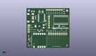
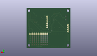
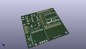

Contents
========

* [PROJ-SPAR-8661-STAN-01>Polar Heart Rate Monitor Interface](#proj-spar-8661-stan-01polar-heart-rate-monitor-interface)
	* [Images](#images)
	* [Interactive BOM](#interactive-bom)
	* [OOMP Parts](#oomp-parts)
	* [Tags](#tags)
  
![][im]
# PROJ-SPAR-8661-STAN-01>Polar Heart Rate Monitor Interface

- ID: PROJ-SPAR-8661-STAN-01
- Hex ID: PRS8661
- Name: Polar Heart Rate Monitor Interface
- Description: 

## Images
  
  

|eagleImage|kicadPcb3dFront|kicadPcb3dBack|kicadPcb3d|
| :---: | :---: | :---: | :---: |
|||||

## Interactive BOM

- Interactive BOM page: [ibom.html](kicad/bom/ibom.html)

## OOMP Parts
  

|OOMP Parts|
| :---: |
|CAPE-0402-X-UNMATCHED-01, C1, 17.018, 20.955, 270,C1, 9pF, 0402-CAP, SparkFun, (0.67, 0.825), R270|
|CAPE-0402-X-UNMATCHED-01, C2, 13.462, 20.955, 270,C2, 9pF, 0402-CAP, SparkFun, (0.53, 0.825), R270|
|CAPE-UNMATCHED-X-UNMATCHED-01, C7, 20.32, 25.4, 90,C7, 10uF, EIA3216, SparkFun, (0.8, 1), R90|
|CAPE-0402-X-NF100-01, C8, 44.449999999999996, 40.64, 0,C8, 0.1uF, 0402-CAP, SparkFun, (1.75, 1.6), R0|
|CAPE-0402-X-NF100-01, C9, 22.86, 27.94, 270,C9, 0.1uF, 0402-CAP, SparkFun, (0.9, 1.1), R270|
|CAPE-0402-X-NF100-01, C11, 10.795, 37.083999999999996, 270,C11, 0.1uF, 0402-CAP, SparkFun, (0.425, 1.46), R270|
|CAPE-0402-X-NF100-01, C14, 10.795, 34.671, 270,C14, 0.1uF, 0402-CAP, SparkFun, (0.425, 1.365), R270|
|UNMATCHED-UNMATCHED-X-UNMATCHED-01, F1, 7.619999999999999, 43.18, 0,F1, 500mA-PTC, PTC-1206, SparkFun, (0.3, 1.7), R0|
|UNMATCHED-UNMATCHED-X-UNMATCHED-01, JP2, 2.54, 26.669999999999998, 270,JP2, 1X04, SparkFun, (0.1, 1.05), R270|
|UNMATCHED-UNMATCHED-X-UNMATCHED-01, JP3, 26.669999999999998, 16.509999999999998, 0,JP3, M09, 1X09, SparkFun, (1.05, 0.65), R0|
|UNMATCHED-0603-X-UNMATCHED-01, LED1, 2.54, 10.16, 180,LED1, Green, LED-0603, SparkFun, (0.1, 0.4), R180|
|UNMATCHED-0603-X-UNMATCHED-01, LED2, 19.049999999999997, 43.18, 270,LED2, Red, LED-0603, SparkFun, (0.75, 1.7), R270|
|UNMATCHED-0603-X-UNMATCHED-01, LED3, 15.239999999999998, 43.18, 270,LED3, Green, LED-0603, SparkFun, (0.6, 1.7), R270|
|UNMATCHED-UNMATCHED-X-UNMATCHED-01, Q1, 16.002, 18.796, 90,Q1, 32kHz, CRYSTAL-32KHZ-SMD_EPSON_MC146, SparkFun, (0.63, 0.74), R90|
|RESE-0402-X-UNMATCHED-01, R1, 19.049999999999997, 41.91, 180,R1, 750, 0402-RES, SparkFun, (0.75, 1.65), R180|
|RESE-0402-X-UNMATCHED-01, R2, 24.13, 20.32, 90,R2, 1K, 0402-RES, SparkFun, (0.95, 0.8), R90|
|RESE-0402-X-UNMATCHED-01, R3, 15.239999999999998, 41.91, 180,R3, 750, 0402-RES, SparkFun, (0.6, 1.65), R180|
|RESE-0402-X-UNMATCHED-01, R4, 19.049999999999997, 20.32, 90,R4, 1K, 0402-RES, SparkFun, (0.75, 0.8), R90|
|RESE-0402-X-UNMATCHED-01, R5, 2.54, 13.97, 270,R5, 750, 0402-RES, SparkFun, (0.1, 0.55), R270|
|<table><tr><td></td><td> R6</td><td>[RESE-0402-X-O103-01 SMD (0402) 10k Ohm Resistor](https://github.com/oomlout/oomlout_OOMP_parts/tree/main/RESE-0402-X-O103-01/)</td><td>[R42103](https://github.com/oomlout/oomlout_OOMP_parts/tree/main/RESE-0402-X-O103-01/)</td></tr></table>|
|<table><tr><td></td><td> R7</td><td>[RESE-0402-X-O103-01 SMD (0402) 10k Ohm Resistor](https://github.com/oomlout/oomlout_OOMP_parts/tree/main/RESE-0402-X-O103-01/)</td><td>[R42103](https://github.com/oomlout/oomlout_OOMP_parts/tree/main/RESE-0402-X-O103-01/)</td></tr></table>|
|RESE-0402-X-O331-01, R9, 22.86, 31.75, 90,R9, 330, 0402-RES, SparkFun, (0.9, 1.25), R90|
|UNMATCHED-UNMATCHED-X-UNMATCHED-01, SJ1, 10.617199999999999, 25.4, 0,SJ1, SOLDERJUMPERNC2, SJ_2S-NOTRACE, SparkFun, (0.418, 1), R0|
|UNMATCHED-UNMATCHED-X-UNMATCHED-01, SJ2, 41.91, 44.958, 270,SJ2, SOLDERJUMPERNO, SJ_2S-NO, SparkFun, (1.65, 1.77), R270|
|UNMATCHED-UNMATCHED-X-UNMATCHED-01, SJ3, 39.37, 44.958, 270,SJ3, SOLDERJUMPERNO, SJ_2S-NO, SparkFun, (1.55, 1.77), R270|
|UNMATCHED-UNMATCHED-X-UNMATCHED-01, SJ4, 36.83, 44.958, 270,SJ4, SOLDERJUMPERNO, SJ_2S-NO, SparkFun, (1.45, 1.77), R270|
|UNMATCHED-UNMATCHED-X-UNMATCHED-01, SJ5, 34.29, 44.958, 270,SJ5, SOLDERJUMPERNO, SJ_2S-NO, SparkFun, (1.35, 1.77), R270|
|UNMATCHED-UNMATCHED-X-UNMATCHED-01, SJ6, 31.75, 44.958, 270,SJ6, SOLDERJUMPERNO, SJ_2S-NO, SparkFun, (1.25, 1.77), R270|
|UNMATCHED-UNMATCHED-X-UNMATCHED-01, SJ7, 29.209999999999997, 44.958, 270,SJ7, SOLDERJUMPERNO, SJ_2S-NO, SparkFun, (1.15, 1.77), R270|
|UNMATCHED-UNMATCHED-X-UNMATCHED-01, SJ8, 26.669999999999998, 44.958, 270,SJ8, SOLDERJUMPERNO, SJ_2S-NO, SparkFun, (1.05, 1.77), R270|
|UNMATCHED-UNMATCHED-X-UNMATCHED-01, SJ9, 24.13, 44.958, 270,SJ9, SOLDERJUMPERNO, SJ_2S-NO, SparkFun, (0.95, 1.77), R270|
|UNMATCHED-UNMATCHED-X-UNMATCHED-01, U1, 15.239999999999998, 8.889999999999999, 0,U1, RMCM01, RMCM01, SparkFun, (0.6, 0.35), R0|
|UNMATCHED-UNMATCHED-X-UNMATCHED-01, U2, 40.64, 33.019999999999996, 0,U2, PIC16F913, SO-28W, SparkFun, (1.6, 1.3), R0|
|UNMATCHED-UNMATCHED-X-UNMATCHED-01, U3, 17.779999999999998, 35.559999999999995, 90,U3, FT232RL-BASICSSOP, SSOP28DB, SparkFun, (0.7, 1.4), R90|
|UNMATCHED-UNMATCHED-X-UNMATCHED-01, U10, 26.669999999999998, 36.83, 270,U10, PIC-ICSPPTH, MOLEX-1X6, SparkFun, (1.05, 1.45), R270|
|UNMATCHED-UNMATCHED-X-UNMATCHED-01, X1, 5.08, 35.559999999999995, 0,X1, USBSMD, USB-MINIB, SparkFun, (0.2, 1.4), R0|

## Tags

- hexID: PRS8661
- oompType: PROJ
- oompSize: SPAR
- oompColor: 8661
- oompDesc: STAN
- oompIndex: 01
- oompName: Polar Heart Rate Monitor Interface
- sources: All source files from https://github.com/sparkfun/Polar_Heart_Rate_Monitor_Interface (source licence details in srcLicense.md)
- linkBuyPage: https://www.sparkfun.com/products/8661
- oompPart: CAPE-0402-X-UNMATCHED-01, C1, 17.018, 20.955, 270
- oompPart: CAPE-0402-X-UNMATCHED-01, C2, 13.462, 20.955, 270
- oompPart: CAPE-UNMATCHED-X-UNMATCHED-01, C7, 20.32, 25.4, 90
- oompPart: CAPE-0402-X-NF100-01, C8, 44.449999999999996, 40.64, 0
- oompPart: CAPE-0402-X-NF100-01, C9, 22.86, 27.94, 270
- oompPart: CAPE-0402-X-NF100-01, C11, 10.795, 37.083999999999996, 270
- oompPart: CAPE-0402-X-NF100-01, C14, 10.795, 34.671, 270
- oompPart: UNMATCHED-UNMATCHED-X-UNMATCHED-01, F1, 7.619999999999999, 43.18, 0
- oompPart: UNMATCHED-UNMATCHED-X-UNMATCHED-01, JP2, 2.54, 26.669999999999998, 270
- oompPart: UNMATCHED-UNMATCHED-X-UNMATCHED-01, JP3, 26.669999999999998, 16.509999999999998, 0
- oompPart: UNMATCHED-0603-X-UNMATCHED-01, LED1, 2.54, 10.16, 180
- oompPart: UNMATCHED-0603-X-UNMATCHED-01, LED2, 19.049999999999997, 43.18, 270
- oompPart: UNMATCHED-0603-X-UNMATCHED-01, LED3, 15.239999999999998, 43.18, 270
- oompPart: UNMATCHED-UNMATCHED-X-UNMATCHED-01, Q1, 16.002, 18.796, 90
- oompPart: RESE-0402-X-UNMATCHED-01, R1, 19.049999999999997, 41.91, 180
- oompPart: RESE-0402-X-UNMATCHED-01, R2, 24.13, 20.32, 90
- oompPart: RESE-0402-X-UNMATCHED-01, R3, 15.239999999999998, 41.91, 180
- oompPart: RESE-0402-X-UNMATCHED-01, R4, 19.049999999999997, 20.32, 90
- oompPart: RESE-0402-X-UNMATCHED-01, R5, 2.54, 13.97, 270
- oompPart: RESE-0402-X-O103-01, R6, 31.75, 25.4, 90
- oompPart: RESE-0402-X-O103-01, R7, 44.449999999999996, 43.18, 0
- oompPart: RESE-0402-X-O331-01, R9, 22.86, 31.75, 90
- oompPart: UNMATCHED-UNMATCHED-X-UNMATCHED-01, SJ1, 10.617199999999999, 25.4, 0
- oompPart: UNMATCHED-UNMATCHED-X-UNMATCHED-01, SJ2, 41.91, 44.958, 270
- oompPart: UNMATCHED-UNMATCHED-X-UNMATCHED-01, SJ3, 39.37, 44.958, 270
- oompPart: UNMATCHED-UNMATCHED-X-UNMATCHED-01, SJ4, 36.83, 44.958, 270
- oompPart: UNMATCHED-UNMATCHED-X-UNMATCHED-01, SJ5, 34.29, 44.958, 270
- oompPart: UNMATCHED-UNMATCHED-X-UNMATCHED-01, SJ6, 31.75, 44.958, 270
- oompPart: UNMATCHED-UNMATCHED-X-UNMATCHED-01, SJ7, 29.209999999999997, 44.958, 270
- oompPart: UNMATCHED-UNMATCHED-X-UNMATCHED-01, SJ8, 26.669999999999998, 44.958, 270
- oompPart: UNMATCHED-UNMATCHED-X-UNMATCHED-01, SJ9, 24.13, 44.958, 270
- oompPart: SKIP-UNMATCHED-X-UNMATCHED-01, U$4, 1.9049999999999998, 5.715, 0
- oompPart: SKIP-UNMATCHED-X-UNMATCHED-01, U$8, 44.449999999999996, 45.72, 0
- oompPart: UNMATCHED-UNMATCHED-X-UNMATCHED-01, U1, 15.239999999999998, 8.889999999999999, 0
- oompPart: UNMATCHED-UNMATCHED-X-UNMATCHED-01, U2, 40.64, 33.019999999999996, 0
- oompPart: UNMATCHED-UNMATCHED-X-UNMATCHED-01, U3, 17.779999999999998, 35.559999999999995, 90
- oompPart: UNMATCHED-UNMATCHED-X-UNMATCHED-01, U10, 26.669999999999998, 36.83, 270
- oompPart: UNMATCHED-UNMATCHED-X-UNMATCHED-01, X1, 5.08, 35.559999999999995, 0
- rawPart: C1, 9pF, 0402-CAP, SparkFun, (0.67, 0.825), R270
- rawPart: C2, 9pF, 0402-CAP, SparkFun, (0.53, 0.825), R270
- rawPart: C7, 10uF, EIA3216, SparkFun, (0.8, 1), R90
- rawPart: C8, 0.1uF, 0402-CAP, SparkFun, (1.75, 1.6), R0
- rawPart: C9, 0.1uF, 0402-CAP, SparkFun, (0.9, 1.1), R270
- rawPart: C11, 0.1uF, 0402-CAP, SparkFun, (0.425, 1.46), R270
- rawPart: C14, 0.1uF, 0402-CAP, SparkFun, (0.425, 1.365), R270
- rawPart: F1, 500mA-PTC, PTC-1206, SparkFun, (0.3, 1.7), R0
- rawPart: JP2, 1X04, SparkFun, (0.1, 1.05), R270
- rawPart: JP3, M09, 1X09, SparkFun, (1.05, 0.65), R0
- rawPart: LED1, Green, LED-0603, SparkFun, (0.1, 0.4), R180
- rawPart: LED2, Red, LED-0603, SparkFun, (0.75, 1.7), R270
- rawPart: LED3, Green, LED-0603, SparkFun, (0.6, 1.7), R270
- rawPart: Q1, 32kHz, CRYSTAL-32KHZ-SMD_EPSON_MC146, SparkFun, (0.63, 0.74), R90
- rawPart: R1, 750, 0402-RES, SparkFun, (0.75, 1.65), R180
- rawPart: R2, 1K, 0402-RES, SparkFun, (0.95, 0.8), R90
- rawPart: R3, 750, 0402-RES, SparkFun, (0.6, 1.65), R180
- rawPart: R4, 1K, 0402-RES, SparkFun, (0.75, 0.8), R90
- rawPart: R5, 750, 0402-RES, SparkFun, (0.1, 0.55), R270
- rawPart: R6, 10K, 0402-RES, SparkFun, (1.25, 1), R90
- rawPart: R7, 10K, 0402-RES, SparkFun, (1.75, 1.7), R0
- rawPart: R9, 330, 0402-RES, SparkFun, (0.9, 1.25), R90
- rawPart: SJ1, SOLDERJUMPERNC2, SJ_2S-NOTRACE, SparkFun, (0.418, 1), R0
- rawPart: SJ2, SOLDERJUMPERNO, SJ_2S-NO, SparkFun, (1.65, 1.77), R270
- rawPart: SJ3, SOLDERJUMPERNO, SJ_2S-NO, SparkFun, (1.55, 1.77), R270
- rawPart: SJ4, SOLDERJUMPERNO, SJ_2S-NO, SparkFun, (1.45, 1.77), R270
- rawPart: SJ5, SOLDERJUMPERNO, SJ_2S-NO, SparkFun, (1.35, 1.77), R270
- rawPart: SJ6, SOLDERJUMPERNO, SJ_2S-NO, SparkFun, (1.25, 1.77), R270
- rawPart: SJ7, SOLDERJUMPERNO, SJ_2S-NO, SparkFun, (1.15, 1.77), R270
- rawPart: SJ8, SOLDERJUMPERNO, SJ_2S-NO, SparkFun, (1.05, 1.77), R270
- rawPart: SJ9, SOLDERJUMPERNO, SJ_2S-NO, SparkFun, (0.95, 1.77), R270
- rawPart: U$4, FIDUCIAL1X2, FIDUCIAL-1X2, SparkFun, (0.075, 0.225), R0
- rawPart: U$8, FIDUCIAL1X2, FIDUCIAL-1X2, SparkFun, (1.75, 1.8), R0
- rawPart: U1, RMCM01, RMCM01, SparkFun, (0.6, 0.35), R0
- rawPart: U2, PIC16F913, SO-28W, SparkFun, (1.6, 1.3), R0
- rawPart: U3, FT232RL-BASICSSOP, SSOP28DB, SparkFun, (0.7, 1.4), R90
- rawPart: U10, PIC-ICSPPTH, MOLEX-1X6, SparkFun, (1.05, 1.45), R270
- rawPart: X1, USBSMD, USB-MINIB, SparkFun, (0.2, 1.4), R0

[im]: kicadPcb3d_450.png
