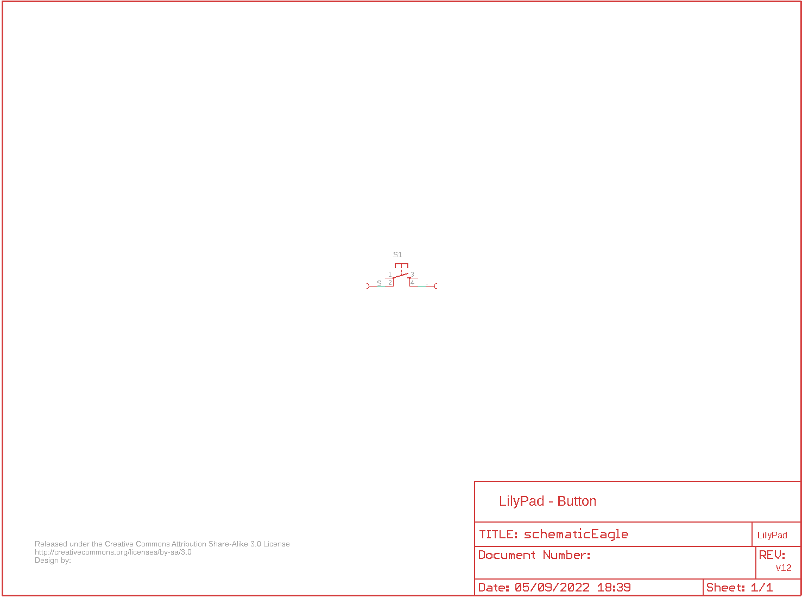
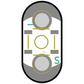
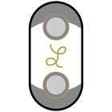
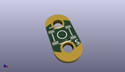
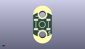
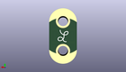

Contents
========

* [PRS8776 > LilyPad Button Board](#prs8776--lilypad-button-board)
	* [Schematic](#schematic)
	* [PCB](#pcb)
	* [Interactive BOM](#interactive-bom)
	* [OOMP Parts](#oomp-parts)
	* [Images](#images)
	* [Tags](#tags)
  
![][im]
# PRS8776 > LilyPad Button Board

- ID: PROJ-SPAR-8776-STAN-01
- Hex ID: PRS8776
- Name: Sparkfun
- Description: Sparkfun
- Long Link: [http://oom.lt/PROJ-SPAR-8776-STAN-01](http://oom.lt/PROJ-SPAR-8776-STAN-01)
- Short Link: [http://oom.lt/PRS8776](http://oom.lt/PRS8776)

## Schematic
  

## PCB
  

## Interactive BOM

- Interactive BOM page: [ibom.html](https://htmlpreview.github.io/?https://github.com/oomlout/oomlout_OOMP_projects/blob/main/PROJ-SPAR-8776-STAN-01/kicad/bom/ibom.html)

## OOMP Parts
  

|OOMP ID|Name|Identifier|
| :---: | :---: | :---: |
|UNMATCHED-UNMATCHED-X-UNMATCHED-01||S1|

## Images
  
  

|bominteractivefront|bominteractiveback|kicadPcb3d|kicadPcb3dFront|kicadPcb3dBack|eagleImage|eagleSchemImage|pcbdraw|pcbdrawback|
| :---: | :---: | :---: | :---: | :---: | :---: | :---: | :---: | :---: |
||||||||||

## Tags

- hexID: PRS8776
- oompType: PROJ
- oompSize: SPAR
- oompColor: 8776
- oompDesc: STAN
- oompIndex: 01
- oompName: LilyPad Button Board
- sources: All source files from https://github.com/sparkfun/LilyPad_Button_Board (source licence details in srcLicense.md)
- linkBuyPage: https://www.sparkfun.com/products/8776
- oompID: PROJ-SPAR-8776-STAN-01
- oompParts: S1,UNMATCHED-UNMATCHED-X-UNMATCHED-01
- rawParts: BUTTON-,SEWTAP8,SEWTAP8,PETAL-MEDIUM-2SIDE,,,
- rawParts: BUTTONS,SEWTAP8,SEWTAP8,PETAL-MEDIUM-2SIDE,,,
- rawParts: LOGO1,LOGO-LPL,LOGO-LPL,LOGO-L,,,
- rawParts: S1,,TAC_SWITCHSMD,TACTILE_SWITCH_SMD,Momentary Switch,,
- rawParts: U$1,CREATIVE_COMMONS,CREATIVE_COMMONS,CREATIVE_COMMONS,,,

[im]: kicadPcb3d_450.png
