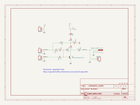
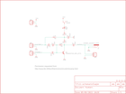

Contents
========

* [PRS8872 > Mic Preamp](#prs8872--mic-preamp)
	* [Schematic](#schematic)
	* [PCB](#pcb)
	* [Interactive BOM](#interactive-bom)
	* [OOMP Parts](#oomp-parts)
	* [Images](#images)
	* [Tags](#tags)
  
![][im]
# PRS8872 > Mic Preamp

- ID: PROJ-SPAR-8872-STAN-01
- Hex ID: PRS8872
- Name: Sparkfun 8872
- Description: Sparkfun 8872
- Long Link: [http://oom.lt/PROJ-SPAR-8872-STAN-01](http://oom.lt/PROJ-SPAR-8872-STAN-01)
- Short Link: [http://oom.lt/PRS8872](http://oom.lt/PRS8872)

## Schematic
  

## PCB
  

## Interactive BOM

- Interactive BOM page: [ibom.html](https://htmlpreview.github.io/?https://github.com/oomlout/oomlout_OOMP_projects/blob/main/PROJ-SPAR-8872-STAN-01/kicad/bom/ibom.html)

## OOMP Parts
  

|OOMP ID|Name|Identifier|
| :---: | :---: | :---: |
|CAPX-UNMATCHED-X-UF10-01||C1, C2, C3, C5|
|CAPX-UNMATCHED-X-UF100-01||C4|
|[DCJP-21D-X-STAN-01](https://github.com/oomlout/oomlout_OOMP_parts/tree/main/DCJP-21D-X-STAN-01/)|[2.1 mm DC Jack](https://github.com/oomlout/oomlout_OOMP_parts/tree/main/DCJP-21D-X-STAN-01/)|[J1](https://github.com/oomlout/oomlout_OOMP_parts/tree/main/DCJP-21D-X-STAN-01/)|
|[HEAD-I01-X-PI02-01](https://github.com/oomlout/oomlout_OOMP_parts/tree/main/HEAD-I01-X-PI02-01/)|[2.54 mm 2 Pin Header](https://github.com/oomlout/oomlout_OOMP_parts/tree/main/HEAD-I01-X-PI02-01/)|[JP1, JP2, JP3, JP4](https://github.com/oomlout/oomlout_OOMP_parts/tree/main/HEAD-I01-X-PI02-01/)|
|LEDS-UNMATCHED-R-STAN-01||LED1|
|UNMATCHED-UNMATCHED-X-UNMATCHED-01||Q1, S1|
|RESE-UNMATCHED-X-O121-01||R1|
|RESE-UNMATCHED-X-O222-01||R2|
|RESE-UNMATCHED-X-O472-01||R3|
|RESE-UNMATCHED-X-O2203-01||R4|

## Images
  
  

|bominteractivefront|bominteractiveback|kicadPcb3d|kicadPcb3dFront|kicadPcb3dBack|kicadSchem|eagleImage|eagleSchemImage|pcbdraw|pcbdrawback|
| :---: | :---: | :---: | :---: | :---: | :---: | :---: | :---: | :---: | :---: |
|||||||||||

## Tags

- hexID: PRS8872
- oompType: PROJ
- oompSize: SPAR
- oompColor: 8872
- oompDesc: STAN
- oompIndex: 01
- oompName: Mic Preamp
- sources: All source files from https://github.com/sparkfun/Mic_Preamp (source licence details in srcLicense.md)
- linkBuyPage: https://www.sparkfun.com/products/8872
- oompID: PROJ-SPAR-8872-STAN-01
- oompParts: C1,CAPX-UNMATCHED-X-UF10-01
- oompParts: C2,CAPX-UNMATCHED-X-UF10-01
- oompParts: C3,CAPX-UNMATCHED-X-UF10-01
- oompParts: C4,CAPX-UNMATCHED-X-UF100-01
- oompParts: C5,CAPX-UNMATCHED-X-UF10-01
- oompParts: J1,DCJP-21D-X-STAN-01
- oompParts: JP1,HEAD-I01-X-PI02-01
- oompParts: JP2,HEAD-I01-X-PI02-01
- oompParts: JP3,HEAD-I01-X-PI02-01
- oompParts: JP4,HEAD-I01-X-PI02-01
- oompParts: LED1,LEDS-UNMATCHED-R-STAN-01
- oompParts: Q1,UNMATCHED-UNMATCHED-X-UNMATCHED-01
- oompParts: R1,RESE-UNMATCHED-X-O121-01
- oompParts: R2,RESE-UNMATCHED-X-O222-01
- oompParts: R3,RESE-UNMATCHED-X-O472-01
- oompParts: R4,RESE-UNMATCHED-X-O2203-01
- oompParts: S1,UNMATCHED-UNMATCHED-X-UNMATCHED-01
- rawParts: C1,10uF,CAP_POLPTH2,CPOL-RADIAL-10UF-25V,Capacitor Polarized,,
- rawParts: C2,10uF,CAP_POLPTH2,CPOL-RADIAL-10UF-25V,Capacitor Polarized,,
- rawParts: C3,10uF,CAP_POLPTH2,CPOL-RADIAL-10UF-25V,Capacitor Polarized,,
- rawParts: C4,100uF,CAP_POLPTH1,CPOL-RADIAL-100UF-25V,Capacitor Polarized,,
- rawParts: C5,10uF,CAP_POLPTH2,CPOL-RADIAL-10UF-25V,Capacitor Polarized,,
- rawParts: J1,POWER_JACKRCA_LOCK,POWER_JACKRCA_LOCK,RCA_LOCK,Power Jack,,
- rawParts: JP1,,M02PTH,1X02,Header 2,,
- rawParts: JP2,,M02PTH,1X02,Header 2,,
- rawParts: JP3,,M02PTH,1X02,Header 2,,
- rawParts: JP4,,M02PTH,1X02,Header 2,,
- rawParts: JP6,LOGO-SFENW2,LOGO-SFENW2,SFE-NEW-WEB,Spark Fun Electronics PCB Logo,,
- rawParts: LED1,Red,LED5MM,LED5MM,LEDs,,
- rawParts: Q1,TRANSISTOR_NPN_2PTH,TRANSISTOR_NPN_2PTH,TO-92,,,
- rawParts: R1,120,RESISTORPTH1,AXIAL-0.3,Resistor,,
- rawParts: R2,2.2K,RESISTORPTH1,AXIAL-0.3,Resistor,,
- rawParts: R3,4.7K,RESISTORPTH1,AXIAL-0.3,Resistor,,
- rawParts: R4,220K,RESISTORPTH1,AXIAL-0.3,Resistor,,
- rawParts: S1,On/Off,SWITCH-SPSTPTH_LOCK,SWITCH-SPDT_LOCK.007S,SPST Switch,,
- rawParts: U$1,LOGO-SFESK,LOGO-SFESK,SFE-LOGO-FLAME,Spark Fun Electronics PCB Logo,,
- rawParts: U$2,STAND-OFF,STAND-OFF,STAND-OFF,Stand Off,,
- rawParts: U$3,STAND-OFF,STAND-OFF,STAND-OFF,Stand Off,,
- rawParts: U$4,STAND-OFF,STAND-OFF,STAND-OFF,Stand Off,,
- rawParts: U$5,STAND-OFF,STAND-OFF,STAND-OFF,Stand Off,,
- rawParts: U$6,LOGO-SFESK,LOGO-SFESK,SFE-LOGO-FLAME,Spark Fun Electronics PCB Logo,,

[im]: kicadPcb3d_450.png
