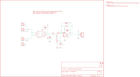

Contents
========

* [PRS8883 > Low Current Sensor Breakout-ACS712](#prs8883--low-current-sensor-breakout-acs712)
	* [Schematic](#schematic)
	* [PCB](#pcb)
	* [Interactive BOM](#interactive-bom)
	* [Images](#images)
	* [Tags](#tags)
  
![][im]
# PRS8883 > Low Current Sensor Breakout-ACS712

- ID: PROJ-SPAR-8883-STAN-01
- Hex ID: PRS8883
- Name: Sparkfun
- Description: Sparkfun
- Long Link: [http://oom.lt/PROJ-SPAR-8883-STAN-01](http://oom.lt/PROJ-SPAR-8883-STAN-01)
- Short Link: [http://oom.lt/PRS8883](http://oom.lt/PRS8883)

## Schematic
  

## PCB
  

## Interactive BOM

- Interactive BOM page: [ibom.html](https://htmlpreview.github.io/?https://github.com/oomlout/oomlout_OOMP_projects/blob/main/PROJ-SPAR-8883-STAN-01/kicad/bom/ibom.html)

## Images
  
  

|bominteractivefront|bominteractiveback|kicadPcb3d|kicadPcb3dFront|kicadPcb3dBack|eagleImage|eagleSchemImage|pcbdraw|pcbdrawback|
| :---: | :---: | :---: | :---: | :---: | :---: | :---: | :---: | :---: |
||||||||||

## Tags

- hexID: PRS8883
- oompType: PROJ
- oompSize: SPAR
- oompColor: 8883
- oompDesc: STAN
- oompIndex: 01
- oompName: Low Current Sensor Breakout-ACS712
- sources: All source files from https://github.com/sparkfun/Low_Current_Sensor_Breakout-ACS712 (source licence details in srcLicense.md)
- linkBuyPage: https://www.sparkfun.com/products/8883
- oompID: PROJ-SPAR-8883-STAN-01
- rawParts: C1,100pF,CAP0402-CAP,0402-CAP,Capacitor,,
- rawParts: C2,0.1uF,CAP0402-CAP,0402-CAP,Capacitor,,
- rawParts: C3,0.1uF,CAP0402-CAP,0402-CAP,Capacitor,,
- rawParts: C4,0.1uF,CAP0402-CAP,0402-CAP,Capacitor,,
- rawParts: C5,1nF,CAP0402-CAP,0402-CAP,Capacitor,,
- rawParts: JP1,M01PTH_2MM,M01PTH_2MM,1X01_2MM,Header 1,,
- rawParts: JP2,M01PTH_2MM,M01PTH_2MM,1X01_2MM,Header 1,,
- rawParts: JP3,,M03PTH,1X03,Header 3,,
- rawParts: JP4,M01PTH,M01PTH,1X01,Header 1,,
- rawParts: JP5,M01PTH,M01PTH,1X01,Header 1,,
- rawParts: R1,47K,RESISTOR0402-RES,0402-RES,Resistor,,
- rawParts: R2,1K,RESISTOR0402-RES,0402-RES,Resistor,,
- rawParts: R3,TRIMPOTSMD,TRIMPOTSMD,TRIMPOT-3MM,,,
- rawParts: R4,TRIMPOTSMD,TRIMPOTSMD,TRIMPOT-3MM,,,
- rawParts: U$1,FIDUCIALUFIDUCIAL,FIDUCIALUFIDUCIAL,MICRO-FIDUCIAL,Fiducial Alignment Points,,
- rawParts: U$2,LOGO-SFENEW,LOGO-SFENEW,SFE-NEW-WEBLOGO,Spark Fun Electronics PCB Logo,,
- rawParts: U$3,FIDUCIALUFIDUCIAL,FIDUCIALUFIDUCIAL,MICRO-FIDUCIAL,Fiducial Alignment Points,,
- rawParts: U1,ACS712,ACS712,SO08,,,
- rawParts: U2,OPA344,OPA344,SOT23-5,,,

[im]: kicadPcb3d_450.png
