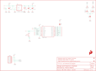

Contents
========

* [PRS8937 > LilyPad XBee](#prs8937--lilypad-xbee)
	* [Schematic](#schematic)
	* [PCB](#pcb)
	* [Interactive BOM](#interactive-bom)
	* [OOMP Parts](#oomp-parts)
	* [Images](#images)
	* [Tags](#tags)
  
![][im]
# PRS8937 > LilyPad XBee

- ID: PROJ-SPAR-8937-STAN-01
- Hex ID: PRS8937
- Name: Sparkfun
- Description: Sparkfun
- Long Link: [http://oom.lt/PROJ-SPAR-8937-STAN-01](http://oom.lt/PROJ-SPAR-8937-STAN-01)
- Short Link: [http://oom.lt/PRS8937](http://oom.lt/PRS8937)

## Schematic
  

## PCB
  

## Interactive BOM

- Interactive BOM page: [ibom.html](https://htmlpreview.github.io/?https://github.com/oomlout/oomlout_OOMP_projects/blob/main/PROJ-SPAR-8937-STAN-01/kicad/bom/ibom.html)

## OOMP Parts
  

|OOMP ID|Name|Identifier|
| :---: | :---: | :---: |
|[CAPC-0603-X-NF100-V50](https://github.com/oomlout/oomlout_OOMP_parts/tree/main/CAPC-0603-X-NF100-V50/)|[SMD (0603) 100 nF Capacitor (Ceramic) 50v](https://github.com/oomlout/oomlout_OOMP_parts/tree/main/CAPC-0603-X-NF100-V50/)|[C1](https://github.com/oomlout/oomlout_OOMP_parts/tree/main/CAPC-0603-X-NF100-V50/)|
|CAPX-3528-X-UF47-01||C2|
|CAPC-0603-X-UNMATCHED-01||C3, C4|
|[LEDS-0603-G-STAN-01](https://github.com/oomlout/oomlout_OOMP_parts/tree/main/LEDS-0603-G-STAN-01/)|[SMD (0603) Green LED](https://github.com/oomlout/oomlout_OOMP_parts/tree/main/LEDS-0603-G-STAN-01/)|[D1, D2](https://github.com/oomlout/oomlout_OOMP_parts/tree/main/LEDS-0603-G-STAN-01/)|
|[HEAD-I01-X-PI06-01](https://github.com/oomlout/oomlout_OOMP_parts/tree/main/HEAD-I01-X-PI06-01/)|[2.54 mm 6 Pin Header](https://github.com/oomlout/oomlout_OOMP_parts/tree/main/HEAD-I01-X-PI06-01/)|[JP1](https://github.com/oomlout/oomlout_OOMP_parts/tree/main/HEAD-I01-X-PI06-01/)|
|[RESE-0603-X-O331-01](https://github.com/oomlout/oomlout_OOMP_parts/tree/main/RESE-0603-X-O331-01/)|[SMD (0603) 330 Ohm Resistor](https://github.com/oomlout/oomlout_OOMP_parts/tree/main/RESE-0603-X-O331-01/)|[R1, R2](https://github.com/oomlout/oomlout_OOMP_parts/tree/main/RESE-0603-X-O331-01/)|
|UNMATCHED-UNMATCHED-X-UNMATCHED-01||S1, U1|
|UNMATCHED-SO235-X-UNMATCHED-01||U2|

## Images
  
  

|bominteractivefront|bominteractiveback|kicadPcb3d|kicadPcb3dFront|kicadPcb3dBack|kicadSchem|eagleImage|eagleSchemImage|pcbdraw|pcbdrawback|
| :---: | :---: | :---: | :---: | :---: | :---: | :---: | :---: | :---: | :---: |
|||||||||||

## Tags

- hexID: PRS8937
- oompType: PROJ
- oompSize: SPAR
- oompColor: 8937
- oompDesc: STAN
- oompIndex: 01
- oompName: LilyPad XBee
- sources: All source files from https://github.com/sparkfun/LilyPad_XBee (source licence details in srcLicense.md)
- linkBuyPage: https://www.sparkfun.com/products/8937
- oompID: PROJ-SPAR-8937-STAN-01
- oompParts: C1,CAPC-0603-X-NF100-V50
- oompParts: C2,CAPX-3528-X-UF47-01
- oompParts: C3,CAPC-0603-X-UNMATCHED-01
- oompParts: C4,CAPC-0603-X-UNMATCHED-01
- oompParts: D1,LEDS-0603-G-STAN-01
- oompParts: D2,LEDS-0603-G-STAN-01
- oompParts: JP1,HEAD-I01-X-PI06-01
- oompParts: R1,RESE-0603-X-O331-01
- oompParts: R2,RESE-0603-X-O331-01
- oompParts: S1,UNMATCHED-UNMATCHED-X-UNMATCHED-01
- oompParts: U1,UNMATCHED-UNMATCHED-X-UNMATCHED-01
- oompParts: U2,UNMATCHED-SO235-X-UNMATCHED-01
- rawParts: C1,0.1uF,0.1UF-25V(+80/-20%)(0603),0603-CAP,CAP-00810,CAP-00810,0.1uF,
- rawParts: C2,47uF,CAP_POL3528,EIA3528,Capacitor Polarized,,,
- rawParts: C3,1.0uF,1.0UF-16V-10%(0603),0603-CAP,CAP-00868,CAP-00868,1.0uF,
- rawParts: C4,1.0uF,1.0UF-16V-10%(0603),0603-CAP,CAP-00868,CAP-00868,1.0uF,
- rawParts: D1,Status,LED-GREEN0603,LED-0603,Various green LEDs,DIO-00821,GREEN,
- rawParts: D2,Status,LED-RED0603,LED-0603,Assorted Red LEDs,DIO-00819,RED,
- rawParts: FID1,FIDUCIAL1X2,FIDUCIAL1X2,FIDUCIAL-1X2,Fiducial Alignment Points,,,
- rawParts: FID2,FIDUCIAL1X2,FIDUCIAL1X2,FIDUCIAL-1X2,Fiducial Alignment Points,,,
- rawParts: FRAME1,FRAME-LETTER,FRAME-LETTER,CREATIVE_COMMONS,Schematic Frame,,,
- rawParts: GND,SEWTAP9,SEWTAP9,PETAL-LONG-1-2SIDE,,,,
- rawParts: JP1,,ARDUINO_SERIAL_PROGRAMPTH,1X06,,,,
- rawParts: LOGO1,SFE_LOGO_FLAME.1COP,SFE_LOGO_FLAME.1COP,SFE_LOGO_FLAME_COPPER_.1,SFE Logo, flame only,,,
- rawParts: R1,330,330OHM1/10W1%(0603),0603-RES,RES-00818,RES-00818,330,
- rawParts: R2,330,330OHM1/10W1%(0603),0603-RES,RES-00818,RES-00818,330,
- rawParts: S1,,TAC_SWITCHSMD,TACTILE_SWITCH_SMD,Momentary Switch,SWCH-08247,,
- rawParts: SJ1,,SOLDERJUMPERNC2,SJ_2S-NOTRACE,Solder Jumper,,,
- rawParts: SJ2,,SOLDERJUMPERNC2,SJ_2S-NOTRACE,Solder Jumper,,,
- rawParts: U$1,LOGO-LPLP,LOGO-LPLP,LOGO-LILYPAD,,,,
- rawParts: U$4,SEWTAP9,SEWTAP9,PETAL-LONG-1-2SIDE,,,,
- rawParts: U$30,SEWTAP9,SEWTAP9,PETAL-LONG-1-2SIDE,,,,
- rawParts: U$31,SEWTAP9,SEWTAP9,PETAL-LONG-1-2SIDE,,,,
- rawParts: U$32,SEWTAP9,SEWTAP9,PETAL-LONG-1-2SIDE,,,,
- rawParts: U$33,SEWTAP9,SEWTAP9,PETAL-LONG-1-2SIDE,,,,
- rawParts: U$34,SEWTAP9,SEWTAP9,PETAL-LONG-1-2SIDE,,,,
- rawParts: U$35,SEWTAP9,SEWTAP9,PETAL-LONG-1-2SIDE,,,,
- rawParts: U$36,SEWTAP9,SEWTAP9,PETAL-LONG-1-2SIDE,,,,
- rawParts: U$37,SEWTAP9,SEWTAP9,PETAL-LONG-1-2SIDE,,,,
- rawParts: U$38,SEWTAP9,SEWTAP9,PETAL-LONG-1-2SIDE,,,,
- rawParts: U$39,SEWTAP9,SEWTAP9,PETAL-LONG-1-2SIDE,,,,
- rawParts: U$40,SEWTAP9,SEWTAP9,PETAL-LONG-1-2SIDE,,,,
- rawParts: U$41,SEWTAP9,SEWTAP9,PETAL-LONG-1-2SIDE,,,,
- rawParts: U$42,SEWTAP9,SEWTAP9,PETAL-LONG-1-2SIDE,,,,
- rawParts: U$43,SEWTAP9,SEWTAP9,PETAL-LONG-1-2SIDE,,,,
- rawParts: U$44,SEWTAP9,SEWTAP9,PETAL-LONG-1-2SIDE,,,,
- rawParts: U$45,SEWTAP9,SEWTAP9,PETAL-LONG-1-2SIDE,,,,
- rawParts: U$46,SEWTAP9,SEWTAP9,PETAL-LONG-1-2SIDE,,,,
- rawParts: U$47,SEWTAP9,SEWTAP9,PETAL-LONG-1-2SIDE,,,,
- rawParts: U$48,SEWTAP9,SEWTAP9,PETAL-LONG-1-2SIDE,,,,
- rawParts: U$51,SEWTAP9,SEWTAP9,PETAL-LONG-1-2SIDE,,,,
- rawParts: U1,XBEE-1B3,XBEE-1B3,XBEE-SMD,,,,
- rawParts: U2,V_REG_LDOSMD,V_REG_LDOSMD,SOT23-5,Voltage Regulator LDO,,,

[im]: kicadPcb3d_450.png
