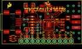
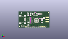
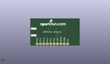
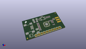

Contents
========

* [PROJ-SPAR-9034-STAN-01>Transceiver Breakout-nRF24LU1 RP-SMA](#proj-spar-9034-stan-01transceiver-breakout-nrf24lu1-rp-sma)
	* [Images](#images)
	* [Interactive BOM](#interactive-bom)
	* [OOMP Parts](#oomp-parts)
	* [Tags](#tags)
  
![][im]
# PROJ-SPAR-9034-STAN-01>Transceiver Breakout-nRF24LU1 RP-SMA

- ID: PROJ-SPAR-9034-STAN-01
- Hex ID: PRS9034
- Name: Transceiver Breakout-nRF24LU1 RP-SMA
- Description: 

## Images
  
  

|eagleImage|kicadPcb3dFront|kicadPcb3dBack|kicadPcb3d|
| :---: | :---: | :---: | :---: |
|||||

## Interactive BOM

- Interactive BOM page: [ibom.html](kicad/bom/ibom.html)

## OOMP Parts
  

|OOMP Parts|
| :---: |
|CAPE-UNMATCHED-X-UNMATCHED-01, C1, 11.43, 5.08, 90,C1, 10uF, EIA3216, SparkFun, (0.45, 0.2), R90|
|CAPE-0402-X-NF100-01, C2, 13.97, 5.08, 180,C2, 0.1uF, 0402-CAP, SparkFun, (0.55, 0.2), R180|
|CAPE-0402-X-UNMATCHED-01, C3, 24.13, 16.509999999999998, 270,C3, 15pF, 0402-CAP, SparkFun, (0.95, 0.65), R270|
|CAPE-0402-X-UNMATCHED-01, C4, 16.509999999999998, 16.509999999999998, 270,C4, 15pF, 0402-CAP, SparkFun, (0.65, 0.65), R270|
|CAPE-0402-X-UNMATCHED-01, C5, 25.4, 16.509999999999998, 90,C5, 33nF, 0402-CAP, SparkFun, (1, 0.65), R90|
|CAPE-0402-X-UNMATCHED-01, C6, 26.669999999999998, 16.509999999999998, 90,C6, 33nF, 0402-CAP, SparkFun, (1.05, 0.65), R90|
|CAPE-0402-X-NF10-01, C7, 13.97, 10.16, 180,C7, 10n, 0402-CAP, SparkFun, (0.55, 0.4), R180|
|CAPE-0402-X-NF10-01, C8, 13.97, 6.35, 180,C8, 10n, 0402-CAP, SparkFun, (0.55, 0.25), R180|
|CAPE-0402-X-NF22D-01, C10, 27.94, 6.35, 180,C10, 2.2nF, 0402-CAP, SparkFun, (1.1, 0.25), R180|
|CAPE-0402-X-UNMATCHED-01, C11, 30.479999999999997, 12.7, 180,C11, 1.0pF, 0402-CAP, SparkFun, (1.2, 0.5), R180|
|CAPE-0402-X-UNMATCHED-01, C12, 30.479999999999997, 11.43, 0,C12, 1.2pF, 0402-CAP, SparkFun, (1.2, 0.45), R0|
|CAPE-0402-X-UNMATCHED-01, C13, 25.4, 11.43, 180,C13, 100nF, 0402-CAP, SparkFun, (1, 0.45), R180|
|CAPE-UNMATCHED-X-UNMATCHED-01, C14, 12.7, 17.779999999999998, 0,C14, 10uF, EIA3216, SparkFun, (0.5, 0.7), R0|
|UNMATCHED-UNMATCHED-X-UNMATCHED-01, J$1, 34.29, 12.7, 270,J$1, SMA_EDGE, SMA-EDGE, SparkFun, (1.35, 0.5), R270|
|UNMATCHED-UNMATCHED-X-UNMATCHED-01, JP1, 31.7999999, 1.29999994, 180,JP1, M10, 1X10, SparkFun, (1.2519685, 0.0511811), R180|
|UNMATCHED-0402-X-UNMATCHED-01, L1, 27.94, 11.43, 0,L1, 4.7nH, C0402, SparkFun, (1.1, 0.45), R0|
|UNMATCHED-0402-X-UNMATCHED-01, L2, 27.94, 10.16, 0,L2, 6.8nH, C0402, SparkFun, (1.1, 0.4), R0|
|UNMATCHED-0402-X-UNMATCHED-01, L3, 27.94, 8.889999999999999, 180,L3, 6.8nH, C0402, SparkFun, (1.1, 0.35), R180|
|UNMATCHED-UNMATCHED-X-UNMATCHED-01, Q1, 20.32, 16.509999999999998, 0,Q1, 16MHz, CRYSTAL-SMD-5X3, SparkFun, (0.8, 0.65), R0|
|RESE-0402-X-UNMATCHED-01, R1, 20.32, 19.049999999999997, 0,R1, 1M, 0402-RES, SparkFun, (0.8, 0.75), R0|
|RESE-0402-X-O223-01, R2, 27.94, 16.509999999999998, 90,R2, 22k, 0402-RES, SparkFun, (1.1, 0.65), R90|
|RESE-UNMATCHED-X-UNMATCHED-01, R3, 12.7, 15.239999999999998, 0,R3, 10, 1206, SparkFun, (0.5, 0.6), R0|
|<table><tr><td></td><td> R4</td><td>[RESE-0402-X-O103-01 SMD (0402) 10k Ohm Resistor](https://github.com/oomlout/oomlout_OOMP_parts/tree/main/RESE-0402-X-O103-01/)</td><td>[R42103](https://github.com/oomlout/oomlout_OOMP_parts/tree/main/RESE-0402-X-O103-01/)</td></tr></table>|
|<table><tr><td></td><td> R5</td><td>[RESE-0402-X-O103-01 SMD (0402) 10k Ohm Resistor](https://github.com/oomlout/oomlout_OOMP_parts/tree/main/RESE-0402-X-O103-01/)</td><td>[R42103](https://github.com/oomlout/oomlout_OOMP_parts/tree/main/RESE-0402-X-O103-01/)</td></tr></table>|
|RESE-0402-X-UNMATCHED-01, R6, 13.97, 12.7, 0,R6, 22, 0402-RES, SparkFun, (0.55, 0.5), R0|
|RESE-0402-X-UNMATCHED-01, R7, 13.97, 11.43, 0,R7, 22, 0402-RES, SparkFun, (0.55, 0.45), R0|
|UNMATCHED-UNMATCHED-X-UNMATCHED-01, U1, 5.08, 2.54, 270,U1, 3.3V, SOT23-5, SparkFun, (0.2, 0.1), R270|
|UNMATCHED-UNMATCHED-X-UNMATCHED-01, U2, 21.59, 8.889999999999999, 270,U2, NRF24LU1, QFN-32, SparkFun, (0.85, 0.35), R270|
|UNMATCHED-UNMATCHED-X-UNMATCHED-01, X1, 5.08, 10.16, 0,X1, USBSMD, USB-MINIB, SparkFun, (0.2, 0.4), R0|

## Tags

- hexID: PRS9034
- oompType: PROJ
- oompSize: SPAR
- oompColor: 9034
- oompDesc: STAN
- oompIndex: 01
- oompName: Transceiver Breakout-nRF24LU1 RP-SMA
- sources: All source files from https://github.com/sparkfun/Transceiver_Breakout-nRF24LU1_RP-SMA (source licence details in srcLicense.md)
- linkBuyPage: https://www.sparkfun.com/products/9034
- oompPart: CAPE-UNMATCHED-X-UNMATCHED-01, C1, 11.43, 5.08, 90
- oompPart: CAPE-0402-X-NF100-01, C2, 13.97, 5.08, 180
- oompPart: CAPE-0402-X-UNMATCHED-01, C3, 24.13, 16.509999999999998, 270
- oompPart: CAPE-0402-X-UNMATCHED-01, C4, 16.509999999999998, 16.509999999999998, 270
- oompPart: CAPE-0402-X-UNMATCHED-01, C5, 25.4, 16.509999999999998, 90
- oompPart: CAPE-0402-X-UNMATCHED-01, C6, 26.669999999999998, 16.509999999999998, 90
- oompPart: CAPE-0402-X-NF10-01, C7, 13.97, 10.16, 180
- oompPart: CAPE-0402-X-NF10-01, C8, 13.97, 6.35, 180
- oompPart: CAPE-0402-X-NF22D-01, C10, 27.94, 6.35, 180
- oompPart: CAPE-0402-X-UNMATCHED-01, C11, 30.479999999999997, 12.7, 180
- oompPart: CAPE-0402-X-UNMATCHED-01, C12, 30.479999999999997, 11.43, 0
- oompPart: CAPE-0402-X-UNMATCHED-01, C13, 25.4, 11.43, 180
- oompPart: CAPE-UNMATCHED-X-UNMATCHED-01, C14, 12.7, 17.779999999999998, 0
- oompPart: UNMATCHED-UNMATCHED-X-UNMATCHED-01, J$1, 34.29, 12.7, 270
- oompPart: UNMATCHED-UNMATCHED-X-UNMATCHED-01, JP1, 31.7999999, 1.29999994, 180
- oompPart: UNMATCHED-0402-X-UNMATCHED-01, L1, 27.94, 11.43, 0
- oompPart: UNMATCHED-0402-X-UNMATCHED-01, L2, 27.94, 10.16, 0
- oompPart: UNMATCHED-0402-X-UNMATCHED-01, L3, 27.94, 8.889999999999999, 180
- oompPart: UNMATCHED-UNMATCHED-X-UNMATCHED-01, Q1, 20.32, 16.509999999999998, 0
- oompPart: RESE-0402-X-UNMATCHED-01, R1, 20.32, 19.049999999999997, 0
- oompPart: RESE-0402-X-O223-01, R2, 27.94, 16.509999999999998, 90
- oompPart: RESE-UNMATCHED-X-UNMATCHED-01, R3, 12.7, 15.239999999999998, 0
- oompPart: RESE-0402-X-O103-01, R4, 13.97, 8.889999999999999, 0
- oompPart: RESE-0402-X-O103-01, R5, 13.97, 7.619999999999999, 0
- oompPart: RESE-0402-X-UNMATCHED-01, R6, 13.97, 12.7, 0
- oompPart: RESE-0402-X-UNMATCHED-01, R7, 13.97, 11.43, 0
- oompPart: SKIP-UNMATCHED-X-UNMATCHED-01, U$12, 1.27, 1.27, 0
- oompPart: SKIP-UNMATCHED-X-UNMATCHED-01, U$13, 35.559999999999995, 19.049999999999997, 0
- oompPart: UNMATCHED-UNMATCHED-X-UNMATCHED-01, U1, 5.08, 2.54, 270
- oompPart: UNMATCHED-UNMATCHED-X-UNMATCHED-01, U2, 21.59, 8.889999999999999, 270
- oompPart: UNMATCHED-UNMATCHED-X-UNMATCHED-01, X1, 5.08, 10.16, 0
- rawPart: C1, 10uF, EIA3216, SparkFun, (0.45, 0.2), R90
- rawPart: C2, 0.1uF, 0402-CAP, SparkFun, (0.55, 0.2), R180
- rawPart: C3, 15pF, 0402-CAP, SparkFun, (0.95, 0.65), R270
- rawPart: C4, 15pF, 0402-CAP, SparkFun, (0.65, 0.65), R270
- rawPart: C5, 33nF, 0402-CAP, SparkFun, (1, 0.65), R90
- rawPart: C6, 33nF, 0402-CAP, SparkFun, (1.05, 0.65), R90
- rawPart: C7, 10n, 0402-CAP, SparkFun, (0.55, 0.4), R180
- rawPart: C8, 10n, 0402-CAP, SparkFun, (0.55, 0.25), R180
- rawPart: C10, 2.2nF, 0402-CAP, SparkFun, (1.1, 0.25), R180
- rawPart: C11, 1.0pF, 0402-CAP, SparkFun, (1.2, 0.5), R180
- rawPart: C12, 1.2pF, 0402-CAP, SparkFun, (1.2, 0.45), R0
- rawPart: C13, 100nF, 0402-CAP, SparkFun, (1, 0.45), R180
- rawPart: C14, 10uF, EIA3216, SparkFun, (0.5, 0.7), R0
- rawPart: J$1, SMA_EDGE, SMA-EDGE, SparkFun, (1.35, 0.5), R270
- rawPart: JP1, M10, 1X10, SparkFun, (1.2519685, 0.0511811), R180
- rawPart: L1, 4.7nH, C0402, SparkFun, (1.1, 0.45), R0
- rawPart: L2, 6.8nH, C0402, SparkFun, (1.1, 0.4), R0
- rawPart: L3, 6.8nH, C0402, SparkFun, (1.1, 0.35), R180
- rawPart: Q1, 16MHz, CRYSTAL-SMD-5X3, SparkFun, (0.8, 0.65), R0
- rawPart: R1, 1M, 0402-RES, SparkFun, (0.8, 0.75), R0
- rawPart: R2, 22k, 0402-RES, SparkFun, (1.1, 0.65), R90
- rawPart: R3, 10, 1206, SparkFun, (0.5, 0.6), R0
- rawPart: R4, 10k, 0402-RES, SparkFun, (0.55, 0.35), R0
- rawPart: R5, 10k, 0402-RES, SparkFun, (0.55, 0.3), R0
- rawPart: R6, 22, 0402-RES, SparkFun, (0.55, 0.5), R0
- rawPart: R7, 22, 0402-RES, SparkFun, (0.55, 0.45), R0
- rawPart: U$12, FIDUCIAL1X2, FIDUCIAL-1X2, SparkFun, (0.05, 0.05), R0
- rawPart: U$13, FIDUCIAL1X2, FIDUCIAL-1X2, SparkFun, (1.4, 0.75), R0
- rawPart: U1, 3.3V, SOT23-5, SparkFun, (0.2, 0.1), R270
- rawPart: U2, NRF24LU1, QFN-32, SparkFun, (0.85, 0.35), R270
- rawPart: X1, USBSMD, USB-MINIB, SparkFun, (0.2, 0.4), R0

[im]: kicadPcb3d_450.png
