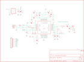

Contents
========

* [PRS9034 > Transceiver Breakout-nRF24LU1 RP-SMA](#prs9034--transceiver-breakout-nrf24lu1-rp-sma)
	* [Schematic](#schematic)
	* [PCB](#pcb)
	* [Interactive BOM](#interactive-bom)
	* [Images](#images)
	* [Tags](#tags)
  
![][im]
# PRS9034 > Transceiver Breakout-nRF24LU1 RP-SMA

- ID: PROJ-SPAR-9034-STAN-01
- Hex ID: PRS9034
- Name: Sparkfun
- Description: Sparkfun
- Long Link: [http://oom.lt/PROJ-SPAR-9034-STAN-01](http://oom.lt/PROJ-SPAR-9034-STAN-01)
- Short Link: [http://oom.lt/PRS9034](http://oom.lt/PRS9034)

## Schematic
  

## PCB
  

## Interactive BOM

- Interactive BOM page: [ibom.html](https://htmlpreview.github.io/?https://github.com/oomlout/oomlout_OOMP_projects/blob/main/PROJ-SPAR-9034-STAN-01/kicad/bom/ibom.html)

## Images
  
  

|bominteractivefront|bominteractiveback|kicadPcb3d|kicadPcb3dFront|kicadPcb3dBack|eagleImage|eagleSchemImage|pcbdraw|pcbdrawback|
| :---: | :---: | :---: | :---: | :---: | :---: | :---: | :---: | :---: |
||||||||||

## Tags

- hexID: PRS9034
- oompType: PROJ
- oompSize: SPAR
- oompColor: 9034
- oompDesc: STAN
- oompIndex: 01
- oompName: Transceiver Breakout-nRF24LU1 RP-SMA
- sources: All source files from https://github.com/sparkfun/Transceiver_Breakout-nRF24LU1_RP-SMA (source licence details in srcLicense.md)
- linkBuyPage: https://www.sparkfun.com/products/9034
- oompID: PROJ-SPAR-9034-STAN-01
- rawParts: C1,10uF,CAP_POL1206,EIA3216,Capacitor Polarized,,
- rawParts: C2,0.1uF,CAP0402-CAP,0402-CAP,Capacitor,,
- rawParts: C3,15pF,CAP0402-CAP,0402-CAP,Capacitor,,
- rawParts: C4,15pF,CAP0402-CAP,0402-CAP,Capacitor,,
- rawParts: C5,33nF,CAP0402-CAP,0402-CAP,Capacitor,,
- rawParts: C6,33nF,CAP0402-CAP,0402-CAP,Capacitor,,
- rawParts: C7,10n,CAP0402-CAP,0402-CAP,Capacitor,,
- rawParts: C8,10n,CAP0402-CAP,0402-CAP,Capacitor,,
- rawParts: C10,2.2nF,CAP0402-CAP,0402-CAP,Capacitor,,
- rawParts: C11,1.0pF,CAP0402-CAP,0402-CAP,Capacitor,,
- rawParts: C12,1.2pF,CAP0402-CAP,0402-CAP,Capacitor,,
- rawParts: C13,100nF,CAP0402-CAP,0402-CAP,Capacitor,,
- rawParts: C14,10uF,CAP_POL1206,EIA3216,Capacitor Polarized,,
- rawParts: J$1,SMA_EDGE,SMA_EDGE,SMA-EDGE,SMA Antenna Connector,,
- rawParts: JP1,M10,M10,1X10,Header 10,,
- rawParts: JP2,LOGO-SFENEW,LOGO-SFENEW,SFE-NEW-WEBLOGO,Spark Fun Electronics PCB Logo,,
- rawParts: L1,4.7nH,INDUCTOR0402,C0402,Inductors,,
- rawParts: L2,6.8nH,INDUCTOR0402,C0402,Inductors,,
- rawParts: L3,6.8nH,INDUCTOR0402,C0402,Inductors,,
- rawParts: Q1,16MHz,CRYSTAL5X3,CRYSTAL-SMD-5X3,Crystals,,
- rawParts: R1,1M,RESISTOR0402-RES,0402-RES,Resistor,,
- rawParts: R2,22k,RESISTOR0402-RES,0402-RES,Resistor,,
- rawParts: R3,10,RESISTOR1206,1206,Resistor,,
- rawParts: R4,10k,RESISTOR0402-RES,0402-RES,Resistor,,
- rawParts: R5,10k,RESISTOR0402-RES,0402-RES,Resistor,,
- rawParts: R6,22,RESISTOR0402-RES,0402-RES,Resistor,,
- rawParts: R7,22,RESISTOR0402-RES,0402-RES,Resistor,,
- rawParts: U$12,FIDUCIAL1X2,FIDUCIAL1X2,FIDUCIAL-1X2,Fiducial Alignment Points,,
- rawParts: U$13,FIDUCIAL1X2,FIDUCIAL1X2,FIDUCIAL-1X2,Fiducial Alignment Points,,
- rawParts: U$14,LOGO-SFESK,LOGO-SFESK,SFE-LOGO-FLAME,Spark Fun Electronics PCB Logo,,
- rawParts: U1,3.3V,V_REG_LDOSMD,SOT23-5,Voltage Regulator LDO,,
- rawParts: U2,NRF24LU1,NRF24LU1,QFN-32,,,
- rawParts: X1,USBSMD,USBSMD,USB-MINIB,USB Connectors,,

[im]: kicadPcb3d_450.png
