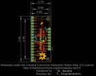
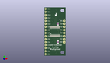
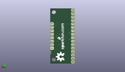
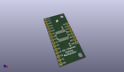

Contents
========

* [PROJ-SPAR-9056-STAN-01>Analog Digital MUX Breakout](#proj-spar-9056-stan-01analog-digital-mux-breakout)
	* [Images](#images)
	* [Interactive BOM](#interactive-bom)
	* [OOMP Parts](#oomp-parts)
	* [Tags](#tags)
  
![][im]
# PROJ-SPAR-9056-STAN-01>Analog Digital MUX Breakout

- ID: PROJ-SPAR-9056-STAN-01
- Hex ID: PRS9056
- Name: Analog Digital MUX Breakout
- Description: 

## Images
  
  

|eagleImage|kicadPcb3dFront|kicadPcb3dBack|kicadPcb3d|
| :---: | :---: | :---: | :---: |
|||||

## Interactive BOM

- Interactive BOM page: [ibom.html](kicad/bom/ibom.html)

## OOMP Parts
  

|OOMP Parts|
| :---: |
|CAPE-0603-X-NF100-01, C1, 11.43, 11.43, 270,C1, 0.1uF, 0603, SparkFun, (0.45, 0.45), R270|
|UNMATCHED-UNMATCHED-X-UNMATCHED-01, JP1, 1.27, 1.27, M90,JP1, 1X16, SparkFun-Connectors, (0.05, 0.05), MR90|
|UNMATCHED-UNMATCHED-X-UNMATCHED-01, JP3, 16.509999999999998, 11.43, M90,JP3, 1X08, SparkFun-Connectors, (0.65, 0.45), MR90|
|<table><tr><td></td><td> R1</td><td>[RESE-0603-X-O103-01 SMD (0603) 10k Ohm Resistor](https://github.com/oomlout/oomlout_OOMP_parts/tree/main/RESE-0603-X-O103-01/)</td><td>[R6103](https://github.com/oomlout/oomlout_OOMP_parts/tree/main/RESE-0603-X-O103-01/)</td></tr></table>|
|UNMATCHED-UNMATCHED-X-UNMATCHED-01, U1, 8.889999999999999, 20.32, 0,U1, MUX-74HC4067, SSOP24, SparkFun, (0.35, 0.8), R0|

## Tags

- hexID: PRS9056
- oompType: PROJ
- oompSize: SPAR
- oompColor: 9056
- oompDesc: STAN
- oompIndex: 01
- oompName: Analog Digital MUX Breakout
- sources: All source files from https://github.com/sparkfun/Analog_Digital_MUX_Breakout (source licence details in srcLicense.md)
- linkBuyPage: https://www.sparkfun.com/products/9056
- oompPart: CAPE-0603-X-NF100-01, C1, 11.43, 11.43, 270
- oompPart: UNMATCHED-UNMATCHED-X-UNMATCHED-01, JP1, 1.27, 1.27, M90
- oompPart: UNMATCHED-UNMATCHED-X-UNMATCHED-01, JP3, 16.509999999999998, 11.43, M90
- oompPart: RESE-0603-X-O103-01, R1, 11.43, 26.669999999999998, 270
- oompPart: UNMATCHED-UNMATCHED-X-UNMATCHED-01, U1, 8.889999999999999, 20.32, 0
- rawPart: C1, 0.1uF, 0603, SparkFun, (0.45, 0.45), R270
- rawPart: JP1, 1X16, SparkFun-Connectors, (0.05, 0.05), MR90
- rawPart: JP3, 1X08, SparkFun-Connectors, (0.65, 0.45), MR90
- rawPart: R1, 10K, 0603, SparkFun, (0.45, 1.05), R270
- rawPart: U1, MUX-74HC4067, SSOP24, SparkFun, (0.35, 0.8), R0

[im]: kicadPcb3d_450.png
