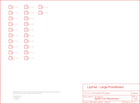
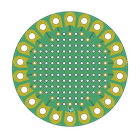

Contents
========

* [PRS9101 > LilyPad Protoboard Large](#prs9101--lilypad-protoboard-large)
	* [Schematic](#schematic)
	* [PCB](#pcb)
	* [Interactive BOM](#interactive-bom)
	* [OOMP Parts](#oomp-parts)
	* [Images](#images)
	* [Tags](#tags)
  
![][im]
# PRS9101 > LilyPad Protoboard Large

- ID: PROJ-SPAR-9101-STAN-01
- Hex ID: PRS9101
- Name: Sparkfun
- Description: Sparkfun
- Long Link: [http://oom.lt/PROJ-SPAR-9101-STAN-01](http://oom.lt/PROJ-SPAR-9101-STAN-01)
- Short Link: [http://oom.lt/PRS9101](http://oom.lt/PRS9101)

## Schematic
  

## PCB
  

## Interactive BOM

- Interactive BOM page: [ibom.html](https://htmlpreview.github.io/?https://github.com/oomlout/oomlout_OOMP_projects/blob/main/PROJ-SPAR-9101-STAN-01/kicad/bom/ibom.html)

## OOMP Parts
  

|OOMP ID|Name|Identifier|
| :---: | :---: | :---: |
|HEAD-I01-X-PI01-01||JP1, JP2, JP3, JP4, JP5, JP6, JP7, JP8, JP9, JP10, JP11, JP12, JP13, JP14, JP15, JP16, JP17, JP18, JP19, JP20, JP21, JP22|

## Images
  
  

|bominteractivefront|bominteractiveback|kicadPcb3d|kicadPcb3dFront|kicadPcb3dBack|kicadSchem|eagleImage|eagleSchemImage|pcbdraw|pcbdrawback|
| :---: | :---: | :---: | :---: | :---: | :---: | :---: | :---: | :---: | :---: |
|||||||||||

## Tags

- hexID: PRS9101
- oompType: PROJ
- oompSize: SPAR
- oompColor: 9101
- oompDesc: STAN
- oompIndex: 01
- oompName: LilyPad Protoboard Large
- sources: All source files from https://github.com/sparkfun/LilyPad_Protoboard_Large (source licence details in srcLicense.md)
- linkBuyPage: https://www.sparkfun.com/products/9101
- oompID: PROJ-SPAR-9101-STAN-01
- oompParts: JP1,HEAD-I01-X-PI01-01
- oompParts: JP2,HEAD-I01-X-PI01-01
- oompParts: JP3,HEAD-I01-X-PI01-01
- oompParts: JP4,HEAD-I01-X-PI01-01
- oompParts: JP5,HEAD-I01-X-PI01-01
- oompParts: JP6,HEAD-I01-X-PI01-01
- oompParts: JP7,HEAD-I01-X-PI01-01
- oompParts: JP8,HEAD-I01-X-PI01-01
- oompParts: JP9,HEAD-I01-X-PI01-01
- oompParts: JP10,HEAD-I01-X-PI01-01
- oompParts: JP11,HEAD-I01-X-PI01-01
- oompParts: JP12,HEAD-I01-X-PI01-01
- oompParts: JP13,HEAD-I01-X-PI01-01
- oompParts: JP14,HEAD-I01-X-PI01-01
- oompParts: JP15,HEAD-I01-X-PI01-01
- oompParts: JP16,HEAD-I01-X-PI01-01
- oompParts: JP17,HEAD-I01-X-PI01-01
- oompParts: JP18,HEAD-I01-X-PI01-01
- oompParts: JP19,HEAD-I01-X-PI01-01
- oompParts: JP20,HEAD-I01-X-PI01-01
- oompParts: JP21,HEAD-I01-X-PI01-01
- oompParts: JP22,HEAD-I01-X-PI01-01
- rawParts: GND,SEWTAP9,SEWTAP9,PETAL-LONG-1-2SIDE,,,
- rawParts: JP1,,M01SMDNS,1X01NS,Header 1,,
- rawParts: JP2,,M01SMDNS,1X01NS,Header 1,,
- rawParts: JP3,,M01SMDNS,1X01NS,Header 1,,
- rawParts: JP4,,M01SMDNS,1X01NS,Header 1,,
- rawParts: JP5,,M01SMDNS,1X01NS,Header 1,,
- rawParts: JP6,,M01SMDNS,1X01NS,Header 1,,
- rawParts: JP7,,M01SMDNS,1X01NS,Header 1,,
- rawParts: JP8,,M01SMDNS,1X01NS,Header 1,,
- rawParts: JP9,,M01SMDNS,1X01NS,Header 1,,
- rawParts: JP10,,M01SMDNS,1X01NS,Header 1,,
- rawParts: JP11,,M01SMDNS,1X01NS,Header 1,,
- rawParts: JP12,,M01SMDNS,1X01NS,Header 1,,
- rawParts: JP13,,M01SMDNS,1X01NS,Header 1,,
- rawParts: JP14,,M01SMDNS,1X01NS,Header 1,,
- rawParts: JP15,,M01SMDNS,1X01NS,Header 1,,
- rawParts: JP16,,M01SMDNS,1X01NS,Header 1,,
- rawParts: JP17,,M01SMDNS,1X01NS,Header 1,,
- rawParts: JP18,,M01SMDNS,1X01NS,Header 1,,
- rawParts: JP19,,M01SMDNS,1X01NS,Header 1,,
- rawParts: JP20,,M01SMDNS,1X01NS,Header 1,,
- rawParts: JP21,,M01SMDNS,1X01NS,Header 1,,
- rawParts: JP22,,M01SMDNS,1X01NS,Header 1,,
- rawParts: U$2,LOGO-LPL,LOGO-LPL,LOGO-L,,,
- rawParts: U$4,SEWTAP9,SEWTAP9,PETAL-LONG-1-2SIDE,,,
- rawParts: U$30,SEWTAP9,SEWTAP9,PETAL-LONG-1-2SIDE,,,
- rawParts: U$31,SEWTAP9,SEWTAP9,PETAL-LONG-1-2SIDE,,,
- rawParts: U$32,SEWTAP9,SEWTAP9,PETAL-LONG-1-2SIDE,,,
- rawParts: U$33,SEWTAP9,SEWTAP9,PETAL-LONG-1-2SIDE,,,
- rawParts: U$34,SEWTAP9,SEWTAP9,PETAL-LONG-1-2SIDE,,,
- rawParts: U$35,SEWTAP9,SEWTAP9,PETAL-LONG-1-2SIDE,,,
- rawParts: U$36,SEWTAP9,SEWTAP9,PETAL-LONG-1-2SIDE,,,
- rawParts: U$37,SEWTAP9,SEWTAP9,PETAL-LONG-1-2SIDE,,,
- rawParts: U$38,SEWTAP9,SEWTAP9,PETAL-LONG-1-2SIDE,,,
- rawParts: U$39,SEWTAP9,SEWTAP9,PETAL-LONG-1-2SIDE,,,
- rawParts: U$40,SEWTAP9,SEWTAP9,PETAL-LONG-1-2SIDE,,,
- rawParts: U$41,SEWTAP9,SEWTAP9,PETAL-LONG-1-2SIDE,,,
- rawParts: U$42,SEWTAP9,SEWTAP9,PETAL-LONG-1-2SIDE,,,
- rawParts: U$43,SEWTAP9,SEWTAP9,PETAL-LONG-1-2SIDE,,,
- rawParts: U$44,SEWTAP9,SEWTAP9,PETAL-LONG-1-2SIDE,,,
- rawParts: U$45,SEWTAP9,SEWTAP9,PETAL-LONG-1-2SIDE,,,
- rawParts: U$46,SEWTAP9,SEWTAP9,PETAL-LONG-1-2SIDE,,,
- rawParts: U$47,SEWTAP9,SEWTAP9,PETAL-LONG-1-2SIDE,,,
- rawParts: U$48,SEWTAP9,SEWTAP9,PETAL-LONG-1-2SIDE,,,
- rawParts: U$51,SEWTAP9,SEWTAP9,PETAL-LONG-1-2SIDE,,,

[im]: kicadPcb3d_450.png
