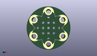
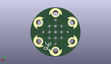
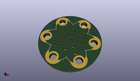

Contents
========

* [PROJ-SPAR-9102-STAN-01>LilyPad Protoboard Small](#proj-spar-9102-stan-01lilypad-protoboard-small)
	* [Images](#images)
	* [Interactive BOM](#interactive-bom)
	* [OOMP Parts](#oomp-parts)
	* [Tags](#tags)
  
![][im]
# PROJ-SPAR-9102-STAN-01>LilyPad Protoboard Small

- ID: PROJ-SPAR-9102-STAN-01
- Hex ID: PRS9102
- Name: LilyPad Protoboard Small
- Description: 

## Images
  
  

|eagleImage|kicadPcb3dFront|kicadPcb3dBack|kicadPcb3d|
| :---: | :---: | :---: | :---: |
|||||

## Interactive BOM

- Interactive BOM page: [ibom.html](kicad/bom/ibom.html)

## OOMP Parts
  

|OOMP Parts|
| :---: |
|UNMATCHED-UNMATCHED-X-UNMATCHED-01, U$3, -6.604, 3.8099999999999996, 240,U$3, SEWTAP6, PETAL-SMALL-2SIDE, LilyPad-Wearables, (-0.26, 0.15), R240|
|UNMATCHED-UNMATCHED-X-UNMATCHED-01, U$4, 6.604, 3.8099999999999996, 120,U$4, SEWTAP6, PETAL-SMALL-2SIDE, LilyPad-Wearables, (0.26, 0.15), R120|
|UNMATCHED-UNMATCHED-X-UNMATCHED-01, U$5, 0.0, -7.619999999999999, 0,U$5, SEWTAP6, PETAL-SMALL-2SIDE, LilyPad-Wearables, (0, -0.3), R0|
|UNMATCHED-UNMATCHED-X-UNMATCHED-01, U$8, -6.600000008, -3.8000000199999997, 300,U$8, SEWTAP6, PETAL-SMALL-2SIDE, LilyPad-Wearables, (-0.25984252, -0.1496063), R300|
|UNMATCHED-UNMATCHED-X-UNMATCHED-01, U$9, 6.600000008, -3.8000000199999997, 60,U$9, SEWTAP6, PETAL-SMALL-2SIDE, LilyPad-Wearables, (0.25984252, -0.1496063), R60|
|UNMATCHED-UNMATCHED-X-UNMATCHED-01, U$10, 0.0, 7.600000039999999, 180,U$10, SEWTAP6, PETAL-SMALL-2SIDE, LilyPad-Wearables, (0, 0.2992126), R180|

## Tags

- hexID: PRS9102
- oompType: PROJ
- oompSize: SPAR
- oompColor: 9102
- oompDesc: STAN
- oompIndex: 01
- oompName: LilyPad Protoboard Small
- sources: All source files from https://github.com/sparkfun/LilyPad_Protoboard_Small (source licence details in srcLicense.md)
- linkBuyPage: https://www.sparkfun.com/products/9102
- oompPart: UNMATCHED-UNMATCHED-X-UNMATCHED-01, U$3, -6.604, 3.8099999999999996, 240
- oompPart: UNMATCHED-UNMATCHED-X-UNMATCHED-01, U$4, 6.604, 3.8099999999999996, 120
- oompPart: UNMATCHED-UNMATCHED-X-UNMATCHED-01, U$5, 0.0, -7.619999999999999, 0
- oompPart: UNMATCHED-UNMATCHED-X-UNMATCHED-01, U$8, -6.600000008, -3.8000000199999997, 300
- oompPart: UNMATCHED-UNMATCHED-X-UNMATCHED-01, U$9, 6.600000008, -3.8000000199999997, 60
- oompPart: UNMATCHED-UNMATCHED-X-UNMATCHED-01, U$10, 0.0, 7.600000039999999, 180
- rawPart: U$3, SEWTAP6, PETAL-SMALL-2SIDE, LilyPad-Wearables, (-0.26, 0.15), R240
- rawPart: U$4, SEWTAP6, PETAL-SMALL-2SIDE, LilyPad-Wearables, (0.26, 0.15), R120
- rawPart: U$5, SEWTAP6, PETAL-SMALL-2SIDE, LilyPad-Wearables, (0, -0.3), R0
- rawPart: U$8, SEWTAP6, PETAL-SMALL-2SIDE, LilyPad-Wearables, (-0.25984252, -0.1496063), R300
- rawPart: U$9, SEWTAP6, PETAL-SMALL-2SIDE, LilyPad-Wearables, (0.25984252, -0.1496063), R60
- rawPart: U$10, SEWTAP6, PETAL-SMALL-2SIDE, LilyPad-Wearables, (0, 0.2992126), R180
- oompID: PROJ-SPAR-9102-STAN-01

[im]: kicadPcb3d_450.png
