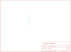

Contents
========

* [PRS9102 > LilyPad Protoboard Small](#prs9102--lilypad-protoboard-small)
	* [Schematic](#schematic)
	* [PCB](#pcb)
	* [Interactive BOM](#interactive-bom)
	* [Images](#images)
	* [Tags](#tags)
  
![][im]
# PRS9102 > LilyPad Protoboard Small

- ID: PROJ-SPAR-9102-STAN-01
- Hex ID: PRS9102
- Name: Sparkfun
- Description: Sparkfun
- Long Link: [http://oom.lt/PROJ-SPAR-9102-STAN-01](http://oom.lt/PROJ-SPAR-9102-STAN-01)
- Short Link: [http://oom.lt/PRS9102](http://oom.lt/PRS9102)

## Schematic
  

## PCB
  

## Interactive BOM

- Interactive BOM page: [ibom.html](https://htmlpreview.github.io/?https://github.com/oomlout/oomlout_OOMP_projects/blob/main/PROJ-SPAR-9102-STAN-01/kicad/bom/ibom.html)

## Images
  
  

|bominteractivefront|bominteractiveback|kicadPcb3d|kicadPcb3dFront|kicadPcb3dBack|eagleImage|eagleSchemImage|pcbdraw|pcbdrawback|
| :---: | :---: | :---: | :---: | :---: | :---: | :---: | :---: | :---: |
||||||||||

## Tags

- hexID: PRS9102
- oompType: PROJ
- oompSize: SPAR
- oompColor: 9102
- oompDesc: STAN
- oompIndex: 01
- oompName: LilyPad Protoboard Small
- sources: All source files from https://github.com/sparkfun/LilyPad_Protoboard_Small (source licence details in srcLicense.md)
- linkBuyPage: https://www.sparkfun.com/products/9102
- oompID: PROJ-SPAR-9102-STAN-01
- rawParts: U$2,LOGO-LPL,LOGO-LPL,LOGO-L,,,
- rawParts: U$3,SEWTAP6,SEWTAP6,PETAL-SMALL-2SIDE,,,
- rawParts: U$4,SEWTAP6,SEWTAP6,PETAL-SMALL-2SIDE,,,
- rawParts: U$5,SEWTAP6,SEWTAP6,PETAL-SMALL-2SIDE,,,
- rawParts: U$8,SEWTAP6,SEWTAP6,PETAL-SMALL-2SIDE,,,
- rawParts: U$9,SEWTAP6,SEWTAP6,PETAL-SMALL-2SIDE,,,
- rawParts: U$10,SEWTAP6,SEWTAP6,PETAL-SMALL-2SIDE,,,

[im]: kicadPcb3d_450.png
