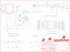

Contents
========

* [PRS9111 > XBee Explorer Serial](#prs9111--xbee-explorer-serial)
	* [Schematic](#schematic)
	* [PCB](#pcb)
	* [Interactive BOM](#interactive-bom)
	* [Images](#images)
	* [Tags](#tags)
  
![][im]
# PRS9111 > XBee Explorer Serial

- ID: PROJ-SPAR-9111-STAN-01
- Hex ID: PRS9111
- Name: Sparkfun
- Description: Sparkfun
- Long Link: [http://oom.lt/PROJ-SPAR-9111-STAN-01](http://oom.lt/PROJ-SPAR-9111-STAN-01)
- Short Link: [http://oom.lt/PRS9111](http://oom.lt/PRS9111)

## Schematic
  

## PCB
  

## Interactive BOM

- Interactive BOM page: [ibom.html](https://htmlpreview.github.io/?https://github.com/oomlout/oomlout_OOMP_projects/blob/main/PROJ-SPAR-9111-STAN-01/kicad/bom/ibom.html)

## Images
  
  

|bominteractivefront|bominteractiveback|kicadPcb3d|kicadPcb3dFront|kicadPcb3dBack|eagleImage|eagleSchemImage|pcbdraw|pcbdrawback|
| :---: | :---: | :---: | :---: | :---: | :---: | :---: | :---: | :---: |
||||||||||

## Tags

- hexID: PRS9111
- oompType: PROJ
- oompSize: SPAR
- oompColor: 9111
- oompDesc: STAN
- oompIndex: 01
- oompName: XBee Explorer Serial
- sources: All source files from https://github.com/sparkfun/XBee_Explorer_Serial (source licence details in srcLicense.md)
- linkBuyPage: https://www.sparkfun.com/products/9111
- oompID: PROJ-SPAR-9111-STAN-01
- rawParts: C1,10uF,10UF-16V-10%(TANT),EIA3216,CAP-00811,CAP-00811,,10uF,
- rawParts: C2,0.1uF,0.1UF-25V(+80/-20%)(0603),0603-CAP,CAP-00810,CAP-00810,,0.1uF,
- rawParts: C3,0.1uF,0.1UF-25V(+80/-20%)(0603),0603-CAP,CAP-00810,CAP-00810,,0.1uF,
- rawParts: C4,0.1uF,0.1UF-25V(+80/-20%)(0603),0603-CAP,CAP-00810,CAP-00810,,0.1uF,
- rawParts: C5,0.1uF,0.1UF-25V(+80/-20%)(0603),0603-CAP,CAP-00810,CAP-00810,,0.1uF,
- rawParts: C6,0.1uF,0.1UF-25V(+80/-20%)(0603),0603-CAP,CAP-00810,CAP-00810,,0.1uF,
- rawParts: C7,10uF,10UF-16V-10%(TANT),EIA3216,CAP-00811,CAP-00811,,10uF,
- rawParts: C8,0.1uF,0.1UF-25V(+80/-20%)(0603),0603-CAP,CAP-00810,CAP-00810,,0.1uF,
- rawParts: D1,MBRA140,DIODE-SCHOTTKY-MBRA140,SMA-DIODE,Schottky diodes in SFEs production catalog,DIO-08053,,MBRA140,
- rawParts: D2,YELLOW,LED-YELLOWLARGE,LED-1206,Yellow SMD LEDs,DIO-00820,,YELLOW,
- rawParts: D3,GREEN,LED-GREENLARGE,LED-1206,Various green LEDs,DIO-00862,,GREEN,
- rawParts: D4,GREEN,LED-GREENLARGE,LED-1206,Various green LEDs,DIO-00862,,GREEN,
- rawParts: D5,RED,LED-RED1206,LED-1206,Assorted Red LEDs,DIO-00809,,RED,
- rawParts: F1,PTCTHERMISTOR1206,PTCTHERMISTOR1206,PTC-1206,Resettable Fuse PTC,RES-08585,,,
- rawParts: FRAME1,FRAME-LETTER,FRAME-LETTER,CREATIVE_COMMONS,Schematic Frame,,,,
- rawParts: JP1,RS232,DB9FEMALE,DB9,DB9 Connector,CONN-08194,,,
- rawParts: JP2,,M11PTH,1X11,Header 11,,,,
- rawParts: JP3,,M11PTH,1X11,Header 11,,,,
- rawParts: JP4,POWER_JACKPTH_LOCK,POWER_JACKPTH_LOCK,POWER_JACK_PTH_LOCK,Power Jack,CONN-08197,PRT-00119,,
- rawParts: LOGO1,OSHW-LOGOL,OSHW-LOGOL,OSHW-LOGO-L,Open Source Hardware Logo,,,,
- rawParts: LOGO2,SFE_LOGO_NAME_FLAME.2_INCH,SFE_LOGO_NAME_FLAME.2_INCH,SFE_LOGO_NAME_FLAME_.2,SFE Logo, name and flame,,,,
- rawParts: LOGO3,SFE_LOGO_FLAME.1_INCH,SFE_LOGO_FLAME.1_INCH,SFE_LOGO_FLAME_.1,SFE Logo, flame only,,,,
- rawParts: Q1,MBT2222,TRANSISTOR_NPNSOT23-3,SOT23-3,Generic NPN BJT,TRANS-08049,,,
- rawParts: R1,1K,1KOHM-1/10W-1%(0603),0603-RES,RES-07856,RES-07856,,1K,
- rawParts: R2,10K,10KOHM-1/10W-1%(0603)0603,0603-RES,RES-00824,RES-00824,,10K,
- rawParts: R3,1K,1KOHM-1/10W-1%(0603),0603-RES,RES-07856,RES-07856,,1K,
- rawParts: R4,1K,1KOHM-1/10W-1%(0603),0603-RES,RES-07856,RES-07856,,1K,
- rawParts: R5,390,390OHM1/10W1%(0603),0603-RES,RES-07864,RES-07864,,390,
- rawParts: R6,240,240OHM1/10W1%(0603),0603-RES,RES-07849,RES-07849,,240,
- rawParts: R7,1K,1KOHM-1/10W-1%(0603),0603-RES,RES-07856,RES-07856,,1K,
- rawParts: R11,1K,1KOHM-1/10W-1%(0603),0603-RES,RES-07856,RES-07856,,1K,
- rawParts: S1,AYZ0202,AYZ0202,AYZ0202,SPDT Slide Switch,SWCH-08179,,,
- rawParts: S3,TAC_SWITCHSMD,SWITCH-MOMENTARY-2SMD-REDUNDANT,TACTILE-SWITCH-SMD,Various NO switches- pushbuttons, reed, etc,SWCH-08247,,,
- rawParts: SJ1,JUMPER-PAD-3-2OF3_NC_BY_TRACE_SMALL,JUMPER-PAD-3-2OF3_NC_BY_TRACE_SMALL,PAD-JUMPER-3-2OF3_NC_BY_TRACE_YES_SILK_FULL_BOX,,,,,
- rawParts: SJ2,JUMPER-PAD-3-2OF3_NC_BY_TRACE_SMALL,JUMPER-PAD-3-2OF3_NC_BY_TRACE_SMALL,PAD-JUMPER-3-2OF3_NC_BY_TRACE_YES_SILK_FULL_BOX,,,,,
- rawParts: TP1,TEST-POINTTP_15TH_THRU,TEST-POINTTP_15TH_THRU,TP_15TH,Bare copper test points for troubleshooting or ICT,,,,
- rawParts: TP2,TEST-POINTTP_15TH_THRU,TEST-POINTTP_15TH_THRU,TP_15TH,Bare copper test points for troubleshooting or ICT,,,,
- rawParts: TP3,TEST-POINTTP_15TH_THRU,TEST-POINTTP_15TH_THRU,TP_15TH,Bare copper test points for troubleshooting or ICT,,,,
- rawParts: TP4,TEST-POINTTP_15TH_THRU,TEST-POINTTP_15TH_THRU,TP_15TH,Bare copper test points for troubleshooting or ICT,,,,
- rawParts: TP5,TEST-POINTTP_15TH_THRU,TEST-POINTTP_15TH_THRU,TP_15TH,Bare copper test points for troubleshooting or ICT,,,,
- rawParts: TP6,TEST-POINTTP_15TH_THRU,TEST-POINTTP_15TH_THRU,TP_15TH,Bare copper test points for troubleshooting or ICT,,,,
- rawParts: U$1,REVISION,REVISION,REVISION,,,,,
- rawParts: U$5,STAND-OFF,STAND-OFF,STAND-OFF,#4 Stand Off,,,,
- rawParts: U$7,FIDUCIAL1X2,FIDUCIAL1X2,FIDUCIAL-1X2,Fiducial Alignment Points,,,,
- rawParts: U$9,STAND-OFF,STAND-OFF,STAND-OFF,#4 Stand Off,,,,
- rawParts: U$10,STAND-OFF,STAND-OFF,STAND-OFF,#4 Stand Off,,,,
- rawParts: U$11,STAND-OFF,STAND-OFF,STAND-OFF,#4 Stand Off,,,,
- rawParts: U$16,FIDUCIAL1X2,FIDUCIAL1X2,FIDUCIAL-1X2,Fiducial Alignment Points,,,,
- rawParts: U1,MAX232SOIC16,MAX232SOIC16,SO016,RS232 Transceiver,IC-08171,,,
- rawParts: U2,XBEE-1B3,XBEE-1B3,XBEE-SMD,Xbee module footprints,CONN-09042,,,
- rawParts: U3,LM117,V_REG_LM1117SOT223,SOT223,Voltage Regulator LM1117,VREG-08170,,,

[im]: kicadPcb3d_450.png
