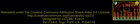
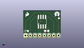
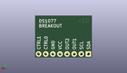
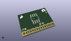

Contents
========

* [PROJ-SPAR-9116-STAN-01>DS1077 Breakout](#proj-spar-9116-stan-01ds1077-breakout)
	* [Images](#images)
	* [Interactive BOM](#interactive-bom)
	* [OOMP Parts](#oomp-parts)
	* [Tags](#tags)
  
![][im]
# PROJ-SPAR-9116-STAN-01>DS1077 Breakout

- ID: PROJ-SPAR-9116-STAN-01
- Hex ID: PRS9116
- Name: DS1077 Breakout
- Description: 

## Images
  
  

|eagleImage|kicadPcb3dFront|kicadPcb3dBack|kicadPcb3d|
| :---: | :---: | :---: | :---: |
|||||

## Interactive BOM

- Interactive BOM page: [ibom.html](kicad/bom/ibom.html)

## OOMP Parts
  

|OOMP Parts|
| :---: |
|CAPE-0603-X-UNMATCHED-01, C1, 12.7, 3.8099999999999996, 0,C1, .1uF, 0603, SparkFun, (0.5, 0.15), R0|
|UNMATCHED-UNMATCHED-X-UNMATCHED-01, JP1, 1.27, 1.27, 0,JP1, 1X08, SparkFun-Connectors, (0.05, 0.05), R0|

## Tags

- hexID: PRS9116
- oompType: PROJ
- oompSize: SPAR
- oompColor: 9116
- oompDesc: STAN
- oompIndex: 01
- oompName: DS1077 Breakout
- sources: All source files from https://github.com/sparkfun/DS1077_Breakout (source licence details in srcLicense.md)
- linkBuyPage: https://www.sparkfun.com/products/9116
- oompPart: CAPE-0603-X-UNMATCHED-01, C1, 12.7, 3.8099999999999996, 0
- oompPart: UNMATCHED-UNMATCHED-X-UNMATCHED-01, JP1, 1.27, 1.27, 0
- oompPart: SKIP-UNMATCHED-X-UNMATCHED-01, U$1, 10.16, 8.889999999999999, 0
- oompPart: SKIP-UNMATCHED-X-UNMATCHED-01, U$3, 19.304, 10.795, 0
- oompPart: SKIP-UNMATCHED-X-UNMATCHED-01, U$4, 2.54, 3.8099999999999996, 0
- rawPart: C1, .1uF, 0603, SparkFun, (0.5, 0.15), R0
- rawPart: JP1, 1X08, SparkFun-Connectors, (0.05, 0.05), R0
- rawPart: U$1, DS1077, SO08, SparkFun, (0.4, 0.35), R0
- rawPart: U$3, FIDUCIAL1X2, FIDUCIAL-1X2, SparkFun, (0.76, 0.425), R0
- rawPart: U$4, FIDUCIAL1X2, FIDUCIAL-1X2, SparkFun, (0.1, 0.15), R0

[im]: kicadPcb3d_450.png
