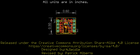
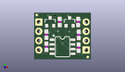
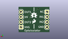
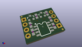

Contents
========

* [PROJ-SPAR-9118-STAN-01>Opto Isolator Breakout](#proj-spar-9118-stan-01opto-isolator-breakout)
	* [Images](#images)
	* [Interactive BOM](#interactive-bom)
	* [OOMP Parts](#oomp-parts)
	* [Tags](#tags)
  
![][im]
# PROJ-SPAR-9118-STAN-01>Opto Isolator Breakout

- ID: PROJ-SPAR-9118-STAN-01
- Hex ID: PRS9118
- Name: Opto Isolator Breakout
- Description: 

## Images
  
  

|eagleImage|kicadPcb3dFront|kicadPcb3dBack|kicadPcb3d|
| :---: | :---: | :---: | :---: |
|||||

## Interactive BOM

- Interactive BOM page: [ibom.html](kicad/bom/ibom.html)

## OOMP Parts
  

|OOMP Parts|
| :---: |
|UNMATCHED-UNMATCHED-X-UNMATCHED-01, JP1, 13.97, 2.54, M90,JP1, 1X04, SparkFun-Connectors, (0.55, 0.1), MR90|
|UNMATCHED-UNMATCHED-X-UNMATCHED-01, JP2, 1.27, 10.16, M270,JP2, 1X04, SparkFun-Connectors, (0.05, 0.4), MR270|
|UNMATCHED-UNMATCHED-X-UNMATCHED-01, Q1, 4.3180000000000005, 10.16, 0,Q1, NPN, SOT23-3, SparkFun-DiscreteSemi, (0.17, 0.4), R0|
|UNMATCHED-UNMATCHED-X-UNMATCHED-01, Q2, 9.524999999999999, 10.16, 0,Q2, NPN, SOT23-3, SparkFun-DiscreteSemi, (0.375, 0.4), R0|
|<table><tr><td></td><td> R1</td><td>[RESE-0603-X-O221-01 SMD (0603) 220 Ohm Resistor](https://github.com/oomlout/oomlout_OOMP_parts/tree/main/RESE-0603-X-O221-01/)</td><td>[R6221](https://github.com/oomlout/oomlout_OOMP_parts/tree/main/RESE-0603-X-O221-01/)</td></tr></table>|
|<table><tr><td></td><td> R2</td><td>[RESE-0603-X-O221-01 SMD (0603) 220 Ohm Resistor](https://github.com/oomlout/oomlout_OOMP_parts/tree/main/RESE-0603-X-O221-01/)</td><td>[R6221](https://github.com/oomlout/oomlout_OOMP_parts/tree/main/RESE-0603-X-O221-01/)</td></tr></table>|
|<table><tr><td></td><td> R3</td><td>[RESE-0603-X-O103-01 SMD (0603) 10k Ohm Resistor](https://github.com/oomlout/oomlout_OOMP_parts/tree/main/RESE-0603-X-O103-01/)</td><td>[R6103](https://github.com/oomlout/oomlout_OOMP_parts/tree/main/RESE-0603-X-O103-01/)</td></tr></table>|
|<table><tr><td></td><td> R4</td><td>[RESE-0603-X-O103-01 SMD (0603) 10k Ohm Resistor](https://github.com/oomlout/oomlout_OOMP_parts/tree/main/RESE-0603-X-O103-01/)</td><td>[R6103](https://github.com/oomlout/oomlout_OOMP_parts/tree/main/RESE-0603-X-O103-01/)</td></tr></table>|
|<table><tr><td></td><td> R5</td><td>[RESE-0603-X-O103-01 SMD (0603) 10k Ohm Resistor](https://github.com/oomlout/oomlout_OOMP_parts/tree/main/RESE-0603-X-O103-01/)</td><td>[R6103](https://github.com/oomlout/oomlout_OOMP_parts/tree/main/RESE-0603-X-O103-01/)</td></tr></table>|
|<table><tr><td></td><td> R6</td><td>[RESE-0603-X-O103-01 SMD (0603) 10k Ohm Resistor](https://github.com/oomlout/oomlout_OOMP_parts/tree/main/RESE-0603-X-O103-01/)</td><td>[R6103](https://github.com/oomlout/oomlout_OOMP_parts/tree/main/RESE-0603-X-O103-01/)</td></tr></table>|
|UNMATCHED-UNMATCHED-X-UNMATCHED-01, U1, 7.619999999999999, 3.429, 270,U1, ILD213T-IDL213T, SO08, SparkFun-DiscreteSemi, (0.3, 0.135), R270|

## Tags

- hexID: PRS9118
- oompType: PROJ
- oompSize: SPAR
- oompColor: 9118
- oompDesc: STAN
- oompIndex: 01
- oompName: Opto Isolator Breakout
- sources: All source files from https://github.com/sparkfun/Opto_Isolator_Breakout (source licence details in srcLicense.md)
- linkBuyPage: https://www.sparkfun.com/products/9118
- oompPart: UNMATCHED-UNMATCHED-X-UNMATCHED-01, JP1, 13.97, 2.54, M90
- oompPart: UNMATCHED-UNMATCHED-X-UNMATCHED-01, JP2, 1.27, 10.16, M270
- oompPart: UNMATCHED-UNMATCHED-X-UNMATCHED-01, Q1, 4.3180000000000005, 10.16, 0
- oompPart: UNMATCHED-UNMATCHED-X-UNMATCHED-01, Q2, 9.524999999999999, 10.16, 0
- oompPart: RESE-0603-X-O221-01, R1, 3.302, 6.731, 270
- oompPart: RESE-0603-X-O221-01, R2, 3.302, 3.429, 270
- oompPart: RESE-0603-X-O103-01, R3, 11.963399999999998, 6.6802, 270
- oompPart: RESE-0603-X-O103-01, R4, 11.937999999999999, 3.175, 90
- oompPart: RESE-0603-X-O103-01, R5, 6.858, 10.16, 270
- oompPart: RESE-0603-X-O103-01, R6, 11.811, 10.16, 270
- oompPart: SKIP-UNMATCHED-X-UNMATCHED-01, U$2, 0.7111999999999999, 12.065, 0
- oompPart: SKIP-UNMATCHED-X-UNMATCHED-01, U$3, 14.401799999999998, 0.635, 0
- oompPart: UNMATCHED-UNMATCHED-X-UNMATCHED-01, U1, 7.619999999999999, 3.429, 270
- rawPart: JP1, 1X04, SparkFun-Connectors, (0.55, 0.1), MR90
- rawPart: JP2, 1X04, SparkFun-Connectors, (0.05, 0.4), MR270
- rawPart: Q1, NPN, SOT23-3, SparkFun-DiscreteSemi, (0.17, 0.4), R0
- rawPart: Q2, NPN, SOT23-3, SparkFun-DiscreteSemi, (0.375, 0.4), R0
- rawPart: R1, 220, 0603, SparkFun-Resistors, (0.13, 0.265), R270
- rawPart: R2, 220, 0603, SparkFun-Resistors, (0.13, 0.135), R270
- rawPart: R3, 10k, 0603, SparkFun-Resistors, (0.471, 0.263), R270
- rawPart: R4, 10k, 0603, SparkFun-Resistors, (0.47, 0.125), R90
- rawPart: R5, 10k, 0603, SparkFun-Resistors, (0.27, 0.4), R270
- rawPart: R6, 10k, 0603, SparkFun-Resistors, (0.465, 0.4), R270
- rawPart: U$2, FIDUCIALUFIDUCIAL, MICRO-FIDUCIAL, SparkFun-Aesthetics, (0.028, 0.475), R0
- rawPart: U$3, FIDUCIALUFIDUCIAL, MICRO-FIDUCIAL, SparkFun-Aesthetics, (0.567, 0.025), R0
- rawPart: U1, ILD213T-IDL213T, SO08, SparkFun-DiscreteSemi, (0.3, 0.135), R270

[im]: kicadPcb3d_450.png
