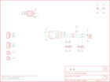

Contents
========

* [PRS9147 > AVR Stick](#prs9147--avr-stick)
	* [Schematic](#schematic)
	* [PCB](#pcb)
	* [Interactive BOM](#interactive-bom)
	* [OOMP Parts](#oomp-parts)
	* [Images](#images)
	* [Tags](#tags)
  
![][im]
# PRS9147 > AVR Stick

- ID: PROJ-SPAR-9147-STAN-01
- Hex ID: PRS9147
- Name: Sparkfun
- Description: Sparkfun
- Long Link: [http://oom.lt/PROJ-SPAR-9147-STAN-01](http://oom.lt/PROJ-SPAR-9147-STAN-01)
- Short Link: [http://oom.lt/PRS9147](http://oom.lt/PRS9147)

## Schematic
  

## PCB
  

## Interactive BOM

- Interactive BOM page: [ibom.html](https://htmlpreview.github.io/?https://github.com/oomlout/oomlout_OOMP_projects/blob/main/PROJ-SPAR-9147-STAN-01/kicad/bom/ibom.html)

## OOMP Parts
  

|OOMP ID|Name|Identifier|
| :---: | :---: | :---: |
|[CAPC-0402-X-NF100-V10](https://github.com/oomlout/oomlout_OOMP_parts/tree/main/CAPC-0402-X-NF100-V10/)|[SMD (0402) 100 nF Capacitor (Ceramic) 10v](https://github.com/oomlout/oomlout_OOMP_parts/tree/main/CAPC-0402-X-NF100-V10/)|[C3](https://github.com/oomlout/oomlout_OOMP_parts/tree/main/CAPC-0402-X-NF100-V10/)|
|[CAPT-3216-X-UF10-V10](https://github.com/oomlout/oomlout_OOMP_parts/tree/main/CAPT-3216-X-UF10-V10/)|[SMD (3216) 10 uF Capacitor (Tantalum) 10v](https://github.com/oomlout/oomlout_OOMP_parts/tree/main/CAPT-3216-X-UF10-V10/)|[C4](https://github.com/oomlout/oomlout_OOMP_parts/tree/main/CAPT-3216-X-UF10-V10/)|
|UNMATCHED-UNMATCHED-X-UNMATCHED-01||IC1, JP3, X1|
|[HEAD-I01-X-PI04-01](https://github.com/oomlout/oomlout_OOMP_parts/tree/main/HEAD-I01-X-PI04-01/)|[2.54 mm 4 Pin Header](https://github.com/oomlout/oomlout_OOMP_parts/tree/main/HEAD-I01-X-PI04-01/)|[JP1, JP2](https://github.com/oomlout/oomlout_OOMP_parts/tree/main/HEAD-I01-X-PI04-01/)|
|HEAD-I01-X-PI01-01||JP4, JP5|
|[LEDS-0603-L-STAN-01](https://github.com/oomlout/oomlout_OOMP_parts/tree/main/LEDS-0603-L-STAN-01/)|[SMD (0603) Blue LED](https://github.com/oomlout/oomlout_OOMP_parts/tree/main/LEDS-0603-L-STAN-01/)|[LED1, LED2](https://github.com/oomlout/oomlout_OOMP_parts/tree/main/LEDS-0603-L-STAN-01/)|
|[LEDS-0603-G-STAN-01](https://github.com/oomlout/oomlout_OOMP_parts/tree/main/LEDS-0603-G-STAN-01/)|[SMD (0603) Green LED](https://github.com/oomlout/oomlout_OOMP_parts/tree/main/LEDS-0603-G-STAN-01/)|[LED3](https://github.com/oomlout/oomlout_OOMP_parts/tree/main/LEDS-0603-G-STAN-01/)|
|[LEDS-0603-Y-STAN-01](https://github.com/oomlout/oomlout_OOMP_parts/tree/main/LEDS-0603-Y-STAN-01/)|[SMD (0603) Yellow LED](https://github.com/oomlout/oomlout_OOMP_parts/tree/main/LEDS-0603-Y-STAN-01/)|[LED4](https://github.com/oomlout/oomlout_OOMP_parts/tree/main/LEDS-0603-Y-STAN-01/)|
|RESE-0402-X-O680-01||R1, R2|
|RESE-0402-X-UNMATCHED-01||R3|
|[RESE-0402-X-O471-01](https://github.com/oomlout/oomlout_OOMP_parts/tree/main/RESE-0402-X-O471-01/)|[SMD (0402) 470 Ohm Resistor](https://github.com/oomlout/oomlout_OOMP_parts/tree/main/RESE-0402-X-O471-01/)|[R4, R5](https://github.com/oomlout/oomlout_OOMP_parts/tree/main/RESE-0402-X-O471-01/)|

## Images
  
  

|bominteractivefront|bominteractiveback|kicadPcb3d|kicadPcb3dFront|kicadPcb3dBack|eagleImage|eagleSchemImage|pcbdraw|pcbdrawback|
| :---: | :---: | :---: | :---: | :---: | :---: | :---: | :---: | :---: |
||||||||||

## Tags

- hexID: PRS9147
- oompType: PROJ
- oompSize: SPAR
- oompColor: 9147
- oompDesc: STAN
- oompIndex: 01
- oompName: AVR Stick
- sources: All source files from https://github.com/sparkfun/AVR_Stick (source licence details in srcLicense.md)
- linkBuyPage: https://www.sparkfun.com/products/9147
- oompID: PROJ-SPAR-9147-STAN-01
- oompParts: C3,CAPC-0402-X-NF100-V10
- oompParts: C4,CAPT-3216-X-UF10-V10
- oompParts: IC1,UNMATCHED-UNMATCHED-X-UNMATCHED-01
- oompParts: JP1,HEAD-I01-X-PI04-01
- oompParts: JP2,HEAD-I01-X-PI04-01
- oompParts: JP3,UNMATCHED-UNMATCHED-X-UNMATCHED-01
- oompParts: JP4,HEAD-I01-X-PI01-01
- oompParts: JP5,HEAD-I01-X-PI01-01
- oompParts: LED1,LEDS-0603-L-STAN-01
- oompParts: LED2,LEDS-0603-L-STAN-01
- oompParts: LED3,LEDS-0603-G-STAN-01
- oompParts: LED4,LEDS-0603-Y-STAN-01
- oompParts: R1,RESE-0402-X-O680-01
- oompParts: R2,RESE-0402-X-O680-01
- oompParts: R3,RESE-0402-X-UNMATCHED-01
- oompParts: R4,RESE-0402-X-O471-01
- oompParts: R5,RESE-0402-X-O471-01
- oompParts: X1,UNMATCHED-UNMATCHED-X-UNMATCHED-01
- rawParts: C3,0.1uF,CAP0402-CAP,0402-CAP,Capacitor,,
- rawParts: C4,10uF,CAP_POL1206,EIA3216,Capacitor Polarized,,
- rawParts: IC1,TINY85S,TINY85S,SOIC8,MICROCONTROLLER,,
- rawParts: JP1,,M04PTH,1X04,Header 4,,
- rawParts: JP2,,M04PTH,1X04,Header 4,,
- rawParts: JP3,AVR_SPI_PRG_6PTH,AVR_SPI_PRG_6PTH,2X3,AVR ISP 6 Pin,,
- rawParts: JP4,M01PTH,M01PTH,1X01,Header 1,,
- rawParts: JP5,M01PTH,M01PTH,1X01,Header 1,,
- rawParts: LED1,Blue,LED0603,LED-0603,LEDs,,
- rawParts: LED2,Blue,LED0603,LED-0603,LEDs,,
- rawParts: LED3,White?,LED0603,LED-0603,LEDs,,
- rawParts: LED4,Yellow,LED0603,LED-0603,LEDs,,
- rawParts: R1,68,RESISTOR0402-RES,0402-RES,Resistor,,
- rawParts: R2,68,RESISTOR0402-RES,0402-RES,Resistor,,
- rawParts: R3,1.5K,RESISTOR0402-RES,0402-RES,Resistor,,
- rawParts: R4,470,RESISTOR0402-RES,0402-RES,Resistor,,
- rawParts: R5,470,RESISTOR0402-RES,0402-RES,Resistor,,
- rawParts: U$1,LOGO-SFESK,LOGO-SFESK,SFE-LOGO-FLAME,Spark Fun Electronics PCB Logo,,
- rawParts: U$2,FIDUCIAL1X2,FIDUCIAL1X2,FIDUCIAL-1X2,Fiducial Alignment Points,,
- rawParts: U$3,FIDUCIAL1X2,FIDUCIAL1X2,FIDUCIAL-1X2,Fiducial Alignment Points,,
- rawParts: U$4,CREATIVE_COMMONS,CREATIVE_COMMONS,CREATIVE_COMMONS,,,
- rawParts: X1,USBPCB,USBPCB,USB-A-PCB,USB Connectors,,

[im]: kicadPcb3d_450.png
