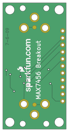

Contents
========

* [PRS9168 > On Screen Display Breakout-MAX7456](#prs9168--on-screen-display-breakout-max7456)
	* [Schematic](#schematic)
	* [PCB](#pcb)
	* [Interactive BOM](#interactive-bom)
	* [OOMP Parts](#oomp-parts)
	* [Images](#images)
	* [Tags](#tags)
  
![][im]
# PRS9168 > On Screen Display Breakout-MAX7456

- ID: PROJ-SPAR-9168-STAN-01
- Hex ID: PRS9168
- Name: Sparkfun
- Description: Sparkfun
- Long Link: [http://oom.lt/PROJ-SPAR-9168-STAN-01](http://oom.lt/PROJ-SPAR-9168-STAN-01)
- Short Link: [http://oom.lt/PRS9168](http://oom.lt/PRS9168)

## Schematic
  

## PCB
  

## Interactive BOM

- Interactive BOM page: [ibom.html](https://htmlpreview.github.io/?https://github.com/oomlout/oomlout_OOMP_projects/blob/main/PROJ-SPAR-9168-STAN-01/kicad/bom/ibom.html)

## OOMP Parts
  

|OOMP ID|Name|Identifier|
| :---: | :---: | :---: |
|[CAPC-0402-X-NF100-V10](https://github.com/oomlout/oomlout_OOMP_parts/tree/main/CAPC-0402-X-NF100-V10/)|[SMD (0402) 100 nF Capacitor (Ceramic) 10v](https://github.com/oomlout/oomlout_OOMP_parts/tree/main/CAPC-0402-X-NF100-V10/)|[C1, C2, C3, C8](https://github.com/oomlout/oomlout_OOMP_parts/tree/main/CAPC-0402-X-NF100-V10/)|
|[CAPC-0402-X-PF22-V50](https://github.com/oomlout/oomlout_OOMP_parts/tree/main/CAPC-0402-X-PF22-V50/)|[SMD (0402) 22 pF Capacitor (Ceramic) 50v](https://github.com/oomlout/oomlout_OOMP_parts/tree/main/CAPC-0402-X-PF22-V50/)|[C4, C5](https://github.com/oomlout/oomlout_OOMP_parts/tree/main/CAPC-0402-X-PF22-V50/)|
|CAPX-3528-X-UF47-01||C6, C7|
|[DCJP-21D-X-STAN-01](https://github.com/oomlout/oomlout_OOMP_parts/tree/main/DCJP-21D-X-STAN-01/)|[2.1 mm DC Jack](https://github.com/oomlout/oomlout_OOMP_parts/tree/main/DCJP-21D-X-STAN-01/)|[J1, J2](https://github.com/oomlout/oomlout_OOMP_parts/tree/main/DCJP-21D-X-STAN-01/)|
|HEAD-I01-X-PI11-01||JP1|
|[RESE-0402-X-O750-01](https://github.com/oomlout/oomlout_OOMP_parts/tree/main/RESE-0402-X-O750-01/)|[SMD (0402) 75 Ohm Resistor](https://github.com/oomlout/oomlout_OOMP_parts/tree/main/RESE-0402-X-O750-01/)|[R1, R2](https://github.com/oomlout/oomlout_OOMP_parts/tree/main/RESE-0402-X-O750-01/)|
|UNMATCHED-UNMATCHED-X-UNMATCHED-01||U3, Y2|

## Images
  
  

|bominteractivefront|bominteractiveback|kicadPcb3d|kicadPcb3dFront|kicadPcb3dBack|kicadSchem|eagleImage|eagleSchemImage|pcbdraw|pcbdrawback|
| :---: | :---: | :---: | :---: | :---: | :---: | :---: | :---: | :---: | :---: |
|||||||||||

## Tags

- hexID: PRS9168
- oompType: PROJ
- oompSize: SPAR
- oompColor: 9168
- oompDesc: STAN
- oompIndex: 01
- oompName: On Screen Display Breakout-MAX7456
- sources: All source files from https://github.com/sparkfun/On_Screen_Display_Breakout-MAX7456 (source licence details in srcLicense.md)
- linkBuyPage: https://www.sparkfun.com/products/9168
- oompID: PROJ-SPAR-9168-STAN-01
- oompParts: C1,CAPC-0402-X-NF100-V10
- oompParts: C2,CAPC-0402-X-NF100-V10
- oompParts: C3,CAPC-0402-X-NF100-V10
- oompParts: C4,CAPC-0402-X-PF22-V50
- oompParts: C5,CAPC-0402-X-PF22-V50
- oompParts: C6,CAPX-3528-X-UF47-01
- oompParts: C7,CAPX-3528-X-UF47-01
- oompParts: C8,CAPC-0402-X-NF100-V10
- oompParts: J1,DCJP-21D-X-STAN-01
- oompParts: J2,DCJP-21D-X-STAN-01
- oompParts: JP1,HEAD-I01-X-PI11-01
- oompParts: R1,RESE-0402-X-O750-01
- oompParts: R2,RESE-0402-X-O750-01
- oompParts: U3,UNMATCHED-UNMATCHED-X-UNMATCHED-01
- oompParts: Y2,UNMATCHED-UNMATCHED-X-UNMATCHED-01
- rawParts: C1,0.1uF,CAP0402,C0402,Capacitor,,
- rawParts: C2,0.1uF,CAP0402,C0402,Capacitor,,
- rawParts: C3,0.1uF,CAP0402,C0402,Capacitor,,
- rawParts: C4,22pf,CAP0402,C0402,Capacitor,,
- rawParts: C5,22pf,CAP0402,C0402,Capacitor,,
- rawParts: C6,47uF,CAP_POL3528,EIA3528,Capacitor Polarized,,
- rawParts: C7,47uF,CAP_POL3528,EIA3528,Capacitor Polarized,,
- rawParts: C8,0.1uF,CAP0402,C0402,Capacitor,,
- rawParts: J1,POWER_JACKRCA_LOCK,POWER_JACKRCA_LOCK,RCA_LOCK,Power Jack,,
- rawParts: J2,POWER_JACKRCA_LOCK,POWER_JACKRCA_LOCK,RCA_LOCK,Power Jack,,
- rawParts: JP1,M11PTH,M11PTH,1X11,Header 11,,
- rawParts: R1,75,RESISTOR0402,C0402,Resistor,,
- rawParts: R2,75,RESISTOR0402,C0402,Resistor,,
- rawParts: U$2,STAND-OFF,STAND-OFF,STAND-OFF,Stand Off,,
- rawParts: U$8,LOGO-SFENEW,LOGO-SFENEW,SFE-NEW-WEBLOGO,Spark Fun Electronics PCB Logo,,
- rawParts: U$9,FIDUCIAL1X2,FIDUCIAL1X2,FIDUCIAL-1X2,Fiducial Alignment Points,,
- rawParts: U$10,FIDUCIAL1X2,FIDUCIAL1X2,FIDUCIAL-1X2,Fiducial Alignment Points,,
- rawParts: U$12,STAND-OFF,STAND-OFF,STAND-OFF,Stand Off,,
- rawParts: U$13,STAND-OFF,STAND-OFF,STAND-OFF,Stand Off,,
- rawParts: U$14,STAND-OFF,STAND-OFF,STAND-OFF,Stand Off,,
- rawParts: U3,MAX7456,MAX7456,TSSOP28,,,
- rawParts: V_IN,TEST-POINT3X5,TEST-POINT3X5,PAD.03X.05,,,
- rawParts: V_OUT,TEST-POINT3X5,TEST-POINT3X5,PAD.03X.05,,,
- rawParts: Y2,27MHz,CRYSTAL5X3,CRYSTAL-SMD-5X3,Crystals,,

[im]: kicadPcb3d_450.png
