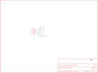

Contents
========

* [PRS9170 > Touch Screen Connector Breakout-Nintendo DS](#prs9170--touch-screen-connector-breakout-nintendo-ds)
	* [Schematic](#schematic)
	* [PCB](#pcb)
	* [Interactive BOM](#interactive-bom)
	* [OOMP Parts](#oomp-parts)
	* [Images](#images)
	* [Tags](#tags)
  
![][im]
# PRS9170 > Touch Screen Connector Breakout-Nintendo DS

- ID: PROJ-SPAR-9170-STAN-01
- Hex ID: PRS9170
- Name: Sparkfun 9170
- Description: Sparkfun 9170
- Long Link: [http://oom.lt/PROJ-SPAR-9170-STAN-01](http://oom.lt/PROJ-SPAR-9170-STAN-01)
- Short Link: [http://oom.lt/PRS9170](http://oom.lt/PRS9170)

## Schematic
  

## PCB
  

## Interactive BOM

- Interactive BOM page: [ibom.html](https://htmlpreview.github.io/?https://github.com/oomlout/oomlout_OOMP_projects/blob/main/PROJ-SPAR-9170-STAN-01/kicad/bom/ibom.html)

## OOMP Parts
  

|OOMP ID|Name|Identifier|
| :---: | :---: | :---: |
|[HEAD-I01-X-PI04-01](https://github.com/oomlout/oomlout_OOMP_parts/tree/main/HEAD-I01-X-PI04-01/)|[2.54 mm 4 Pin Header](https://github.com/oomlout/oomlout_OOMP_parts/tree/main/HEAD-I01-X-PI04-01/)|[JP1](https://github.com/oomlout/oomlout_OOMP_parts/tree/main/HEAD-I01-X-PI04-01/)|
|UNMATCHED-UNMATCHED-X-UNMATCHED-01||U$1|

## Images
  
  

|bominteractivefront|bominteractiveback|kicadPcb3d|kicadPcb3dFront|kicadPcb3dBack|kicadSchem|eagleImage|eagleSchemImage|pcbdraw|pcbdrawback|
| :---: | :---: | :---: | :---: | :---: | :---: | :---: | :---: | :---: | :---: |
|||||||||||

## Tags

- hexID: PRS9170
- oompType: PROJ
- oompSize: SPAR
- oompColor: 9170
- oompDesc: STAN
- oompIndex: 01
- oompName: Touch Screen Connector Breakout-Nintendo DS
- sources: All source files from https://github.com/sparkfun/Touch_Screen_Connector_Breakout-Nintendo_DS (source licence details in srcLicense.md)
- linkBuyPage: https://www.sparkfun.com/products/9170
- oompID: PROJ-SPAR-9170-STAN-01
- oompParts: JP1,HEAD-I01-X-PI04-01
- oompParts: U$1,UNMATCHED-UNMATCHED-X-UNMATCHED-01
- rawParts: FID1,FIDUCIAL1X2,FIDUCIAL1X2,FIDUCIAL-1X2,Fiducial Alignment Points,,
- rawParts: FID2,FIDUCIAL1X2,FIDUCIAL1X2,FIDUCIAL-1X2,Fiducial Alignment Points,,
- rawParts: JP1,,M04PTH,1X04,Header 4,,
- rawParts: U$1,DS_TOUCH_CONNECTOR,DS_TOUCH_CONNECTOR,DS_TOUCH_CONNECTOR,4-pin DS touch screen connector,,
- rawParts: U$2,LOGO-SFESK,LOGO-SFESK,SFE-LOGO-FLAME,Spark Fun Electronics PCB Logo,,

[im]: kicadPcb3d_450.png
