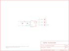

Contents
========

* [PRS9267 > LilyPad Accelerometer-ADXL335](#prs9267--lilypad-accelerometer-adxl335)
	* [Schematic](#schematic)
	* [PCB](#pcb)
	* [Images](#images)
	* [Tags](#tags)
  
![][im]
# PRS9267 > LilyPad Accelerometer-ADXL335

- ID: PROJ-SPAR-9267-STAN-01
- Hex ID: PRS9267
- Name: Sparkfun
- Description: Sparkfun
- Long Link: [http://oom.lt/PROJ-SPAR-9267-STAN-01](http://oom.lt/PROJ-SPAR-9267-STAN-01)
- Short Link: [http://oom.lt/PRS9267](http://oom.lt/PRS9267)

## Schematic
  

## PCB
  

## Images
  
  

|kicadPcb3d|kicadPcb3dFront|kicadPcb3dBack|eagleImage|eagleSchemImage|
| :---: | :---: | :---: | :---: | :---: |
||||||

## Tags

- hexID: PRS9267
- oompType: PROJ
- oompSize: SPAR
- oompColor: 9267
- oompDesc: STAN
- oompIndex: 01
- oompName: LilyPad Accelerometer-ADXL335
- sources: All source files from https://github.com/sparkfun/LilyPad_Accelerometer-ADXL335 (source licence details in srcLicense.md)
- linkBuyPage: https://www.sparkfun.com/products/9267
- oompID: PROJ-SPAR-9267-STAN-01
- rawParts: C1,0.1uF,CAP0402-CAP,0402-CAP,Capacitor,,
- rawParts: C2,0.1uF,CAP0402-CAP,0402-CAP,Capacitor,,
- rawParts: C3,0.1uF,CAP0402-CAP,0402-CAP,Capacitor,,
- rawParts: C4,0.1uF,CAP0402-CAP,0402-CAP,Capacitor,,
- rawParts: C5,0.1uF,CAP0402-CAP,0402-CAP,Capacitor,,
- rawParts: J1,SEWTAP6,SEWTAP6,PETAL-SMALL-2SIDE,,,
- rawParts: J2,SEWTAP6,SEWTAP6,PETAL-SMALL-2SIDE,,,
- rawParts: J3,SEWTAP6,SEWTAP6,PETAL-SMALL-2SIDE,,,
- rawParts: J4,SEWTAP6,SEWTAP6,PETAL-SMALL-2SIDE,,,
- rawParts: J5,SEWTAP6,SEWTAP6,PETAL-SMALL-2SIDE,,,
- rawParts: J6,SEWTAP-NOHOLE2,SEWTAP-NOHOLE2,PETAL-NOHOLE-2SIDE,,,
- rawParts: R1,0,RESISTOR0402-RES,0402-RES,Resistor,,
- rawParts: U$4,LOGO-LP,LOGO-LPLP,LOGO-LILYPAD,,,
- rawParts: U$7,CREATIVE_COMMONS,CREATIVE_COMMONS,CREATIVE_COMMONS,,,
- rawParts: U1,ADXL335,ADXL335,LFCSP-16,,,

[im]: kicadPcb3d_450.png
